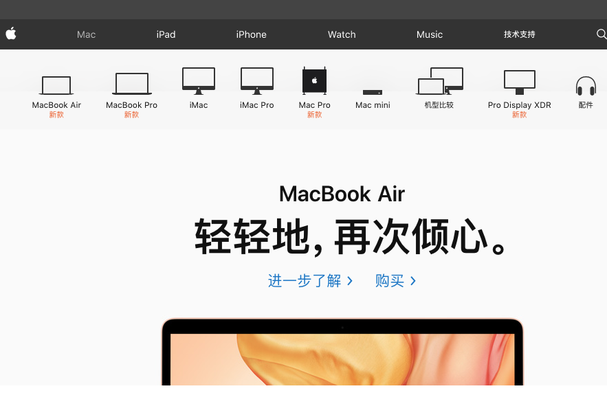
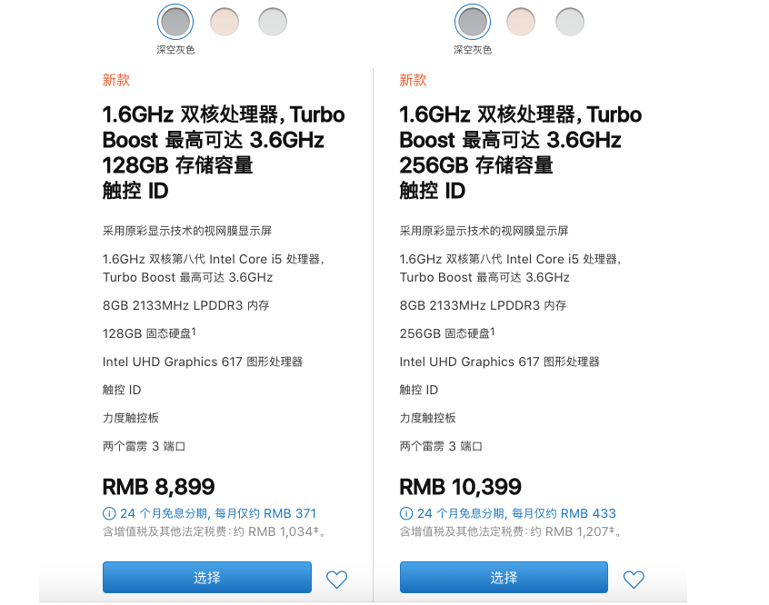
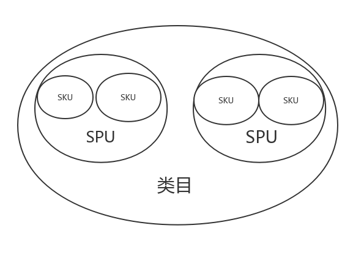

`SPU`英文全称 Standard Product Unit(标准产品单位)、`SKU`英文全称 stock keeping unit(库存量单位)。

<!--truncate-->

## 基本概念

`SPU`英文全称 Standard Product Unit(标准产品单位)、`SKU`英文全称 stock keeping unit(库存量单位)。

### 商品 SPU

1. SPU 是`商品`信息聚合的`最小`单位，是一组`可复用`、`易检索`的标准化信息的`集合`，该集合描述了一个产品的特性。
1. 我们在浏览[mac 官网](https://www.apple.com/cn/mac/)时，上栏有 MacBook Air、MacBook Pro、iMac...等等。其中 MacBook Air 是一个 SPU，MacBook Pro 也是一个 SPU，iMac 也是一个 SPU。
   简单的说：`MacBook Air`就是一个 SPU，这与颜色和内存大小`都无关`。
   实际上指的就是`MacBook Air`这台笔记本。

### 商品 SKU

1. SKU 即`库存`进出计量的单位， 可以是以件、盒、托盘等为单位。
2. 当你点进`MacBook Air`购买时,页面有两种内存大小不同的款式，并且`不同`的款式间有三种颜色选择。
   如果你选择 128G 银色 的`MacBook Air`。这时候你选择了具体的内存大小和颜色的`MacBook Air`就是一个 SKU。
   不同的内存大小`MacBook Air`的价格是肯定是不同，而且`不同`的颜色和内存大小的库存也是`不同`的。可能 256G 银色这款比较受欢迎，所以 256G 银色 的`MacBook Air`库存会比较少。

## SPU 和 SKU 间关系

- 结合前面所举的列子来看，SPU 与 SKU 两者的`关系`似乎就是类目下包含 SPU，SPU 包含 SKU。

1. SPU 是一个`抽象概念`的商品（MacBook Air），而 SKU 是一个`更为具体`的商品（128G 银色 的 MacBook Air）。这里不难看出商品 SKU`从属于`商品 SPU。
1. 由于 SKU 从属于 SPU，故两者的`功能`有所差别：
   SPU 通常是用来`定位`某件商品，而 SKU 通常是用来`定价`和`管理库存`。

