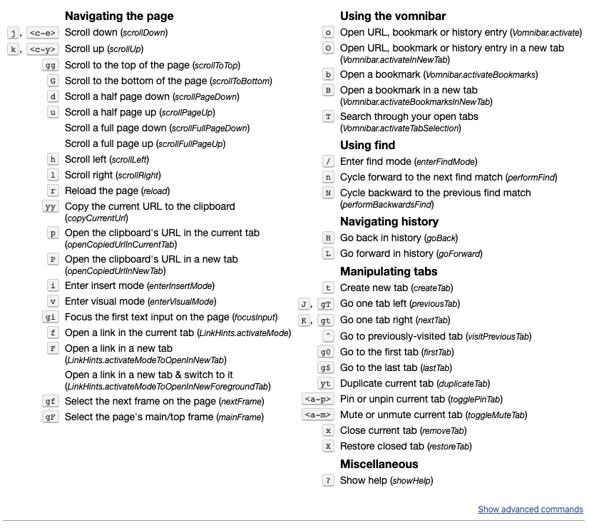

vimium 类似于 vim 的快捷键，是 chrome 浏览器的一款插件, 可以用键盘代替鼠标的操作, 提高我们的浏览速度和上网体验。

<!--truncate-->

## 使用

1. `Vimium`作为 Chrome 的一个扩展工具，安装当然很简单。在 Chrome 应用店上安装即可[Vimium](https://chrome.google.com/webstore/detail/vimium/dbepggeogbaibhgnhhndojpepiihcmeb?utm_source=chrome-ntp-icon)
2. 可以`自定义`快捷方式
   右击右上角扩展的图标 -> 进入选项 -> 在 Custom key mappings 新增下面快捷内容 -> 点击下面 save changes

```
// Insert your preferred key mappings here.
map w scrollUp
map s scrollDown
map a scrollLeft
map d scrollRight
map l scrollPageDown
map h scrollPageUp
map qq scrollToTop
map ee scrollToBottom
map j goBack
map k goForward
```

1. 官方的快捷方式说明



## 常用的快捷方式(默认)

1. `**页面的移动**`
   | 按键 | 效果 |
   | --- | --- |
   | r | 刷新 |
   | f/F | 跳转链接 |
   | h/j/k/l | 左/下/上/右 |
   | u/d | 上/下半页滚动 |
   | gg/G | 回到顶部/底部 |
   | H/L | 后退/前进 |

2. `**复制&粘贴**`
   | 按键 | 效果 |
   | --- | --- |
   | yy | 复制当前页面的 url 到剪切板 |
   | yt | 重复当前标签 |
   | p/P | 搜索剪贴板关键字 在当前/新标签 |

3. `**模式&定位**`
   | 按键 | 效果 |
   | --- | --- |
   | i/v | 编辑模式/可视模式 |
   | gi | 定位到页面首个输入框 |
   | 2gi | 定位到页面第二个输入框 |
   | / | 进入寻找模式 |
   | n/N | 向下/上查找结果 |

4. `**书签**`
   | 按键 | 效果 |
   | --- | --- |
   | o/O | 查找历史记录+书签 |
   | b/B | 打开书签 在当前/新窗口 |

5. `**标签**`
   | 按键 | 效果 |
   | --- | --- |
   | t/T | 创建/查看标签页 |
   | ^ | 上一次标签切换 |
   | x/X | 关闭/恢复标签 |
   | J,gT/K,gt | 跳转标签页 |
   | g0/g$ | 切换到首个标签/最后标签 |
   | gu/gU | 跳转到当前 url 上一级/最高级 |
   | ge/gE | 编辑 url 在当前/新标签 |
   | ? | 显示帮助 |

> 平时要是忘记了快捷方式,也可以在浏览器页面 `?` 显示快捷键帮助

## 扩展

### ideavim

1. Jetbrains 系列软件直接在`插件`浏览器搜索安装即可，重启后在边栏`tools`上可以看到`vim Emulator`
2. 由于 ideavim 有些快捷方式与 IDEA 原本快捷方式会`冲突`, 可以在以下位置进行设置。

```
preferences -> Editor -> Vim Emulation(mac系统)
Settings -> Other Settings -> Vim Emulation设置(win系统)
```

1. 可以选择冲突的按键统一设置成 IDE 的快捷键。

### vscode vim

1. 直接在扩展搜索 vim 安装即可
2. 关闭被 vim 冲突掉的`Ctrl+C`

```
在首选项 -> 设置 -> 配置搜索(vim.use) -> Vim: Use Ctrl Keys -> 设置false(不打勾)
```

1. 使用系统剪贴板->设置 true

```
在首选项 -> 设置 -> 配置搜索(vim.use) -> Vim: use System Clipboardsh -> 设置true(打勾)
```
