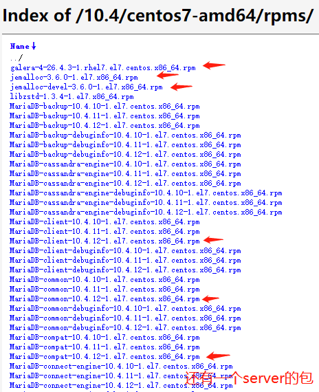
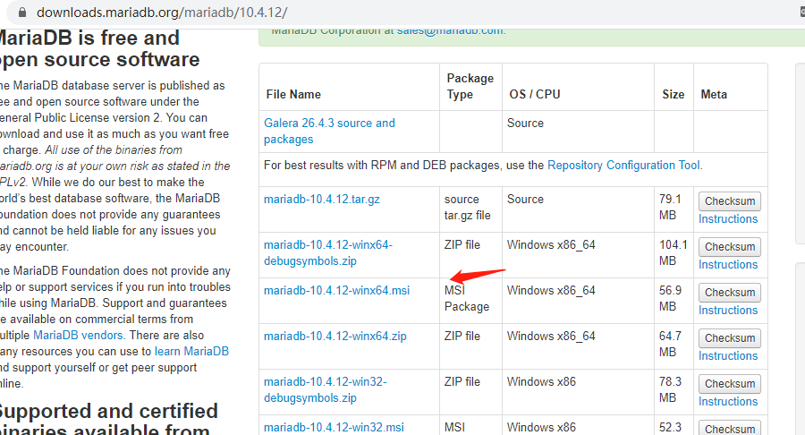

记录一下使用离线的方式在 CentOS7 中安装 mariaDB 10.4.x

<!--truncate-->

## 前言

MariaDB 是开源关系数据库，是 MySQL 的原始开发人员制作，并保证保持开源，可以说是 MySQL 的孪生兄弟。随着甲骨文收购了 MySQL，并且半闭源 Java，所以 MySQL 存在着闭源的潜在危险。因此之前 MySQL 的原班人马采用 MariaDB 这个分支来避免风险。
MariaDB 是完全兼容于 MySQL 的，包括 API 和命令行。



## 正文

### 下载 RPM 包

1. 安装 7 个所需的 RPM 包，这些包都可以在[MariaDB 网站](http://yum.mariadb.org/10.4/centos7-amd64/rpms/)上找到


2. 选择 client、common、compat、server 包时，`版本要一致`



### 逐步安装 RPM 包(一定要按顺序)

1. 使用 yum 安装所需的所有依赖项

```sh
$ yum install rsync nmap lsof perl-DBI nc
```

1. 安装`jemalloc-3.6.0-1.el7.x86_64.rpm`

```sh
$ rpm -ivh jemalloc-3.6.0-1.el7.x86_64.rpm
```

1. 安装`jemalloc-devel-3.6.0-1.el7.x86_64.rpm`

```sh
$ rpm -ivh jemalloc-devel-3.6.0-1.el7.x86_64.rpm
```

1. 安装 5 个剩下的包(`要按先后顺序来`)

```sh
$ rpm -ivh MariaDB-common-10.4.12-1.el7.centos.x86_64.rpm \
MariaDB-compat-10.4.12-1.el7.centos.x86_64.rpm \
MariaDB-client-10.4.12-1.el7.centos.x86_64.rpm \
galera-4-26.4.3-1.rhel7.el7.centos.x86_64.rpm \
MariaDB-server-10.4.12-1.el7.centos.x86_64.rpm
```

> 在安装 MariaDB-common-10.4.12-1.el7.centos.x86_64.rpm 时，可能与较旧的 MariaDB 软件包冲突。我们需要删除它们并重新安装原始 rpm。
> #rpm -ivh MariaDB-10.1.21-centos7-x86_64-common.rpm
> warning: MariaDB-10.1.21-centos7-x86_64-common.rpm: Header V4 DSA/SHA1 Signature, key ID 1bb943db: NOKEY
> error: Failed dependencies:
> mariadb-libs < 1:10.1.21-1.el7.centos conflicts with MariaDB-common-10.1.21-1.el7.centos.x86_64
> **`一个警告缺少导入MariaDb的key`** 和 **`与mariadb-libs包冲突了`**

### 解决报错问题

1. 卸载冲突的 mariadb-libs
   先搜索

```sh
$ rpm -qa | grep mariadb-libs
mariadb-libs-5.5.60-1.el7_5.x86_64
```

进行卸载

```sh
$ rpm -ev --nodeps mariadb-libs-5.5.60-1.el7_5.x86_64
```

2. 导入 MariaDb 的 key

```sh
$ rpm --import http://yum.mariadb.org/RPM-GPG-KEY-MariaDB
```

3. 在安装 Galera 软件包时，依赖软件包的安装可能会发生冲突。这是错误消息：

> error: Failed dependencies:
> libboost_program_options.so.1.53.0()(64bit) is needed by galera-25.3.19-1.rhel7.el7.centos.x86_64
> The dependencies for Galera package is: libboost_program_options.so.1.53.0

4. 需要安装`boost-devel`依赖环境

```sh
$ yum install boost-devel.x86_64
```

5. 继续执行安装 5 个剩下的包命令时，会再次报缺失`libaio包`错误

6. `下载并安装` libaio 包 (此步骤在安装 10.4.8+需要)

```sh
$ wget http://mirror.centos/6/os/x86_64/Packages/libaio-0.3.107-10.e16.x86_64.rpm
$ rpm -ivh libaio-0.3.107-10.e16.x86_64.rpm
```

7. 最后执行安装 5 个剩下的包命令，等待下载好就完成了

### 运行并配置 MariaDB

1. 启动 MariaDB（服务名是与 MySQL 一样的）

```sh
$ service mysql start
```

1. 安全配置(设置密码)

```sh
$ mysql_secure_installation
```

1. 初始化时是没有密码的，直接回车
   `Enter current password for root (enter for none)`
2. 不需要权限切换
   `Switch to unix_socket anthentication [Y/n] n`
3. 是否更改密码
   `Change the root password? [Y/n] Y`
4. 设置新密码
   `New password: yourPassword`
5. 确认密码
   `Re-enter new password: yourPassword`
6. 是否移除匿名用户（安全起见可以删除）
   `Remove anonymous users? [Y/n] Y`
7. 是否允许远程登录(也可以设置 n，如果后面需要远程连接时也可以修改)
   `Disallow root login remotely? [Y/n] Y`
8. 是否删除 test 数据库（留着也好）
   `Remove test database and access to it? [Y/n] n`
9. 重新加载 tables 的内容
   `Reload privilege tables now? [Y/n] Y`

### 远程 ip 登录

**如果设置允许就不需要下面操作了。**
**如果在配置 MariaDB`步骤9`时，设置`不允许远程登录`时，可使用以下进行修改。**

1. 进入 MariaDB 控制台

```
$ mysql -u root -p
```

1. 需要将 localhost 改为%,让外网能访问

```sh
$ GRANT ALL PRIVILEGES ON *.* TO 'root'@'%' IDENTIFIED BY 'yourPassword' WITH GRANT OPTION;
```

1. 刷新权限

```sh
$ FLUSH  PRIVILEGES;
```

### 在线安装

1. 除了离线使用下载的安装包进行安装之外，也可以使用 yum 的方式进行在线安装


### win 安装

1. win 安装比较简单，直接下 MSI 包一键安装即可



## 文献参考

MariaDB 官网 - [MariaDB Installation](https://mariadb.com/kb/en/mariadb-installation-version-10121-via-rpms-on-centos-7/)
