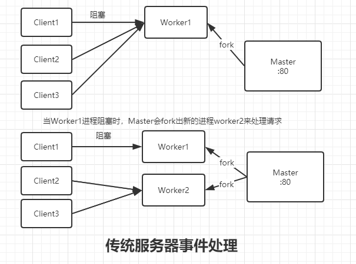

Nginx 作为最常见的服务器，我们不但要知道能将项目部署在上面，还要知道其相关原理。

<!--truncate-->

## Nginx 方向代理

大多时候我们使用 Nginx 时，可能都会使用 Nginx 反向代理的功能。那么什么是反向代理呢？
在理解什么是 Nginx 反向代理时，我们先得知道什么是正向代理。

#### 正向代理

正向代理服务器是`客户端`请求`目标服务器`之间的一个代理服务器。
一般我们发送了一个请求后，它会先经过代理服务器，然后在经过代理服务器转发请求到`指定的目标服务器`，获得内容后将结果最终响应给客户端。

#### 反向代理

反向代理：用户请求目标服务器，由代理服务器决定访问哪个 ip 目标服务器

#### 联系

理解这两种代理的关键在于代理服务器所代理的对象是什么，正向代理代理的是`客户端`，我们需要在客户端进行一些代理的设置。
而反向代理代理的是`服务器`，作为客户端的我们是我们是不知道代理服务器具体访问哪个 ip 目标服务器的。

## Nginx 进程模型

Nginx 作为高性能的服务器，离不开良好进程模型的支持。
Nginx 有 Master 主进程和 Worker 工作进程。对于每个 Worker 进程来说，它们都是独立的进程，互相之间不会影响。
Master 进程通过发指令信号的形式通知 Worker 工作进程

- Master 进程主要用来管理 Worker 进程

1. Master 进程接收来自外界的信号
2. Master 进程向各 Worker 进程发送信号
3. Master 进程监控 Worker 进程的运行状态
4. 当 Worker 进程异常退出后，会自动重新启动新的 Worker 进程。

- 我们可以在配置文件`nginx.conf`配置 Worker 进程的数量
  `worker_processes 2`

## Nginx 请求机制

对于 Nginx 为什么性能这么高，能达到这么高的并发,最主要的是有`Worker抢占机制`和`处理请求的模型是异步非阻塞`(多路复用器)

#### 传统服务器-同步阻塞

传统服务器中，客户端发起一个请求，如果处理这个请求的工作进程由于处理的时间比较长被阻塞住了，那么它将不会处理后续其它 Client 的请求。Master 进程会 fork 出新的 Worker2 进程来处理。很显然这种方式是不好的，如果刚 fork 的 Worker2 进程也被阻塞的话，Master 又只能 fork 出现 Worker 进程。在高并发情况，发生阻塞的话，服务器会开很多进程来处理，这对服务器资源开销是非常大的。这就是同步阻塞的弊端。这在高并发情况下，这无疑是一场灾难。

#### Nginx 服务器-异步非阻塞

Nginx 服务器，客户端发起一个请求，即便处理这个请求的工作进程 1 被阻塞住了，是不会影响它处理其它客户端的请求的，这样就不需要 fork 新的 Worker 进程来处理其它客户端的请求。这是异步非阻塞的好处。

#### Nginx Worker 抢占机制

当一个请求过来时，会有一个 accept_mutex 互斥锁。Worker 进程会抢占这个锁，抢到后才能处理相对应客户端的请求，假设 Worker1 抢到这个锁后会建立关系，Worker1 就会处理这个请求，将这个请求进行解析、处理、响应，而 Worker2 和 Worker3 没抢到则不需操作。

