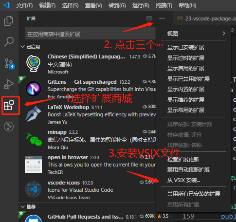

vscode 作为开发者青睐的开发工具，其强大之处就是免费开源、精小轻便，还有就是可以随意安装各种扩展应用。

<!--truncate-->

## 前文

vscode 作为开发者青睐的开发工具，其强大之处就是免费开源、精小轻便，还有就是可以随意安装各种扩展应用。
至于安装扩展应用的话十分简单，就是对 vscode 扩展商店中搜索对应的名称，点击安装之后即可使用；对于删除也是很简单，选择对应扩展应用进行删除即可。
下载后的扩展应用安装包会保存在相对应的计算机`C:\Users\YourName\.vscode\extensions`目录下，有时候我们在搬运扩展应用安装包时，这个传输是十分耗时的。因此将其打包成 vsix 文件的话，这样传输起来十分方便快速。之后，再将 vsix 文件进行安装即可。

## 正文

### 打包扩展包

1. 本地打包还是发布到应用市场都需要借助 vsce 工具

```sh
$ npm i vsce -g
```

1. 进入`C:\Users\YourName\.vscode\extensions`选择需要打包的扩展
2. 扩展包中需要的 node_modules 和 package.json 进行打包

```
$ vsce package
```

1. 打包成功后会在扩展包的根目录生成 vsix 文件的

> 如果打包失败的话，可能需要删除 node_modules，然后重新`npm install`，再打包`vsce package`

### 安装 vsix

在 vscode 安装 vsix 文件是十分简单的。

1. 打开 vscode，选择左边扩展应用
1. 点击扩展应用小页面左上角的`···`(也就是视图和更多操作，并不是指整个 vscode 页面的`···`)



3. 选择`Install form VSIX...`(从 VSIX 安装)
4. 跳转至选择存放 vsix 文件目录选择想要安装 vsix 文件即可
