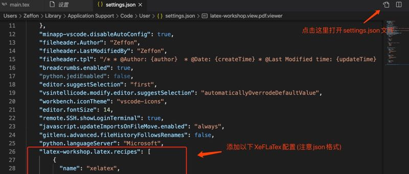
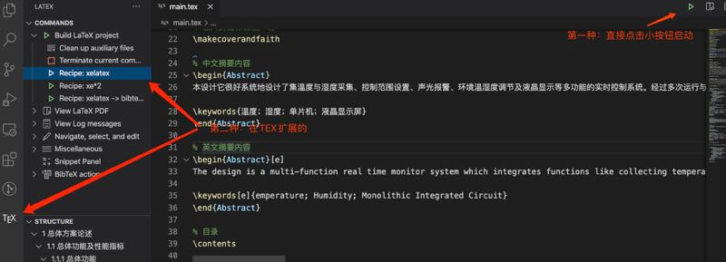

Latex 注重文字编写，不需要去关注排版。这个对于写论文之类的特殊文章简直是个神奇。记录一下 LaTex 在 vscode 上进行编译运行的教程。

<!--truncate-->

## 正文

### mac 系统

#### 安装流程

1. 下载 mactex 安装包
   在[mactex 官网下载](https://tug.org/mactex/mactex-download.html)(接近 4G,下载要等待一段时间)
2. 安装 LaTex 扩展
   在 vscode 扩展应用商城中，安装`LaTeX Workshop`扩展
3. 添加 XeFLaTeX 配置
   LaTeX WorkShop 插件默认只提供**PDFLaTeX**，如果是中文编译则需要**XeFLaTeX**，所以还需另行配置。



4. 配置代码
   依次选择 `Code > Preferences > Settings`，点击下图所示花括号图标进入 Settings 的 JSON 文件（`用户配置`）

```json
    "latex-workshop.latex.recipes": [
        {
          "name": "xelatex",
          "tools": [
            "xelatex"
          ]
        },
        {
          "name": "xe*2",
          "tools": [
            "xelatex",
            "xelatex"
          ]
        },
        {
          "name": "xelatex -> bibtex -> xelatex*2",
          "tools": [
            "xelatex",
            "bibtex",
            "xelatex",
            "xelatex"
          ]
        }
      ],
      "latex-workshop.latex.tools": [
        {
          "name": "latexmk",
          "command": "latexmk",
          "args": [
            "-synctex=1",
            "-interaction=nonstopmode",
            "-file-line-error",
            "-pdf",
            "%DOC%"
          ]
        },
        {
          "name": "xelatex",
          "command": "xelatex",
          "args": [
            "-synctex=1",
            "-interaction=nonstopmode",
            "-file-line-error",
            "%DOC%"
          ]
        },
        {
          "name": "bibtex",
          "command": "bibtex",
          "args": [
            "%DOCFILE%"
          ]
        }
      ],
      "latex-workshop.view.pdf.viewer": "tab"
```

5. 在.tex 文件的右上角的启动按钮->点击运行



### win 系统

#### 下载安装 texlive

选择清华大学镜像下载会更快-[地址](https://mirrors.tuna.tsinghua.edu.cn/CTAN/systems/texlive/Images/)

安装 - 以管理员方式运行安装脚本`install-tl-windows.bat`
安装过程中记得给 全部用户进行安装

#### vscode 配置

win 的**xelatex 配置**

```json
    "latex-workshop.latex.tools": [
      {
          "name": "xelatex",
          "command": "xelatex",
          "args": [
              "-synctex=1",
              "-interaction=nonstopmode",
              "-file-line-error",
              "-pdf",
              "%DOCFILE%"
          ]
      },
      {
          "name": "pdflatex",
          "command": "pdflatex",
          "args": [
              "-synctex=1",
              "-interaction=nonstopmode",
              "-file-line-error",
              "%DOCFILE%"
          ]
      },
      {
          "name": "bibtex",
          "command": "bibtex",
          "args": [
              "%DOCFILE%"
          ]
      }
    ],
    "latex-workshop.latex.recipes": [
      {
          "name": "xelatex",
          "tools": [
              "xelatex"
          ]
      },
      {
          "name": "xe->bib->xe->xe",
          "tools": [
              "xelatex",
              "bibtex",
              "xelatex",
              "xelatex"
          ]
      },
      {
          "name": "pdflatex",
          "tools":[
              "pdflatex"
          ]
      }
    ],
    "latex-workshop.view.pdf.viewer": "tab",
```

与 mac 系统一样就不细说了

### 报错处理

**在不同的系统中可能会因为字体导不进来而报错**，我们可以进行`修改字体的名字`或是`增加字体`。

> 在 Mac 系统中因为字体问题而产生报错问题：
> Could not map source abbreviation O for OT.
> Need to update /usr/local/texlive/2020/texmf-dist/fonts/map/fontname/special.map
> Package fontspec Error: The font "FangSong" cannot be found.（**找不到仿宋字体相关的包**）

**报错原因：**
宋字体在 mactex 中没有存在的字体包，所以会导致报错。

**解决方案：**

1. 更改样式中字体名
   更改成计算机有仿宋字体的名字
2. 计算机添加字体
   ~/Library/Fonts 添加入[font](https://github.com/dolbydu/font)(下载后记得重命名为 font)

```
使用中文字体会有文件编码的问题以及会造成不同的浏览器，不同系统语言的不兼容
所以建议使用中文字体的英文表示。 如下：

Mac OS的一些：
华文细黑：STHeiti Light [STXihei]
华文黑体：STHeiti
华文楷体：STKaiti
华文宋体：STSong
华文仿宋：STFangsong
儷黑 Pro：LiHei Pro Medium
儷宋 Pro：LiSong Pro Light
標楷體：BiauKai
蘋果儷中黑：Apple LiGothic Medium
蘋果儷細宋：Apple LiSung Light

Windows的一些：
新細明體：PMingLiU
細明體：MingLiU
標楷體：DFKai-SB
黑体：SimHei
宋体：SimSun
新宋体：NSimSun
仿宋：FangSong
楷体：KaiTi
仿宋_GB2312：FangSong_GB2312
楷体_GB2312：KaiTi_GB2312
微軟正黑體：Microsoft JhengHei
微软雅黑体：Microsoft YaHei

装Office会生出来的一些：
隶书：LiSu
幼圆：YouYuan
华文细黑：STXihei
华文楷体：STKaiti
华文宋体：STSong
华文中宋：STZhongsong
华文仿宋：STFangsong
方正舒体：FZShuTi
方正姚体：FZYaoti
华文彩云：STCaiyun
华文琥珀：STHupo
华文隶书：STLiti
华文行楷：STXingkai
华文新魏：STXinwei
```
