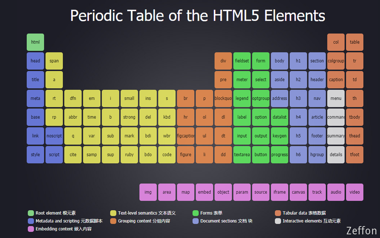

一文介绍**html5**基础：语义化、文本元素、HTML 实体、a 元素、路径写法、图片元素、多媒体元素、容器元素、元素包含关系...

<!--truncate-->

## 基础

### 注释

注释为代码的阅读者提供帮助，注释不参与运行
​

### 元素

> 其它叫法 标签

```html
<a href="https://www.baidu.com">百度</a>
```

整体： element (元素)
元素 = 起始标记（begin tag） + 结束标记 （end tag）+ 元素内容
​

有些元素没有结束标记，这样的元素叫做： **空元素**

```html
<meta charset="UFT-8" />
```

### 元素的嵌套

元素不能相互嵌套
父元素、子元素、祖先元素、后代元素、兄弟元素（拥有同一个父元素的两个元素）
​

### 标准的文档结构

1. HTML: 页面、HTML 文档

文档声明： 告诉浏览器当前文档使用的 HTML 标准是 HTML5。

> HTML 标准是从 2.0 开始的
> **不写文档声明，将导致浏览器进入怪异渲染模式**

```html
<!DOCTYPE html>
```

2. 根元素

根元素，一个页面最多只能一个，并且该元素是所有其他元素的父元素或祖先元素。
HTML5 版本中没有强制要求书写该元素

```html
<html lang="en"></html>
```

lang 属性：language，全局属性，表示该元素内部使用的文字是使用哪一种自然语言书写而成的。
汉语： zh-CN 已经过时，最新使用的是：cmn-hans
​

3. 文档头

文档头，文档头内部的内容，不会显示到页面上。

```html
<head></head>
```

​

4. 元数据

文档的元数据：附加信息。
charset：指定网页内容编码

> 计算机中，低压电（0 ~ 2 V）表示 **0**，高压电（2 ~ 5 V）表示 **1。**
> 计算机中，只能存储数字。遇到文字时，只能将文字和数字进行对应，比如 a -- 97。该字典叫做字符编码表。
> 国内中文编码表：GB2312，台湾的中文编码表：GBK

```html
<meta charset="UTF-8" />
```

> **UTF-8** 是 **Unicode **编码的一个版本。

​

5. 适配手机端

```html
<meta name="viewport" content="width=device-width, initial-scale=1.0" />
```

​

6. 兼容 IE

告诉浏览器，如果你是 IE 浏览器的话，那么使用内核的时候建议使用 Edge 的内核。

```html
<meta http-equiv="X-UA-Compatible" content="ie=edge" />
```

​

7. 网页标题

```html
<title>我的网站</title>
```

8. 文档体

```html
<body></body>
```

​

## 语义化

### 什么是语义化

1. 每一个 HTML 元素都有具体的含义，

a 元素：超链接
p 元素：段落
h1 元素：一级标题

2. 所有元素与展示效果无关

元素展示到原页面中的效果，应该由 CSS 来决定。
因为浏览器带有默认的 CSS 样式，所以每个元素都有一些默认样式

> **重要：选择什么元素，取决于内容的含义，而不是显示出的效果**

​

### 为什么需要语义化？

1. 为了搜索引擎优化（SEO）

搜索引擎：百度、搜搜、Bing、Google
每隔一段时间，搜索引擎会从整个互联网中，抓取页面源代码。
​

2. 为了浏览器理解网页

阅读模式、语音模式（安装插件）
​

## 文本元素

HTML5 中支持的元素：[HTML5 元素周期表](https://www.xuanfengge.com/funny/html5/element/)。


### h

标题： head
h1 ~ h6 表示一级标题到六级标题

### p

段落：paragraphs

> lorem, 乱数假文，没有任何实际含义的文字

```html
p*6>lorem
```

### span[无语义]

没有语义，仅用于设置样式

> 某些元素在显示时会独占一行（块级元素），而某些元素不会（行级元素）
> 在 HTML5 中，已经弃用这种说法。
> 根据 w3c 标准：这是元素的语义化的问题，所有元素与展示效果无关。

### pre

预格式化文本元素
空白折叠：在源代码中的连续空白字符（空格、换行、制表），在页面显示时，会被折叠为一个空格。
例外：在 pre 元素中的内容不会出现空白折叠
在 pre 元素内部出现的内容，会按源代码格式显示在页面上。
该元素通常用于在网页中显示一些代码
pre 元素功能的本质：他有一个默认的 css 属性

> code： 显示代码时，通常在外面套 code 元素，code 元素表示代码区域。

​

## HTML 实体

[实体字符](https://developer.mozilla.org/zh-CN/docs/Glossary/Entity)，HTML Entity
实体字符通常用于在页面中显示一些特殊符号。书写分为两种

1. &单词;
1. &#数字;

比如写出小于符号：lt 表示为 <, 需要** & **和 **；**

```html
<body>
  在页面，表示段落使用： &lt;
</body>
```

| 字符 | 实体   | 说明                                                                                             |
| ---- | ------ | ------------------------------------------------------------------------------------------------ |
| &    | &amp;  | 解析为实体或字符引用的开头                                                                       |
| <    | &lt;   | 解析为 [tag](https://developer.mozilla.org/zh-CN/docs/Glossary/Tag) 的开头                       |
| >    | &gt;   | 解析为 [tag](https://developer.mozilla.org/zh-CN/docs/Glossary/Tag) 的结尾                       |
| ©    | &copy; | 版权                                                                                             |
| 空格 | &nbsp; | &nbsp;                                                                                           |
| "    | &quot; | 解析为 [attribute ](https://developer.mozilla.org/zh-CN/docs/Glossary/Attribute)的值的开头和结尾 |

## a 元素

超链接
​

### herf 属性

hyper reference（引用）：通常表示跳转地址

1. 普通链接

```html
<a href="https://www.baidu.com">百度</a>
```

2. 锚链接（通过属性 id 来实现跳转）

id 属性：全局属性，表示元素在文档中的唯一编号

```html
<a href="chapter1">章节1</a>
<h2 id="chapter1">章节1</h2>

// 生成6个章节，每个章节中的段落字数1000
((h2[id="chapter$"]>{章节$})+p>lerem1000)*6 // 生成对应的目录
a[href="#chapter$"]*6>{章节$} // 回到顶部
<a href="#">回到顶部</a>
```

> 区别：超链接与锚点本质是一样的，都是跳转，是会改变 url，但是锚点在同一个页面时不刷新页面的。

3. 功能链接

点击后，触发某个功能：

- 执行 JS 代码（ 加上 javascript: ）
- 发送邮件，mailto: (要求用户计算机上安装邮件发送软件：exchange)
- 拨号，tel: （计算机需要安装有拨号软件，或者使用的是移动端访问）

```html
<a href="javascript:alert('你好！')"> 弹出：你好！ </a>
<a href="mailto:ZeffonWu@gmail.com"> 点击给我发送邮件 </a>
<a href="tel:13800000000"> 点击给我拨打电话 </a>
```

### target 属性

表示跳转窗口位置，
target 的取值：
\_self: 在当前页面窗口打开，默认值
\_blank: 在新窗口打开

### titile 属性

鼠标移上去显示的提示文字
​

## 路径的写法

### 站内资源和站外资源

站内资源：当前网站的资源
站外资源：非当前网站的资源
​

### 绝对路径和相对路径

站外资源：绝对路径
站内资源：相对路径
​

1. 绝对路径

绝对路径的书写格式：
url 地址：

```html
协议名://主机名:端口号/路径 schema://host:port/path
```

> 协议名：http、https、file

当跳转目标和当前页面的协议相同时，可以省略协议（省略 协议名: //需要保留）
​

2. 相对路径

以** ./ **开头 ** ./ **表示当前目录 （是可以省略的）
**../** 返回上一级目录
​

## 图片元素

## img 元素

image 缩写，空元素
**src **属性：source
**alt **属性：当图片资源失效时，将使用该属性的文字替代图片

```html

```

### 和 a 元素联用

```html
<a target="_blank" href="https://www.baidu.com">
  
</a>
```

### 和 map 元素

map： 地图
map 的子元素：area
衡量坐标时，为了避免衡量误差，需要使用专业的衡量工具（PS）

```html
<a target="_blank" href="https://www.baidu.com">
  
</a>
<map name="solarMap">
  <!-- shape：形状   circle 圆   rect 矩形   poly 多边形  -->
  <!-- coords: 坐标  circle x轴 y轴 半径   rect 需要四点坐标 -->
  <area
    shape="circle"
    coords="360,204,48"
    href="./木星.png"
    alt="木星"
    target="_blank"
  />
</map>
```

### 和 figure 元素

指代、定义，通常用于把图片、图片标题、描述包裹起来
子元素：figcaption

```html
<figure>
  <a target="_blank" href="https://www.baidu.com">
    
  </a>
  <figcaption>
    <h2>太阳系</h2>
  </figcaption>
  <p>这是太阳系的描述</p>
</figure>
```

## 多媒体元素

### video 视频

**controls:** 控制控件的显示，取值只能为 controls

> 某些属性，只有两种状态：1. 不写 2. 取值为属性名，这种属性叫做布尔属性
> 布尔属性在 HTML5 中可以不用书写属性值

**autoplay: **自动播放属性
**muted: **布尔属性，静音播放
**loop: **布尔属性，循环播放

```html
<video controls autoplay src="./open.mp4"></video>
```

### audio 音频

和**video**视频完全一致

```html
<video controls autoplay src="./open.mp4"></video>
```

### 兼容性

1. 旧版本的浏览器不支持这两个元素
1. 不同的浏览器支持的音频视频格式可能不一致

​

## 列表元素

### 有序列表

**ol：**ordered list
**li： **list item
[type](https://developer.mozilla.org/zh-CN/docs/Web/HTML/Element/ol#attr-type)属性，设置编号的类型：

- a 表示小写英文字母编号
- A 表示大写英文字母编号
- i 表示小写罗马数字编号
- I 表示大写罗马数字编号
- 1 表示数字编号（默认）

编号类型适用于整个列表，除非在 `<ol>` 元素的 `<li>`元素中使用不同的 `type`属性。

```html
<body>
  把大象装进冰箱，总共分几步？
  <ol>
    <li>打开冰箱门</li>
    <li>大象进去了</li>
    <li>关闭冰箱门</li>
  </ol>
</body>
```

> **Note: **这个属性在 HTML4 中弃用，但是在 HTML5 中被重新引入。除非列表中序号很重要（比如，在法律或者技术文件中条目通常被需要所引用），否则请使用 CSS [list-style-type](https://developer.mozilla.org/zh-CN/docs/Web/CSS/list-style-type) 属性替代。

### 无序列表

**ul：**unordered list
**li： **list item
无序列表通常用于制定菜单 或者 新闻列表

### 定义列表

通常用于一些术语的定义
**dl： **definition list
**dt： **definition title
**dd：**definition description

## 容器元素

容器元素：该元素代表一个块区域内部用于放置其它元素

### div 元素

没有语义

### 语义化容器元素

**header：**通常用于表示页头，也可以用于表示文章的头部
**footer：**通常用于表示页脚，也可以用于表示文章的尾部
**article:** 通常用于表示整篇文章
**section：**通常用于表示文章的章节
**aside: **通常用于表示侧边栏
​

## 元素包含关系

以前：块级元素可以包含行级元素，行级元素不可以包含块级元素，a 元素除外
元素的包含关系由元素的内容类别决定。
可以去[MDN](https://developer.mozilla.org/zh-CN/docs/Web/HTML/Element)查看
例如，查看 h1 元素中是否可以包含 p 元素（搜索 h1 mdn）
​

总结：

1. 容器元素中可以包含任何元素
1. a 元素中几乎可以包含任何元素
1. 某些元素有固定的子元素（ul>li，ol>li， dl>dt+dd）
1. 标题元素和段落元素不能相互嵌套，并且不能包含容器元素

​
