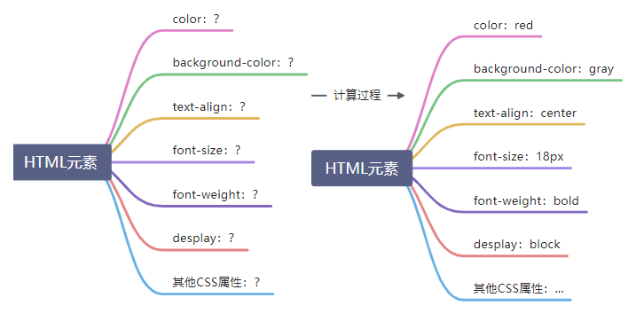

一文介绍 **css** 基础：网页样式、样式声明、选择器、层叠、继承、css 属性值、盒模型、常规流...

<!--truncate-->

## 为网页添加样式

CSS 规则 = 选择器 + 声明块

```css
h1 {
  color: red;
  background-color: lightblue;
  text-align: center;
}
```

### 选择器

选择器：选择元素

1. ID 选择器：选中的是对应 id 值的元素
1. 元素选择器
1. 类选择器

### 声明块

出现在打括号中
声明块中包含很多声明（属性），每一个声明（属性）表达了某一方面的样式

### CSS 代码书写位置

1. 内部样式元素

书写在 **style** 元素中

2. 内联样式表，也叫元素样式表

直接书写在元素的 **style** 属性中

3. 外部样式表

将样式书写在独立的 css 文件中，通过 **link** 元素进行链接

1.  外部样式可以解决多页面样式重复的问题
1.  有利于浏览器缓存，从而提高页面响应速度
1.  有利于代码分离（HTML 和 CSS），更容易阅读和维护

## 常见样式声明

1. color

元素内部的颜色
**预设值**：定义好的单词
**三原色，色值**：光学三原色（红、绿、蓝），每个颜色可以使用 **0 ~ 255**之间的数字来表达，色值。

```
rgb表示法（分别是红、绿、蓝）：
rgb(0, 255, 0)

hex（16进制）表示法（前两位红，中间两位绿，后两位蓝，如果两个相同可以进行简写）：
淘宝红   #ff4400  ->  #f40
```

2. background-color

元素背景颜色

3. font-size

元素内部文字的尺寸大小

1.  **px**：像素，简单理解为文字的高度占多少个像素
1.  **em**：相对单位，相对父元素的字体大小

每个元素必须有字体大小，如果没有声明，则直接使用父元素的字体大小；
如果没有父元素（html），则使用基准字号（浏览器设置的字号）。

> user agent stylesheet ，UA，用户代理（浏览器）

4. font-weight

文字粗细程度，可以取值数字，可以取值为预设值（比如正常 **normal** 相当 400，加粗 **bold** 相当 700）

> strong 元素，默认加粗。

5. font-family

文字类型：微软雅黑、consolas 等
必须用户计算机中存在的字体才会有效。
使用多个字体，以匹配不同环境。

6. font-style

字体样式，通常用它设置**斜体**，normal 正常。

> **i**元素，**em** 元素，默认样式是倾斜字体；实际使用中，通常用它来表示一个图标（icon）

7. text-decoration

文本修饰，给文本加线。
中间加线：line-through; 上面加线： overline; 下面加线：underline;

> **a**元素可以设置** text-decoration **的值为** none; **则不会有下划线
> **del**元素：错误的内容
> **s**元素：过期的元素

8. text-indent

首行文本缩进

9. line-height

每行文本的高度，该值越大，每行文本的距离越大
设置行高为容器的高度，可以让单行文本垂直居中
行高可以设置为纯数字，表示相对于当前元素的字体大小

10. width

宽度

11. height

高度

12. letter-space

文字间隙

13. text-align

元素内部文字的水平排列方式

### 透明

每个颜色都具有透明通道， **0 ~ 1**

1. rgba(红，绿，蓝，alpha)
1. hex：#红绿蓝透

## 选择器

选择器：帮助你精准的选中想要的元素

### 简单选择器

1. ID 选择器
1. 元素选择器
1. 类选择器
1. 适配符选择器

\*，选中所有元素

5. 属性选择器

根据属性名和属性值选中元素，以 **[]** 来进行筛选。具体的语法使用可以查看 MDN 的[属性选择器](https://developer.mozilla.org/zh-CN/docs/Web/CSS/Attribute_selectors)。

6. 伪类选择器

选中某些元素的某种状态

1.  :link：超链接未访问时的状态
1.  :visited：超链接访问过的状态
1.  :hover：鼠标悬停状态
1.  :active：激活状态，鼠标按下状态

爱恨法则：love hate 按照上面的顺序编写

```css
/* 选中鼠标悬停时的a元素 */
a:hover {
  color: red;
}
/* 鼠标按下时的a元素 */
a:active {
  color: blue;
}
```

7. 伪元素选择器

生成并选中某个元素内部的子元素
before
after

```html
<p>第一本CSS相关的书籍 -- <span>CSS世界</span></p>
<style>
  span::before {
    content: "《";
    color: red;
  }
  span::after {
    content: "》";
    color: red;
  }
</style>
```

### 选择器的组合

1. 两个选择器直接结合为**并且**关系
1. 后代元素 --- 空格
1. 子元素 --- >
1. 相邻兄弟元素（指的是下一个） --- +
1. 兄弟元素（指的是后面全部的兄弟） --- ~

:::tip
CSS 没有提供改变之前的兄弟选择器组合，主要跟样式的渲染有光，无法改变之前的样式
:::

### 选择器的并列

多个选择器，用逗号分隔
语法糖

## 层叠

声明冲突：同一个样式，多次应用到同一个元素
层叠：解决声明冲突的过程，浏览器自行处理（权重计算）

### 1. 比较重要性

重要性从高到低：

:::tip
作者样式表：开发者书写的样式
:::

1. 作者样式表的 **!important** 样式
1. 作者样式表中的普通样式
1. 浏览器默认样式表中的样式

### 2. 比较特殊性

选择器
总体规则：选择器选中的范围越窄，越特殊
具体规则：通过选择器，计算出一个 **4** 位数（xxxx）逢 256 进一

1. 千位：如果是内联样式，记**1**，否则记**0**
1. 百位：等于选择器中所有 id 选择器的数量
1. 十位：等于选择器中所有类选择器、属性选择器、伪类选择器的数量
1. 个位：等于选择器中所有元素选择器、伪元素选择器的数量

```html
<!DOCTYPE html>
<html lang="en">
  <head>
    <meta charset="UTF-8" />
    <title>特殊性比较规则</title>
    <style>
      a {
        /* 0001 */
        color: red;
      }
      div ul a {
        /* 0003 */
        color: green;
      }
      #mydiv #myul a {
        /* 0201 */
        color: gray;
      }
      #mydiv #myul .mylink {
        /* 0210 */
        color: #008c8c;
      }
      #mydiv #myul a:link {
        /* 0211 (有伪类选择器:link) */
        color: chocolate;
      }
    </style>
  </head>
  <body>
    <div id="mydiv">
      <ul id="myul">
        <li id="myli">
          <a href="https://www.baidu.com" class="mylink">链接</a>
        </li>
      </ul>
    </div>
  </body>
</html>
```

### 3. 比较源次序

代码书写靠后的胜出

```css
#mydiv #myul .mylink {
  /* 0210 */
  color: #008c8c;
}

#mydiv #myul :link {
  /* 0210 */
  color: chocolate;
}
```

### 应用

1. 重置样式表

书写一些作者样式，覆盖浏览器的默认样式
重置样式表 **->** 浏览器的默认样式
常见的重置样式表：normalize.css、reset.css、meyer.css

2. 爱恨法则

link > visited > hover > active

## 继承

子元素会继承父元素的某些 CSS 属性
某些：通常跟字体内容相关的属性都能被继承
可以在 [MDN](https://developer.mozilla.org/zh-CN/docs/Web/CSS/font) 上查找属性是否能被继承，背景色、宽高是不能被继承的。

## 属性值的计算过程

一个元素一个元素以此渲染，顺序按照页面文档的属性目录结构进行

渲染每个元素的前提条件：该元素所有的 CSS 属性必须有值
一个元素，从所有属性都没有值，到所有的属性都有值，这个计算过程，叫做属性值计算过程。


无属性值 -> 1. 确定声明值 -> 2. 层叠冲突 -> 3. 使用继承 -> 4. 使用默认值 -> 每个属性都有值

### 1. 确定声明值

参考样式表中没有冲突的声明，作为 CSS 属性值。

> 样式表可以是：作者样式表或者是浏览器默认样式表

```html
<h1 class="test">Lorem</h1>
```

作者样式表

```css
.red {
  color: red;
  font-size: 40px;
}
h1 {
  font-size: 26px;
}
div h1.red {
  font-size: 3em;
  font-size: 30px;
}
```

浏览器默认样式表

```css
h1 {
  display: block;
  font-size: 2em;
  font-weight: bold;
}
```

### 2. 层叠冲突

对样式表有冲突的声明使用层叠规则，确定 CSS 属性值。
通过：

1. 比较重要性
1. 比较特殊性
1. 比较源次序

来进行筛选 CSS 属性值

### 3. 使用继承

对仍然没有值的属性，若可以继承，则继承父元素的值

### 4. 使用默认值

对仍然没有值的属性，使用默认值

### 应用

CSS 属性值：

> 红色表示 1.确定声明值时赋值的，橙色则是 2.层叠冲突赋值，黄色是 3.使用继承，绿色是 4.使用默认值

color：red
background：transparent
text-align：center
font-size：30px
font-weight：bold
display：block
其他 CSS 属性：...

### 特殊的两个 CSS 属性

- inherit： 手动（强制）继承，将元素的值应用到该元素
- initial：初始值，将该属性设置为默认值

## 盒模型

box：盒子，每个元素在页面中都会生成一个矩形区域（盒子）
盒子类型：

1. 行盒，**display** 等于 **inline** 的元素（不换行）
1. 块盒，**display** 等于 **block** 的元素（独占一行）

行盒在页面中不换行，块盒独占一行。

> 所以之前 HTML 中的块级元素，行级元素叫法就不准确，原因是显示出来的效果是由 CSS 元素来决定的。

**display**： 默认值为 **inline**
浏览器默认样式表设置的块盒：容器元素、h1 ~ h6、p
常见的行盒：span、a、img、video、audio

### 盒子的组成部分

无论是行盒、还是块盒，都由下面几个部分组成，从内到外分别是：

1. 内容 **content**

**width、height**，设置的是盒子内容的宽高
内容部分通常叫做整个盒子的**内容盒 content-box**。

2. 填充 **padding**

盒子边框到盒子内容的距离
**padding-top、padding-right、padding-bottom、padding-left**
**padding**：简写属性
**padding**：上右下左
填充去 + 内容区 = **填充盒 padding-box**

3. 边框 **border**

边框 = 边框宽度 + 边框样式 + 边框颜色
边框宽度：**border-width**
边框样式：**border-style**
边框颜色：**border-color**
边框 + 填充区 + 内容区 = **边框盒 border-box**
速写属性：**border**

4. 外边框 **margin**

边框到其它盒子的距离
**margin-top、margin-right、margin-bottom、margin-left**
速写属性：**margin**

## 盒模型应用

### 改变宽高范围

默认情况下：**width** 和 **height** 设置的是内容盒宽高。

> 页面重构师：将 psd 文件（设计稿）制作为静态页面

衡量设计稿尺寸的时候，往往使用的是**边框盒**的尺寸，但设置 **width** 和 **height** 时，则设置的是**内容盒**的尺寸。

1. 精确计算（以前）
1. CSS3：**box-sizing**（默认设置的是 content-box）

```css
div {
  width: 235px;
  height: 51px;
  /* 改变宽高的影响范围，这时候的width盒height设置就是边框盒的宽度和高度 */
  box-sizing: border-box;
}
```

### 改变背景覆盖范围

默认情况下，背景覆盖**边框盒**
可以通过 **background-clip** 进行修改

- border-box ：覆盖到**边框盒**
- padding-box ：覆盖到**填充盒**
- content-box：覆盖到**内容盒**

更多可以在 [MDN ](https://developer.mozilla.org/zh-CN/docs/Web/CSS/background-clip)上查看

### 溢出处理

**overflow**，控制内容
速写属性，有 **overflow-y、overflow-x**。默认是 **visible**，还有 **hidden、scroll、auto**

> overflow-y: auto; 需要滚动条才出现，不需要则不出现

### 断词规则

**word-break**，会影响文字在什么位置被拦截换行
**normal**：普通方式。CJK（中日韩）字符在文字位置截断，非 CJK 在单词位置截断
**break-all**：截断所有。所有字符都在文字处截断
**keep-all**：保持所有，所有文字都在单词之间截断

### 空白处理

**white-space: nowrap;** 不换行
**overflow: hiddden;** 超出部分隐藏
**text-overflow: ellipsis;** 三个圆点省略

> 需要三个属性一起使用，但是只能对单行文本有效，多行需要 js 来处理

**white-space: pre;** 会空白折叠（默认值 normal，不进行空白折叠，nowrap 空白折叠会发生，但不换行）

```html
<!-- pre元素默认样式有white-space: pre; -->
<pre>
		var i = 1;
    console.log(i)
</pre>
```

## 行盒的盒模型

常见的行盒：包含具体内容的元素
**span、strong、em、i、img、video、audio**

### 显著特点

1. 盒子沿着内容沿伸
1. 行盒不能设置宽高

   > 要调整行盒的宽高，应该使用字体大小、行高、字体类型，间接调整。

1. 内边距（填充区）

水平方向有效，垂直方向不会实际占据空间

4. 边框

水平方向有效，垂直方向不会实际占据空间

5. 外边距

水平方向有效，垂直方向不会实际占据空间

### 行块盒

**display: inline-block;** 的盒子

1. 不独占一行
1. 盒模型中所有尺寸都有效

在开发中，经常用来作分页

```html
<style>
  .pager a {
    border: 1px solid #e1e2e3;
    text-decoration: none;
    color: #38f;
    width: 34px;
    height: 34px;
    display: inline-block;
    text-align: center;
    line-height: 34px;
  }

  .pager a:hover {
    border-color: #38f;
    background: #f2f8ff;
  }

  // 为什么在这里需要加上a元素，因为元素的属性值计算时，.pager a:hover 的层叠值比
  // .pager .selected 高，所以加上 a 元素
  .pager a.selected {
    border: none;
    color: #000;
    background: initial;
  }
</style>
<body>
  <div class="pager">
    <a href="">1</a>
    <a href="">2</a>
    <a href="" class="selected">3</a>
    <a href="">4</a>
    <a href="">5</a>
    <a href="">6</a>
    <a href="">7</a>
    <a href="">8</a>
    <a href="">9</a>
    <a href="">10</a>
  </div>
</body>
```

### 空白折叠

空白折叠，发生在行盒（行块盒）内部 或 行盒（行块盒）之间

### 可替换元素 和 非可替换元素

大部分元素，页面上显示的结果，取决于元素内容，称为 **非可替换元素**
少部分元素，页面上显示的结果，取决于元素属性，称为 **可替换元素**
可替换元素： **img**、**video、audio**
绝大部分可替换元素均为行盒。
可替换元素类似于行块盒，盒模型中所有尺寸都有效。

```
object-fit: fill; // 在边框内显示全部图片，破坏比例（默认值）
object-fit: contain; // 保持图片尺寸
object-fit: cover; // 显示全部图片，又要保持图片尺寸，只好牺牲图片信息
```

## 常规流

盒模型：规定单个盒子的规则
视觉可视化模型（布局规则）：页面中的多个盒子排列规则
视觉可视化模型，大体将页面中盒子的排列分为三种方式：

1. **常规流**
1. 浮动
1. 定位

### 常规流布局

常规流、文档流、普通文档流、常规文档流
所有元素，默认情况下，都属于**常规流**布局
总体规则：块盒独占一行，行盒水平依次排列
**包含块**（**containing block**）：每个盒子都有它的**包含块**，**包含块**决定了盒子的排列区域。
绝大部分情况下：盒子的**包含块**，为其父元素的**内容盒**。

```html
<style>
  .parent {
    background: lightbule;
    width: 300px;
    height: 200px;
    border: 2px solid;
    padding: 30px;
  }
  .child {
    border: 2px solid;
    height: 100px;
    background: red;
  }
</style>
<body>
  <div class="parent">
    <div class="child"></div>
  </div>
</body>
```

### 块盒

1. 每个块盒的总宽度，必须刚好等于包含块的宽度

宽度默认值是 **auto**
**margin**的取值也可以是 **auto**，默认值 0
**auto：**将剩余空间吸收掉
**width**吸收能力强于 **margin**
若宽度、边框、内边距、外边距计算后，仍然有剩余空间，该剩余空间被 **margin-right **全部吸收。
在常规流中，块盒在其包含块中居中，可以先定宽，然后左右 **margin**设置为**auto。**

2. 每个块盒垂直方向上的 **auto**值

**height: auto;**适应内容的高度
**margin: auto;**表示 0

3. 百分比取值

**padding**、宽、**margin**可以取值为百分比
以上的所有百分比相对于**包含块**的宽度
高度的百分比：

1.  包含块的高度是否取决于子元素的高度，设置百分比无效（无效）
1.  包含块的高度不取决于元素的高度，百分比相对于父元素高度（有效）
1.  上下外边距的合并

两个常规流块盒，上下外边距相邻，会进行合并
两个外边距取最大值。
