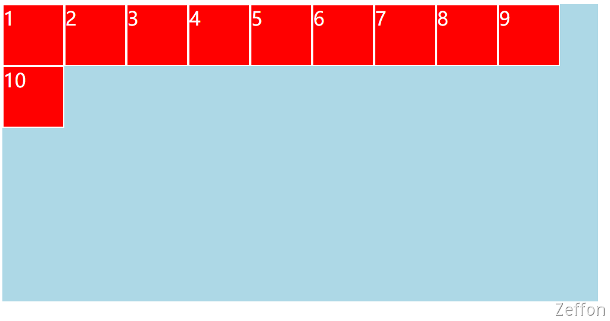
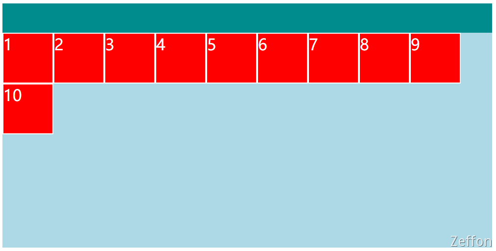
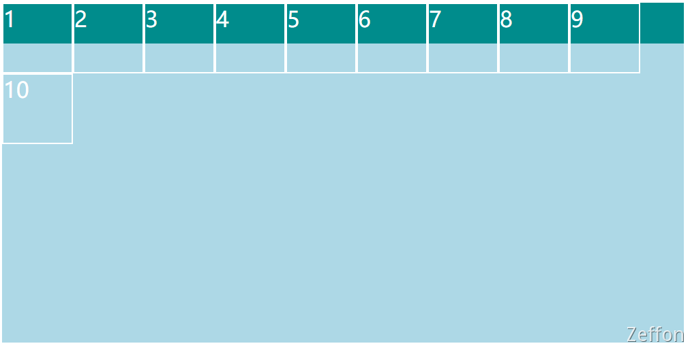
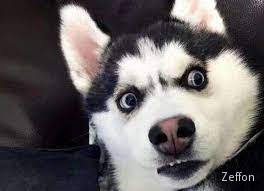
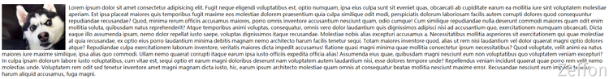
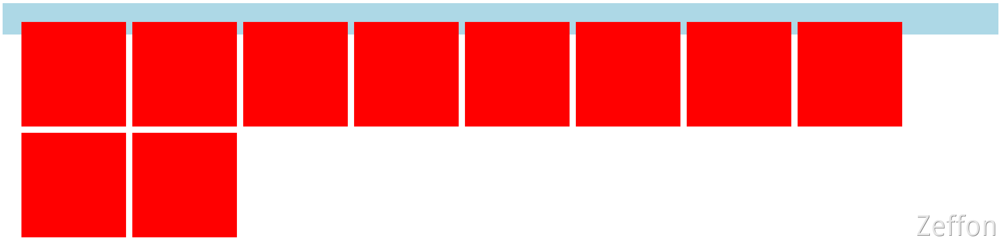
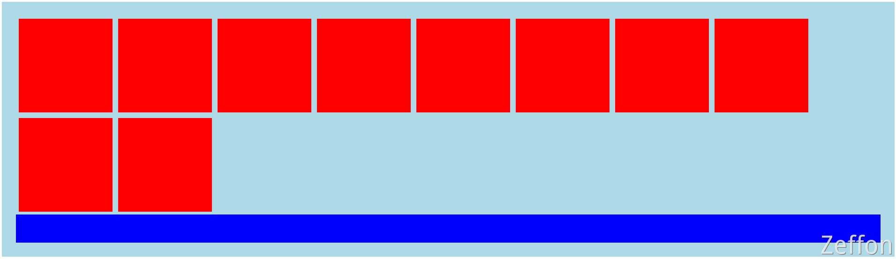

视觉格式模型，大体上将页面中盒子的排列分为三种方式： 常规流、浮动、定位

<!--truncate-->

## 浮动

视觉格式模型，大体上将页面中盒子的排列分为三种方式：

1. 常规流
1. 浮动：**float**
1. 定位：position

### 应用场景

1. 文字环绕
1. 横向排列

### 浮动的基本特点

修改** float **属性值为：

- **left：**左浮动，元素靠上靠左
- **right：**右浮动，元素靠上靠右

默认值为 **none**（不浮动就是常规流）

1. 当一个元素浮动后，元素必定为块盒（更改 display 属性为 block）

```html
<!DOCTYPE html>
<html lang="en">
  <head>
    <meta charset="UTF-8" />
    <title>Document</title>
    <style>
      span {
        border: 1px solid;
        float: left; /* display: block; */
      }
    </style>
  </head>
  <body>
    <span> Lorem ipsum dolor sit. </span>
  </body>
</html>
```

2. 浮动元素的**包含块**，和常规流一样，为父元素的**内容盒**

```html
<!DOCTYPE html>
<html lang="en">
  <head>
    <meta charset="UTF-8" />
    <title>Document</title>
    <style>
      .container {
        width: 500px;
        height: 500px;
        background: lightblue;
      }

      .container div {
        width: 100px;
        height: 100px;
        background: red;
      }

      .container .left {
        float: left;
      }

      .container .right {
        float: right;
      }
    </style>
  </head>
  <body>
    <div class="container">
      <div class="left"></div>
      <div class="right"></div>
    </div>
  </body>
</html>
```

### 盒子尺寸

1. 宽度为 **auto**时，适应内容宽度
1. 高度为 **auto**时，与常规流一致，适应内容的高度
1. **margin**为**auto**，数值为 0
1. 边框、内边距、百分比设置与常规流一样

### 盒子排列

1. 左浮动的盒子靠上靠左排列
1. 右浮动的盒子靠上靠右排列

```html
<!DOCTYPE html>
<html lang="en">
  <head>
    <meta charset="UTF-8" />
    <title>Document</title>
    <style>
      .container {
        width: 1000px;
        height: 500px;
        background: lightblue;
      }
      .item {
        float: left;
        width: 100px;
        height: 100px;
        border: 2px solid;
        background: red;
        color: #fff;
        font-size: 2em;
      }
    </style>
  </head>
  <body>
    <div class="container">
      <div class="item">1</div>
      <div class="item">2</div>
      <div class="item">3</div>
      <div class="item">4</div>
      <div class="item">5</div>
      <div class="item">6</div>
      <div class="item">7</div>
      <div class="item">8</div>
      <div class="item">9</div>
      <div class="item">10</div>
    </div>
  </body>
</html>
```



3. 浮动盒子在包含块中排列时，会避开常规流盒子。（常规流盒子先排列，后面的浮动盒子会避开）

```html
<!DOCTYPE html>
<html lang="en">
  <head>
    <meta charset="UTF-8" />
    <title>Document</title>
    <style>
      .container {
        width: 1000px;
        height: 500px;
        background: lightblue;
      }
      .item {
        float: left;
        width: 100px;
        height: 100px;
        border: 2px solid;
        background: red;
        color: #fff;
        font-size: 2em;
      }
      .normal {
        height: 60px;
        background: #008c8c;
      }
    </style>
  </head>
  <body>
    <div class="container">
      <!-- 常规流盒子 -->
      <div class="normal"></div>
      <div class="item">1</div>
      <div class="item">2</div>
      <div class="item">3</div>
      <div class="item">4</div>
      <div class="item">5</div>
      <div class="item">6</div>
      <div class="item">7</div>
      <div class="item">8</div>
      <div class="item">9</div>
      <div class="item">10</div>
    </div>
  </body>
</html>
```



4. 常规流块盒在排列时，会无视浮动盒子。（先排列浮动盒，再排列常规流块盒会看不到前面浮动盒子的排列，导致浮动盒子会覆盖住常规流块盒。）

```html
<!DOCTYPE html>
<html lang="en">
  <head>
    <meta charset="UTF-8" />
    <title>Document</title>
    <style>
      .container {
        width: 1000px;
        height: 500px;
        background: lightblue;
      }
      .item {
        float: left;
        width: 100px;
        height: 100px;
        border: 2px solid;
        /* background: red; */
        color: #fff;
        font-size: 2em;
      }
      .normal {
        height: 60px;
        background: #008c8c;
      }
    </style>
  </head>
  <body>
    <div class="container">
      <div class="item">1</div>
      <div class="item">2</div>
      <div class="item">3</div>
      <div class="item">4</div>
      <div class="item">5</div>
      <div class="item">6</div>
      <div class="item">7</div>
      <div class="item">8</div>
      <div class="item">9</div>
      <div class="item">10</div>
      <!-- 常规流盒子 -->
      <div class="normal"></div>
    </div>
  </body>
</html>
```



5. 行盒在排列时，会避开浮动盒子
   > 如果文字没有在行盒中，浏览器会自动生成一个行盒包裹文字，该行盒叫做匿名行盒。

```html
<!DOCTYPE html>
<html lang="en">
  <head>
    <meta charset="UTF-8" />
    <title>文字环绕</title>
  </head>
  <body>
    <div class="container">
      
      <p>
        Lorem ipsum dolor sit amet consectetur adipisicing elit. Fugit neque
        eligendi voluptatibus est, optio numquam, ipsa eius culpa sunt sit
        eveniet quas, obcaecati ab cupiditate earum ea mollitia iure sint
        voluptatem molestiae aperiam. Est ipsa placeat maiores quis temporibus
        fugit maxime eos molestiae dolorem praesentium quia culpa similique odit
        modi, perspiciatis dolorum laboriosam facilis autem corrupti dolores
        quod consequuntur repudiandae recusandae? Quod, minima rerum officiis
        accusamus maiores, porro omnis inventore accusantium nesciunt quam, odio
        cumque! Cum similique repudiandae nulla deserunt commodi maiores quam
        odit enim mollitia soluta, quibusdam natus reprehenderit? Atque
        temporibus animi voluptas, consequatur, omnis vero dolor laudantium quis
        dignissimos adipisci nisi ad accusantium quo, exercitationem numquam
        obcaecati. Dicta eaque illo assumenda ipsam, nemo dolor repellat iusto
        saepe, voluptas dignissimos itaque recusandae. Molestiae nobis alias
        excepturi accusamus a. Necessitatibus mollitia asperiores sit
        exercitationem qui quae molestiae at quia recusandae, ex optio eius
        porro laudantium minima debitis magnam nemo architecto harum facilis
        tenetur sequi. Totam maiores inventore quod, alias ut rem nisi
        laudantium vel dolor quaerat magni optio dolores atque? Repudiandae
        culpa exercitationem laborum inventore, veritatis maiores dicta impedit
        accusamus! Ratione quasi magni minima quae mollitia consectetur ipsum
        necessitatibus? Quod voluptate, velit animi ea natus maiores iure maxime
        similique, ipsa alias quo commodi. Ullam nemo quaerat corrupti itaque
        earum ipsa iusto officiis expedita officia alias! Assumenda eius quae,
        quibusdam magni nesciunt eum non voluptatibus quo voluptatem veniam
        excepturi? In culpa ipsam dolorum labore iusto voluptatibus, cum vitae
        est, sequi optio et earum magni doloribus deserunt nam voluptatem autem
        laudantium nisi, esse dolores tempore unde? Repellendus veniam incidunt
        quaerat quae porro rem velit nemo molestias unde. Voluptatem rem odit
        sed tenetur inventore amet magni magnam dicta iusto, hic, earum ipsum
        architecto molestiae quam omnis at consequatur beatae mollitia nesciunt
        maxime error. Recusandae nesciunt eum impedit tenetur harum aliquid
        accusamus, fuga magni.
      </p>
    </div>
  </body>
</html>
```




6. 外边距合并不会发生

### 高度坍塌

高度坍塌的根源：常规流盒子的自动高度，在计算时，不会考虑浮动盒子。
解决：清除浮动，涉及 css 属性：**clear**

- 默认值： **none**
- **left**：清除左浮动，该元素必须出现在前面所有左浮动盒子的下方
- **right**：清除右浮动，该元素必须出现在前面所有右浮动盒子的下方
- **both**：清除左右浮动，该元素必须出现在前面所有浮动盒子的下方




#### 添加一个空元素

这样是有弊端的，会多了一个多余的元素

```html
<!DOCTYPE html>
<html lang="en">
  <head>
    <meta charset="UTF-8" />
    <title>高度坍塌</title>
    <style>
      .container {
        background: lightblue;
        padding: 30px;
      }
      .item {
        width: 200px;
        height: 200px;
        background: red;
        margin: 6px;
        float: left;
      }
      .clearfix::after {
        height: 60px;
        /* background: blue; */
        clear: both;
      }
    </style>
  </head>
  <body>
    <div class="container clearfix">
      <div class="item"></div>
      <div class="item"></div>
      <div class="item"></div>
      <div class="item"></div>
      <div class="item"></div>
      <div class="item"></div>
      <div class="item"></div>
      <div class="item"></div>
      <div class="item"></div>
      <div class="item"></div>
      <div class="clearfix"></div>
      <!-- 这是多余的空元素 -->
    </div>
  </body>
</html>
```

#### 使用伪元素

```html
<!DOCTYPE html>
<html lang="en">
  <head>
    <meta charset="UTF-8" />
    <title>高度坍塌</title>
    <style>
      .container {
        background: lightblue;
        padding: 30px;
      }
      .item {
        width: 200px;
        height: 200px;
        background: red;
        margin: 6px;
        float: left;
      }
      .clearfix::after {
        content: "";
        display: block;
        clear: both;
      }
    </style>
  </head>
  <body>
    <div class="container clearfix">
      <div class="item"></div>
      <div class="item"></div>
      <div class="item"></div>
      <div class="item"></div>
      <div class="item"></div>
      <div class="item"></div>
      <div class="item"></div>
      <div class="item"></div>
      <div class="item"></div>
      <div class="item"></div>
    </div>
  </body>
</html>
```

## 定位

视觉格式模型，大体上将页面中盒子的排列分为三种方式：

1. 常规流
1. 浮动：float
1. 定位：**position**

定位：手动控制元素在**包含块**中的精准位置
涉及的** css **属性：**position**

### position 属性

- 默认值，**static**，静态位置（不定位）
- **relative：**相对定位
- **absolute：**绝对定位
- **fixed：**固定定位

一个元素，只要 position 的取值不是**static**，认为该元素是一个**定位元素**。
定位元素会脱离**文档流**（相对定位除外）
一个脱离了**文档流**的元素：

1. 文档流中的元素摆放时，会忽略脱离了**文档流**的元素
1. 文档流中元素计算自动高度时，会忽略脱离了**文档流**的元素

### 相对定位

不会导致元素脱离文档流，只是让元素在原来位置上进行偏移。
可以通过四个 CSS 属性对设置其位置：

- **left**
- **right**
- **top**
- **bottom**

盒子的偏移不会对其它元素造成任何影响。

> 当设置 **left，**又设置 **right，**以 **left**为准；**top** 和 **bottom**同理，以**top**为准。

```html
<!DOCTYPE html>
<html lang="en">
  <head>
    <meta charset="UTF-8" />
    <title>相对定位</title>
    <style>
      .item {
        height: 50px;
        background: red;
        border: 2px solid #000;
        position: relative;
      }
      .item:nth-child(1) {
        margin-left: 50px;
      }
      .item:nth-child(2) {
        left: 50px;
      }
    </style>
  </head>
  <body>
    <div class="item"></div>
    <div class="item"></div>
    <div class="item"></div>
  </body>
</html>
```

### 绝对定位

1. 盒模型的宽高为** auto**，适应内容
1. **包含块**变化：找**祖先元素**中第一个**定位元素**，该元素的**填充盒**为其**包含块。**若找不到，则它的包含块为整个网页（初始化包含块）

```html
<!DOCTYPE html>
<html lang="en">
  <head>
    <meta charset="UTF-8" />
    <title>绝对定位</title>
    <style></style>
  </head>
  <body>
    <div
      style="width: 1000px; height: 300px; position: relative; padding: 30px; border: 2px solid;"
    >
      <div
        style="width: 800px; height: 200px; padding: 30px; border: 2px solid;"
      >
        <div
          style="width: 100px; height: 100px; background: red; position: absolute; left: 0;"
        ></div>
      </div>
    </div>
  </body>
</html>
```

### 固定定位

其它情况和绝对定位完全一样。
**包含块**不同：固定为视口（浏览器的可视窗口）

### 定位下的居中

某个方向居中：

1. 水平定宽（垂直定高）
1. 将左右（上下）坐标设置为 0
1. 将左右（上下）**margin**设置为 **auto**
   > 绝对定位和固定定位中，**margin** 为 **auto** 时，会自动吸收剩余空间

```html
<!DOCTYPE html>
<html lang="en">
  <head>
    <meta charset="UTF-8" />
    <title>定位下的居中</title>
    <style>
      .item {
        width: 100px;
        height: 100px;
        position: fixed;
        background: red;
        left: 0;
        right: 0;
        top: 0;
        bottom: 0;
        margin: auto;
      }
    </style>
  </head>
  <body>
    <div class="item"></div>
  </body>
</html>
```

### 多个定位元素重叠时

堆叠上下文
设置**z-index**，通常情况下，该值越大，越靠近用户
只有**定位元素**设置 **z-index**有效
**z-index**可以是负数，如果是负数，则遇到常规流、浮动元素，则会被其覆盖

```html
<!DOCTYPE html>
<html lang="en">
  <head>
    <meta charset="UTF-8" />
    <title>多个定位元素重叠时</title>
    <style>
      .item {
        position: absolute;
        width: 70px;
        height: 70px;
        border: 5px solid;
        box-sizing: border-box;
        border-radius: 50%;
      }
      .circle1 {
        left: 0;
        top: 0;
        border-color: blue;
      }
      .circle2 {
        left: 70px;
        top: 0;
        border-color: #000;
      }
      .circle3 {
        left: 140px;
        top: 0;
        border-color: red;
        z-index: 2;
      }
      .circle4 {
        left: 35px;
        top: 40px;
        border-color: yellow;
      }
      .circle5 {
        left: 105px;
        top: 40px;
        border-color: green;
        z-index: 1;
      }
    </style>
  </head>
  <body>
    <div class="item circle1"></div>
    <div class="item circle2"></div>
    <div class="item circle3"></div>
    <div class="item circle4"></div>
    <div class="item circle5"></div>
  </body>
</html>
```

### 补充

- 绝对定位、固定定位元素一定是块盒，
- 绝对定位、固定定位元素一定不是浮动
- 没有外边距合并

## 更多的选择器

### 更多伪类选择器

1. **first-child**

选中第一个子元素
**first-of-type**，选中子元素中第一个指定类型的元素
**a:first-child：**选中 **a**元素，并且 **a** 元素必须是第一个子元素
**a:first-of-type：**选中的是子元素中第一个 **a**元素

2. **last-child**

选中最后一个子元素
**last-of-type：**选中子元素中最后一个指定类型的元素

3. **nth-child**

选中指定的第几个子元素

4. **nth-of-type**

选中指定的第几个子元素指定类型的元素

### 更多的伪元素选择器

1. **first-letter**

选中元素中第一个字母

2. **first-line**

选中元素中第一行的文字

3. **selection**

选中被用户框选的文字

## 更多样式

### 透明度

1. **opacity**：它设置的是整个元素的透明度，它的取值是 **0 ~ 1**
1. 在颜色位置设置 alpha 通道（rgba）

### 鼠标

使用 **cursor**属性设置
cursor: auto; 浏览器自己控制
cursor: pointer; 小手
cursor: url("./img/target.ico"), auto; 自定义鼠标图片

### 盒子隐藏

1. **display: none;** 不生成盒子，会影响其它盒子的排列
1. **visibility: hidden;**生成盒子,只是从视觉上移除盒子，盒子仍占据空间（控制这个属性达到样式闪烁的效果）

### 背景图

### 和 img 元素的区别

**img**元素属于 HTML 的概念
背景图属于 CSS 的概念

1. 当图片属于网页内容时，必须使用 **img**元素
1. 当图片仅用于美化页面时，必须使用背景图

### 涉及的 css 属性

1. **background-image: url("./test.png")**
1. **background-repeat: repeat**

默认情况下，背景图会在横坐标和纵坐标中进行重复
**background-repeat: no-repeat**（速写属性，x 轴 与 y 轴）

3. **backgroun-size**

**background-size: contain;**保证图片完整显示，同时比例不变
**background-size: cover;**保证图片一定撑满区域，同时比例不变
预设值：contain、cover，类似于**object-fit**
数值或者百分比（ 100px 100px; /50% ），控制背景图的尺寸

4. **background-position**

设置背景图的位置
center：横向、纵向居中
center top: 横向居中，靠上
预设值 **left、bottom、right、top、bottom**，通过改变**x 轴 y 轴**来实现位置的变化
数值或者百分比
雪碧图（精灵图）（spirit） 小图标合并成一张图片

```css
/* 在一张雪碧图中，获取通过移动图标的位置，剪切掉尺寸来获取想要的图标 */
.item {
  width: 30px;
  height: 30px;
  background-image: url("imgs/icon.png");
  background-repeat: no-repeat;
  background-position: -47px 38px;
}
```

5. **background-attachment**

通常用它控制背景图是否固定
fixed：背景图相对于视口不动

6. 背景图与背景颜色混用

**background-color，**没有背景图会用该颜色值进行填充

7. 速写（简写）**background**

**background：url(test.png) no-repeat 50% 50%/100% fixed #000;**
先写位置，再写尺寸，用 **/**隔开
