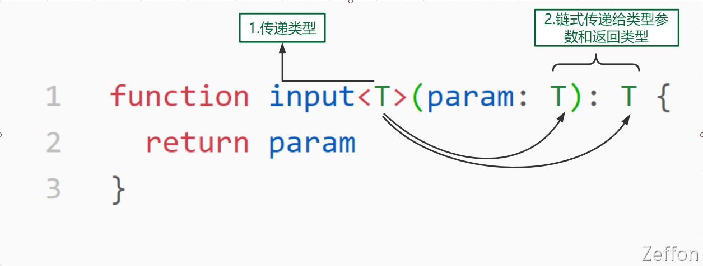

在 Java 中，我们可以使用泛型来封装一些通用的组件或者工具类。泛型的作用使得这些工具类或者组件更加具有灵活，可以接收各种不同的参数类型。同样，在 TypeScript 中，也可以使用泛型达到相同的效果。

<!--truncate-->

## 什么是泛型

**泛型**（**Generics**）是指在定义函数、接口或类的时候，不预先指定具体的类型，而在使用的时候再指定类型的一种特性。
以下就是泛型常见写法：

```typescript
function input<T>(param: T): T {
  return param;
}
```

> 在上面中，出现了三个 **T**，分别是什么，作用是什么，有什么区别吗？

其中 T 代表 **Type**，在定义泛型时通常用作第一个类型变量名称。但实际上我们是可以用其它字母来代替 **T**。除了 **T** 之外，以下是常见泛型变量代表的意思：

- K(Key): 表示对象中的键类型；
- V(Value): 表示对象中的值类型；
- E(Element): 表示元素类型。

在图中，**`<T>`** 表示的是 **inupt** 函数的传递类型，它有 **调用方** 传递具体的参数类型，从而传递至参数 **param**的 **T** 和函数的返回类型 **T**。
在 **input** 函数中，我们接收一个 **param** 参数。**input** 函数并不知道 **param** 是什么类型，用 **T** 来占位表示该参数的类型；而我们函数返回的 **T** 也是未知，由 **`<T>`** 来进行类型的传递工作。


## 泛型初体验

比如有一个 **input** 函数，不加上任何的参数限制。

1. 传入 number 类型的参数 **123，**函数的返回结果 **result1 **是 **any **类型**。**在打印的时候也可以正确的打印出我们想要的结果。
1. 传入 string 类型的参数 **'abc', **函数的返回结果 **result2 **是 **any **类型。结果打印的时候也是 **'abc'**。

上面的结果似乎挺好的，都可以拿到我们自己想要的数值。但是，**any **类型会让我们想要的结果类型太广了，使得返回结果类型我们无法准确地知道是个什么类型的。

```typescript
function input(data) {
  return data;
}
const result1 = input(123);
const result2 = input("abc");
```

所以，将上面的代码应用泛型的，这样，我们在明确地知道** result1 **是** number **类型，**result2 **是 **string **类型。

```typescript
function input<T>(data: T): T {
  return data;
}
const result1 = input(123);
const result2 = input("abc");
```

同时，泛型是支持多个传入的。

```typescript
function swap<T, U>(tuple: [T, U]): [U, T] {
  return [tuple[1], tuple[0]];
}
const result = swap(["string", 123]);
// result 的类型是 [number, string]
```

## 泛型更多应用

### 泛型与类和接口

泛型更多的与接口 **interface **进行组合搭配

```typescript
// 泛型 和 interface
interface KeyPair<T, U> {
  key: T;
  value: U;
}

let kp1: KeyPair<number, string> = { key: 1, value: "str" };
let kp2: KeyPair<string, number> = { key: "str", value: 123 };
```

在下面代码中存在一个问题，它允许你向队列中添加任何类型的数据，当然，当数据被弹出队列时，也可以是任意类型。比如可以向队列中添加 **string **类型的数据，但是 函数外面接收时 queue.pop().toFixed() 四舍五入无法识别 **string**，就会出现我们无法在编译前捕捉到的错误。

```typescript
class Queue {
  private data = [];
  push(item) {
    return this.data.push(item);
  }
  pop() {
    return this.data.shift();
  }
}

const queue = new Queue();
queue.push(1);
queue.push("str");
console.log(queue.pop().toFixed());
console.log(queue.pop().toFixed());
```

将上述的队列采用泛型的方式传递参数，可以规避一些因类型导致在类的内部错误

```typescript
class Queue<T> {
  private data = [];
  push(item: T) {
    return this.data.push(item);
  }
  pop(): T {
    return this.data.shift();
  }
}
const queue = new Queue<number>();
```

### 泛型约束

**在函数内部使用泛型变量的时候，由于事先不知道它是哪种类型，所以不能随意的操作它的属性或方法。**
下面例子中，泛型 T 不一定包含属性 **length**，我们可以给它传入任意类型，当然有些不包括 **length **属性，那样就会报错。

```typescript
function input<T>(arg: T): T {
  console.log(arg.length);
  return arg;
}
```

所以我们对**泛型进行约束**，我们让泛型继承自一个接口 **ILength**，该接口有 **length **属性。这样的话所有传入的任意类型中都会有** length **属性。这样就不会报错了。

```typescript
interface ILength {
  length: number;
}
function input<T extends ILength>(arg: T): T {
  console.log(arg.length);
  return arg;
}

const str = input("str");
const obj = input({ length: 10 });
const arr = input([1, 2, 3]);
```
