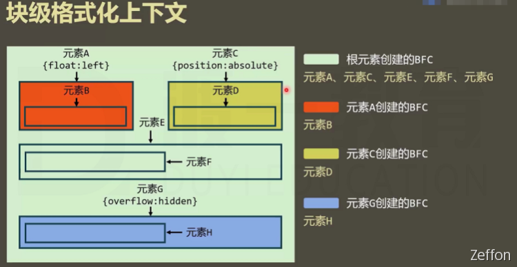
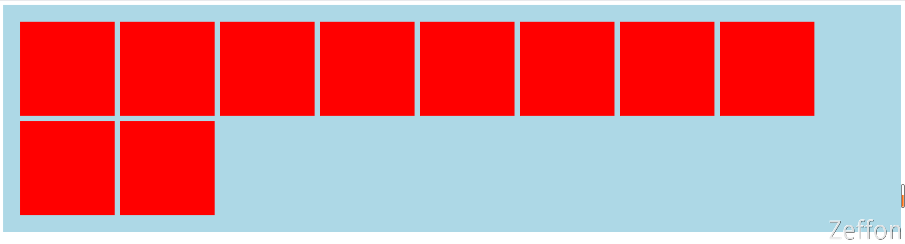

**BFC** 全称 **block Formatting Content**，翻译过来称为块级格式化上下文。
而对于 BFC 就是一个独立的**渲染区域**，它规定了在该区域中，**常规流块盒**（文档流）的布局。

<!--truncate-->

## 初识 BFC

**BFC** 全称 **block Formatting Content，**翻译过来称为块级格式化上下文。
而对于 BFC 就是一个独立的**渲染区域**，它规定了在该区域中，**常规流块盒**（文档流）的布局。
​

### 常规流盒子

首先我们先了解一下常规流块盒的布局规则，在**盒模型**中，是规定了单个盒子的规则。而多个盒子的排列规则，在**可视化模型**中大致上分为三种：

1. 常规流块盒（文档流）
1. 浮动
1. 定位

​
而所有元素默认情况下，都是属于常规流布局。**常规流块盒原本**的布局规则：

- 常规流块盒在水平方向上，必须撑满**包含块（**一般为其父元素的内容盒**）。**
- 常规流块盒在**包含块**的垂直方向上依次摆放。
- 常规流块盒若外边距无缝相邻，则进行外边距合并。
- 常规流块盒的自动高度和摆放位置，**无视浮动元素**。

​

### 什么元素算是 BFC 区域

那么，什么区域才算是 **BFC** 渲染区域呢？
这个区域由某个 HTML 元素创建，以下元素会在**其内部**创建 BFC 区域：

- 根元素（意味着，`<html>`元素创建的 BFC 区域，覆盖了网页中所有的元素）
- **浮动**和**绝对**、**固定**定位元素（）
- **overflow **不等于 **visible **的块盒
- 行块盒（**display：inline-block**）
- 弹性盒子、网格元素（[display](https://developer.mozilla.org/zh-CN/docs/Web/CSS/display) 为 **flex** 或 **inline-flex**、[display](https://developer.mozilla.org/zh-CN/docs/Web/CSS/display) 为 **grid** 或 **inline-grid**）
- 更多在 [MDN](https://developer.mozilla.org/zh-CN/docs/Web/Guide/CSS/Block_formatting_context) 上查看

以上就是比较常见的创建 **BFC** 区域的元素，而在开发中最常见主要有：

- **float: left/right;**
- **display: absolute;**
- **overflow: hidden;**



### BFC 区域的布局

**BFC** 区域最基本的规则：

1. **不同的 BFC 区域，它们进行渲染时互不干扰**
1. **创建 BFC 的元素，隔绝了它内部和外部的联系，内部的渲染不会影响到外部**

**BFC** 区域内的**常规流盒子**布局规则：

1. **创建 BFC 的元素，它的自动高度需要计算浮动元素**
1. **创建 BFC 的元素，它的边框盒不会与浮动元素重叠**
1. **创建 BFC 的元素，不会和它的子元素进行外边距合并**

## BFC 简单应用

### BFC 区域自动高度会计算浮动元素

常规流布局中，常规流块盒的**自动高度**和摆放位置，**无视浮动元素**。也就是说，一个**自动高度**的常规流块盒会看不到其里面**浮动盒子**的排列，所以没法计算浮动盒子的高度，这样会导致常规流盒子的高度无法撑起，形成高度坍塌的问题。
以前浮动元素会造成父元素（常规流）高度坍塌，之前采用的 **clearfix**样式来解决，现在可以将父元素创建 **BFC**区域即可。比如设置成 **float**或者 **position**（这两种会改变盒子的布局），但设置为 **overflow: hidden;**的副作用最小。如果仅仅是解决高度坍塌，还是采用**clearfix**清除浮动最好。

```css
// clearfix 通过在其元素之后新增一个空内容的盒子，清除左右浮动 解决高度坍塌问题
.clearfix::after {
  content: "";
  display: block;
  clear: both;
}
```

**给 container 创建 BFC 区域，计算里面的浮动盒子高度**

```html
<!DOCTYPE html>
<html lang="en">
  <head>
    <meta charset="UTF-8" />
    <title>高度坍塌</title>
    <style>
      .container {
        background: lightblue;
        padding: 30px;
        /* 给 container 创建BFC区域，计算里面的浮动盒子高度 */
        overflow: hidden;
      }
      .item {
        width: 200px;
        height: 200px;
        background: red;
        margin: 6px;
        float: left;
      }
    </style>
  </head>
  <body>
    <div class="container clearfix">
      <div class="item"></div>
      <div class="item"></div>
      <div class="item"></div>
      <div class="item"></div>
      <div class="item"></div>
      <div class="item"></div>
      <div class="item"></div>
      <div class="item"></div>
      <div class="item"></div>
      <div class="item"></div>
    </div>
  </body>
</html>
```




### BFC 区域边框盒不会与浮动元素重叠

> 边框盒 = content + padding + border

常规流盒子排在浮动盒子的后面时，是会无视浮动盒子的。因此两个盒子会重叠排放在一起。但是如果将常规流盒子创建 BFC，则不会与浮动元素重叠。在这里设置两个元素的外边距时，只能设置浮动元素的外边距**margin-right，**设置常规流盒子的 **margin-left**是无效的。

**给 container 创建 BFC 区域，让其边框盒不会与浮动元素重叠**

```html
<!DOCTYPE html>
<html lang="en">
  <head>
    <meta charset="UTF-8" />
    <title>BFC边框盒不会与浮动元素重叠</title>
    <style>
      .float {
        width: 200px;
        height: 200px;
        margin: 20px;
        background: red;
        float: left;
      }
      .container {
        height: 500px;
        background: #008c8c;
        /* 给 container 创建 BFC区域 */
        overflow: hidden;
      }
    </style>
  </head>
  <body>
    <div class="float"></div>
    <div class="container"></div>
  </body>
</html>
```


### BFC 的元素不会和它的子元素进行外边距合并

**给 container 创建 BFC，不会和它的子元素进行外边距合并。**

```html
<!DOCTYPE html>
<html lang="en">
  <head>
    <meta charset="UTF-8" />
    <title>创建BFC的元素，不会和它的子元素进行外边距合并</title>
    <style>
      .container {
        height: 500px;
        background: #008c8c;
        margin-top: 30px;
        /* 给container创建BFC，不会和它的子元素进行外边距合并 */
        overflow: hidden;
      }
      .child {
        height: 100px;
        margin: 50px;
        background: red;
      }
    </style>
  </head>
  <body>
    <div class="container">
      <div class="child"></div>
    </div>
  </body>
</html>
```


