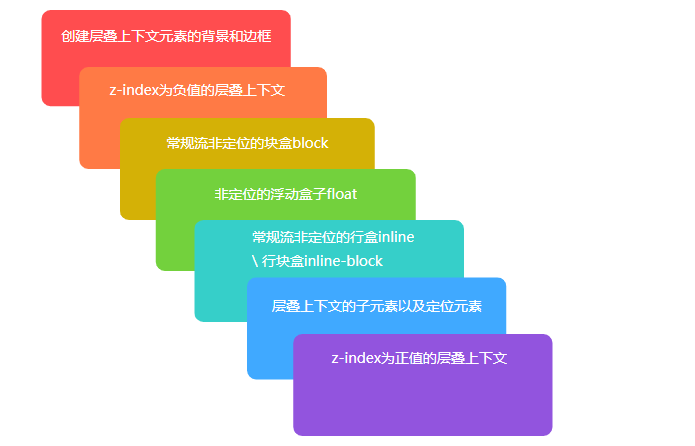
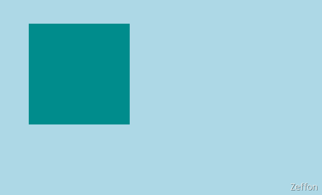
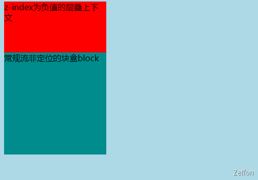
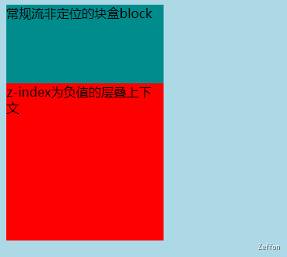
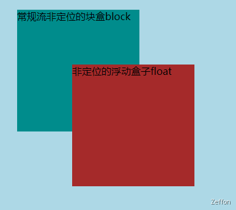
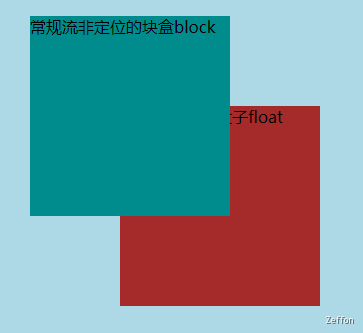
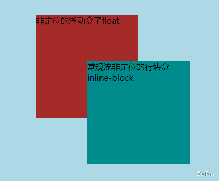
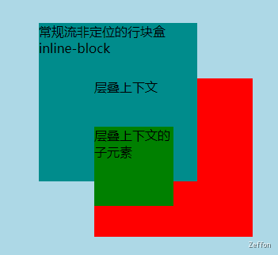
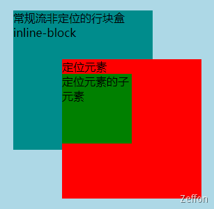

在可视化平面上，我们很容易就可以根据水平和垂直方向规定出坐标轴中的**X**轴和 **Y**轴。但是，还有一条 **Z**轴的存在（垂直于平面的轴线）。也就是 Z 轴相当是我们望向平面的轴线。

<!--truncate-->

## 初识层叠上下文

在可视化平面上，我们很容易就可以根据水平和垂直方向规定出坐标轴中的** X **轴和 **Y **轴。但是，还有一条 **Z **轴的存在（垂直于平面的轴线）。也就是 Z 轴相当是我们望向平面的轴线。
​

层叠上下文（**stack context**），也称为 **堆 / 栈**叠上下文，它是一块区域，这块区域由某个元素创建，它规定了该区域中的内容在 **Z**轴上排列的先后顺序。而这个层叠水平是受**CSS** **z-index**属性值影响的。

创建层叠上下文的元素有很多，但是常见有如下的元素：

1. html 元素（根元素）
1. 设置了 **z-index** 数值（非**auto**）的定位元素
1. 设置了 **z-index** 数值（非**auto**）的 **flex **容器的子元素
1. 设置了 **z-index** 数值（非**auto**）的 **grid **容器的子元素
1. 更多可在 [MDN ](https://developer.mozilla.org/zh-CN/docs/Web/CSS/CSS_Positioning/Understanding_z_index/The_stacking_context#%E5%B1%82%E5%8F%A0%E4%B8%8A%E4%B8%8B%E6%96%87)上查看
   > **注意：每个层叠上下文，独立于其它层叠上下文，它们之间不能相互穿插。**

## 层叠上下文的顺序规则

在**同一个**层叠上下文中，元素的渲染顺序是由区别的。通常我们可能只关注将** z-index** 设置为正值，便可以实现将想要渲染的元素覆盖住其他元素，显示在最“上层”。
但是元素的层叠水平不能等同于 CSS 的 **z-index** 属性。某些情况下 **z-index** 确实可以影响层叠水平，但这个只限于同一个层叠上下文中。在实际开发中，我们应该尽量避免使用 z-index 来控制层叠的顺序。更多的是采用如下的规则来渲染元素的层叠顺序。
顺序规则遵循以下规则（数值越大越靠近用户）：

1. 创建层叠上下文元素的背景和边框
1. z-index 为负值的层叠上下文
1. 常规流非定位的块盒 block
1. 非定位的浮动盒子 float
1. 常规流非定位的行盒 inline \ 行块盒 inline-block
1. 层叠上下文的子元素以及定位元素
1. z-index 为正值的层叠上下文

​

**层叠顺序图可以更加直观的体现出它们的顺序关系**，图表如下：


## 比较测试

### 比较一

创建层叠上下文元素的背景和边框 与 z-index 为负值的层叠上下文

```html
<!DOCTYPE html>
<html lang="en">
  <head>
    <meta charset="UTF-8" />
    <title>创建层叠上下文元素的背景和边框与z-index为负值的层叠上下文</title>
    <style>
      html {
        background: lightblue;
      }
      .container {
        background: #008c8c;
        width: 200px;
        height: 200px;
        margin: 50px;
        z-index: -100;
      }
    </style>
  </head>
  <body>
    <div class="container"></div>
  </body>
</html>
```



### 比较二

z-index 为负值的层叠上下文 与 常规流非定位的块盒 block

```html
<!DOCTYPE html>
<html lang="en">
  <head>
    <meta charset="UTF-8" />
    <title>z-index为负值的层叠上下文与常规流非定位的块盒block</title>
    <style>
      html {
        background: lightblue;
      }
      .container {
        width: 200px;
        height: 200px;
        background: red;
        z-index: -100;
      }
      .normal {
        background: #008c8c;
        width: 200px;
        height: 200px;
        margin-top: -100px;
      }
    </style>
  </head>
  <body>
    <!-- 如果这两个元素顺序颠倒，结果是相反的 -->
    <div class="container">z-index为负值的层叠上下文</div>
    <div class="normal">常规流非定位的块盒block</div>
  </body>
</html>
```



### 比较三

常规流非定位的块盒 block 与 非定位的浮动盒子 float

```html
<!DOCTYPE html>
<html lang="en">
  <head>
    <meta charset="UTF-8" />
    <title>常规流非定位的块盒block与非定位的浮动盒子float</title>
    <style>
      html {
        background: lightblue;
      }
      .container {
        background: #008c8c;
        width: 200px;
        height: 200px;
        /* position: relative; */ /* 如果有定位元素结果相反 */
        margin: 50px;
      }
      .float {
        width: 200px;
        height: 200px;
        float: left;
        background: brown;
        margin-top: -160px;
        margin-left: 140px;
      }
    </style>
  </head>
  <body>
    <div class="container">常规流非定位的块盒block</div>
    <div class="float">非定位的浮动盒子float</div>
  </body>
</html>
```

 

### 比较四

非定位的浮动盒子 float 与 常规流非定位的行盒 inline \ 行块盒 inline-block

```html
<!DOCTYPE html>
<html lang="en">
  <head>
    <meta charset="UTF-8" />
    <title>
      非定位的浮动盒子float与常规流非定位的行盒inline \ 行块盒inline-block
    </title>
    <style>
      html {
        background: lightblue;
      }
      .float {
        width: 200px;
        height: 200px;
        float: left;
        background: brown;
        margin-top: 130px;
        margin-left: 340px;
      }
      .inline-block {
        background: #008c8c;
        width: 200px;
        height: 200px;
        display: inline-block;
        margin-top: 220px;
        margin-left: -100px;
      }
    </style>
  </head>
  <body>
    <div class="float">非定位的浮动盒子float</div>
    <div class="inline-block">常规流非定位的行块盒inline-block</div>
  </body>
</html>
```



### 比较五

```html
<!DOCTYPE html>
<html lang="en">
  <head>
    <meta charset="UTF-8" />
    <title>
      常规流非定位的行盒inline \ 行块盒inline-block 与
      层叠上下文的子元素以及定位元素
    </title>
    <style>
      html {
        background: lightblue;
      }
      .inline-block {
        background: #008c8c;
        width: 200px;
        height: 200px;
        display: inline-block;
        margin-top: 220px;
        margin-left: 500px;
      }
      .auto-absolute {
        display: grid;
        /* z-index: 0; */
        /* position: absolute; */
        margin-top: -130px;
        margin-left: 570px;
        width: 200px;
        height: 200px;
        background: red;
      }
      .item {
        width: 100px;
        height: 100px;
        background: green;
      }
    </style>
  </head>
  <body>
    <div class="inline-block">常规流非定位的行块盒inline-block</div>
    <div class="auto-absolute">
      层叠上下文
      <div class="item">层叠上下文的子元素</div>
    </div>
  </body>
</html>
```



```html
<!DOCTYPE html>
<html lang="en">
  <head>
    <meta charset="UTF-8" />
    <title>
      常规流非定位的行盒inline \ 行块盒inline-block 与
      层叠上下文的子元素以及定位元素
    </title>
    <style>
      html {
        background: lightblue;
      }
      .inline-block {
        background: #008c8c;
        width: 200px;
        height: 200px;
        display: inline-block;
        margin-top: 220px;
        margin-left: 500px;
      }
      .auto-absolute {
        /* display: grid; */
        /* z-index: 0; */
        position: absolute;
        margin-top: -130px;
        margin-left: 570px;
        width: 200px;
        height: 200px;
        background: red;
      }
      .item {
        width: 100px;
        height: 100px;
        background: green;
      }
    </style>
  </head>
  <body>
    <div class="inline-block">常规流非定位的行块盒inline-block</div>
    <div class="auto-absolute">
      定位元素
      <div class="item">定位元素的子元素</div>
    </div>
  </body>
</html>
```


