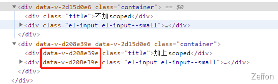
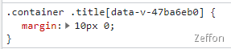
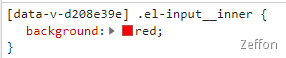

在 Vue 项目中，我们对样式大部分采用全局样式处理，统一地在一个文件全局地修改组件的样式。但是在某些页面需要组件显示特殊的样式，那么在那个页面书写样式 **style**的时候，经常用 **scoped**属性实现组件样式的私有化。这样是确保样式不会受到其它文件的影响。但是，如果要改变 element-ui 某些组件的样式时，即便我们基准地选中样式，会发现样式并没有生效。

<!--truncate-->

## 常见场景

在 Vue 项目中，我们对样式大部分采用全局样式处理，统一地在一个文件全局地修改组件的样式。但是在某些页面需要组件显示特殊的样式，那么在那个页面书写样式 **style **的时候，经常用 **scoped **属性实现组件样式的私有化。这样是确保样式不会受到其它文件的影响。但是，如果要改变 element-ui 某些组件的样式时，即便我们基准地选中样式，会发现样式并没有生效。
以 **el-input **组件为例：

```vue
<style lang="scss" scoped>
.el-input__inner {
  background: red;
}
</style>
```

我们会发现其实 **el-input\_\_inner** 的背景色是不会变红的。

## 原因

其实很大的原因就是 **scoped** 属性所导致的。
我们可以尝试书写两个 el-input 组件，一个有加上**scoped**，一个不加上 **scoped**。
可以清晰地看到加上**scoped**属性的组件，会在对应的元素上多个 **data-v-xxxxxxx** 的属性。

这个 **data-v-xxxxxxx** 属性就是我们采用像 **sass** 或者 **less** 预编译语言在编译之后，给元素随机添加的。
而这个属性会在对应的 **css** 的样式中以 **属性选择器** 的方式加上该属性。
比如下面的 **title** 元素 和 **el-input** 内部元素：

 

所以这样多了个 **data-v-xxxxxxxx** 会造成我们即便精准地选中 **class** 样式，但是效果无法生效的原因。

## 解决方案

### 去掉 scoped

是的，这是由于**scoped**属性所引起，那么我们只要不加上 **scoped** 属性就不会导致样式无法生效的问题了。但是这样的话会影响全局的样式，导致系统内所有该组件的样式都会被该样式所影响。所以这种是十分**不推荐**的。

### 深度选择器

通常我们使用**深度选择器**>>>来解决该问题，可以在 **el-input\_\_inner** 这种深层样式的前面加上**深度选择器，**这样可以通过来命中我们所需要选中**DOM**元素。
而 Vue 的 **style**一般会采用 **sass 或 less** CSS 的预编译语言。因此，**>>>**是无法被它们识别的，通常用 **/deep/** 或者 **::deep** 两种关键词来修饰。

> **less**使用 **/deep/，sass**使用 **::deep**。

```vue
<style lang="scss" scoped>
::v-deep .el-input__inner {
  background: red;
}
</style>
```
