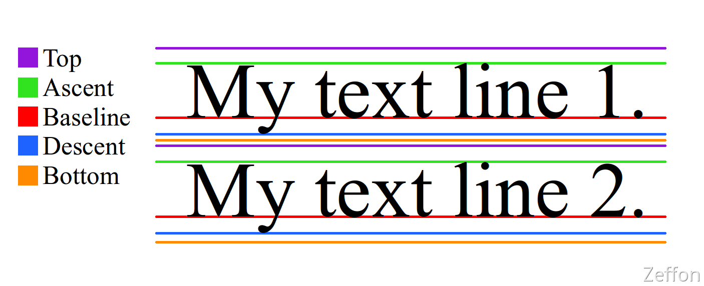

网络上的各式各样的文字是怎么制作出来的？通常是借助 **fontforge** 工具根据不同间距的参考线和字体形态制作而成。而制作字体大致上可以会有**几根**参考线。不同类型的字体，其参考线是不一样（主要体现在线与线的间距），而同一个文字类型，参考线一致。

<!--truncate-->

### 初识参考线

网络上的各式各样的文字是怎么制作出来的？通常是借助 **fontforge**工具根据不同间距的参考线和字体形态制作而成。而制作字体大致上可以会有**几根**参考线。不同类型的字体，其参考线是不一样（主要体现在线与线的间距），而同一个文字类型，参考线一致。
比如下面的参考线：

由上图我们可以知道，参考线其实很类似我们小学练习书写拼音时的四线三格，不过这里是五线四格。中间红色一条是 **基线 Baseline**大部分的字体都以它为对齐标准线。而在基线上面那条绿色 **Ascent**为**上基线；**基线下面那条蓝色**Descent**为**下基线。**最上面的为 **顶线 Top，**最下面的为 **底线 Bottom**。

由图可看出字体上下间是紧密排序的，**line-height、vertical-align**这两个 CSS 属性在视觉效果上是会影响 **字体** 垂直方向的排布的。

而参考线也是会对 **字体大小 font-size**造成影响的。参考线的**顶线**和**底线**之间的距离是文字所占区域大小，称为 **内容区域 content-area**。 一般的 **字体大小** 指的是字体的高度，并不是直接认为是 **content-area**。毕竟每个字体参考线的**顶线**和**底线**之间的距离是不同的。字体大小 会由自身**原本的字体大小** 与 **content-area** 等比缩放。

> 我们在实际中接触与参考线相关的知识主要是**line-height**和**vertical-align**这两个 **css** 属性。

### 行高 line-height

**顶线 Top**向上延申的空间，和 **底线 Bottom**向下延申的空间，两个空间是**相等**，叫做 **间隙 gap**。

**行高 line-height** **=** 参考线原本的**内容区域 content-area** + 两个**间隙 gap**

**gap**默认情况下，是字体设计者决定。**line-height：normal，**默认值，使用文字默认的 **gap**。
而我们改变 **line-height**来实现文字间距的改变，其实就是改变 **gap 空间高度**。

### 垂直对齐方式 vertical-align

一个元素如果子元素出现**行盒**，该元素内部也会产生参考线。而不同字体（文字与图标）的参考线是不一致，这样就会导致他们尽管水平排布但会垂直不对齐。因此需要调整**垂直方向**上是基于那根 **参考线** 进行
**预设值**：

1. baseline：该元素的基线与父元素的基线对齐
1. super：该元素的基线与父元素的上基线对齐
1. sub：该元素的基线与父元素的下基线对齐
1. top-text：该元素的**virtual-area**的顶边，对齐父元素的 **text-top**
1. bottom-text：该元素的**virtual-area**底边，对齐父元素的 **text-bottom**
1. top：该元素的**virtual-area**的顶边，对齐父元素的顶边（该行中最高顶边）（对齐 line-box 的顶边）
1. bottom：该元素的**virtual-area**的底边，对齐父元素的底边（该行中最高底边）（对齐 line-box 的底边）
1. middle：该元素的中线（content-area 的一半），与父元素 **x** 字母高度一般的位置对齐

**数值**：相对于基线的偏移量，向上为正数，向下为负数
**百分比**：相对于基线的偏移量，百分比是相对于自身 **virtual-area** 的高度
