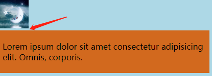

图片空白间隙是怎么出现以及解决方案。

<!--truncate-->

## 图片空白间隙问题

### 图片空白间隙复现

图片空白问题很常见，在设置 **img 元素 **后，在排列其他元素时，会在两者中间形成一个小空白间隙。一般情况，我们可以将其看作元素间的分隔。如果我们想解决这个图片多出来的空白间隙，需要如何解决。



```html
<!DOCTYPE html>
<html lang="en">
  <head>
    <meta charset="UTF-8" />
    <title>图片空白问题</title>
    <style>
      body {
        margin: 0;
        padding: 0;
        background-color: lightblue;
      }
      div {
        padding: 5px;
        background-color: chocolate;
        width: 400px;
      }
    </style>
  </head>
  <body>
    
    <div>
      <p>
        Lorem ipsum dolor sit amet consectetur adipisicing elit. Omnis,
        corporis.
      </p>
    </div>
  </body>
</html>
```

### 空白间隙是怎么产生的

其实这个跟 CSS 参考线有关。在 [CSS 字体参考线](./2021-08-20-css-baseline.md) 中，我们字体一般都是以 **基线 Baseline**为**对齐**来着，可图片的 **display**是 **inline**，这样的**inline**图片与**块盒**的**基线**是不同的。图片的**基线**位置位于下外边距。而**img 元素**的父元素（body 元素）是一个 **块盒** **block**，**图片**的基线与**块盒**的基线并没有对齐，两者错开而导致出现空白间隙。

### 图片空白间隙解决方案

1. 调整垂直居中方式 **vertical-align**，可以是**bottom、middle、top**

```css
img {
  vertical-align: bottom;
}
```

2. **img 元素**设置为 **块盒**，图片为**块盒**与 **父元素块盒 **的基线一致就不会产生空白间隙了。

```css
img {
  display: block;
}
```

3. **img 元素**包裹一个父元素**div 元素，**并修改**行高 line-height 为 0**

```css
.img-parent {
  line-height: 0px;
}
```

> 修改**line-height**其实这是变相 **压缩掉**该**父元素**块盒的**间隙，line-height**是设置参考线之外上下间隙的高度，直接将**line-height**设置**0**，这样父元素没有多余的间隙空间，就不会形成图片空白间隙了。** -- **[**CSS 字体参考线**](./2021-08-20-css-baseline.md)

4. **img 元素**包裹一个父元素**div 元素，**并修改 **字体 font-size 为 0**

```css
.img-parent {
  font-size: 0px;
}
```

> 修改**font-size**其实也是修改**line-height**，该**父元素 div**不管是继承自浏览器还是其他父级元素的**line-height**的，与 **字体 font-size=0**计算后**都是 0。** -- [**line-height 的应用**](./2021-08-27-line-height.md)

## 图片失效时的宽高问题

如果 **img**元素的图片链接无效，**img 元素**会默认给个图片无效的图片标识。但是这样之前原本图片的宽高失效后会对周边元素的布局造成影响。那么我们就需要给 img 元素设置宽高。可是，**img**元素的 **display**为**inline**，这样是无法设置**宽高**数值的。所以需要将 **img** 元素设置为**行块盒**即可。

```html
<!DOCTYPE html>
<html lang="en">
  <head>
    <meta charset="UTF-8" />
    <title>图片失效时的宽高问题</title>
    <style>
      img {
        width: 200px;
        height: 200px;
        border: 2px solid;
        display: inline-block;
      }
    </style>
  </head>
  <body>
    
  </body>
</html>
```
