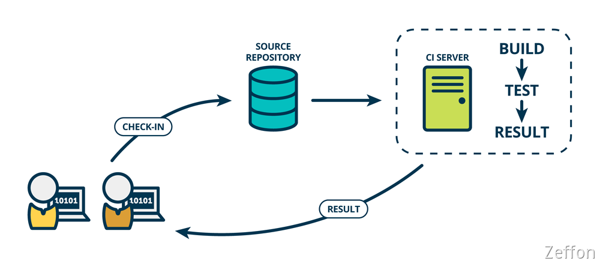
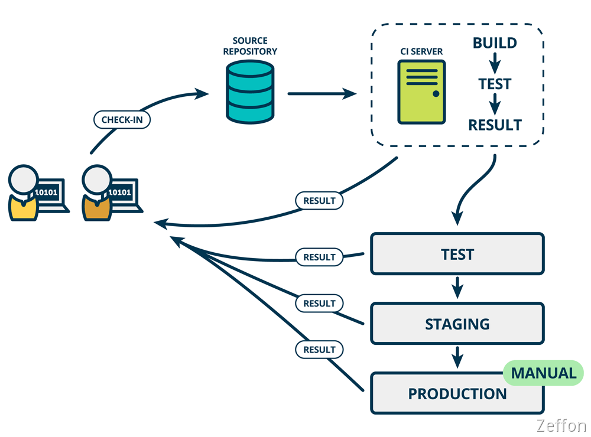
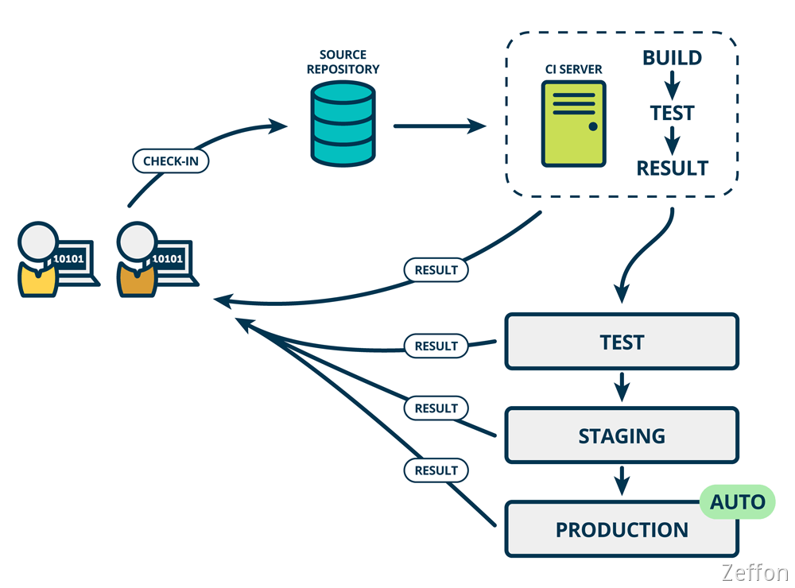

最近常常接触到** CI**、**CD **这两个词汇，所以想系统性地学习一下。找了一下资料，发现国外大佬的[文章](https://www.mindtheproduct.com/what-the-hell-are-ci-cd-and-devops-a-cheatsheet-for-the-rest-of-us/)和阮老师的[文章](https://www.ruanyifeng.com/blog/2015/09/continuous-integration.html)，让我非常受用，特意学习记录一下。

<!--truncate-->

## 持续集成

**持续集成**（英语：Continuous integration，缩写为 **CI**），是一种软件工程流程。它可以**频繁**将代码**自动**集成到主干分支。
​

**持续集成**在开发者提交代码后，会将项目进行构建、（单元）测试。根据测试后的结果，判断提交的代码能否与之前的代码正确地集成在一起。

> **持续集成的目的，就是让产品可以快速迭代，同时还能保持高质量。**它的核心措施是，代码集成到主干之前，必须通过自动化测试。只要有一个测试用例失败，就不能集成。

它的好处是很明显的：

1. **快速发现错误。**每完成一点更新，就集成到主干，可以快速发现错误，定位错误也比较容易。
1. **防止分支大幅偏离主干。**如果不是经常集成，主干又在不断更新，会导致以后集成的难度变大，甚至难以集成。

## 持续交付

**持续交付**（英语：Continuous delivery，缩写为 **CD**），是一种软件工程方法。它是持续集成的延展，指的是频繁地将软件的新版本，交付给质量团队或者用户，以供评审。如果评审通过，代码就进入生产阶段。

> **持续交付**可以看作**持续集成**的下一步。它强调的是，不管怎么更新，软件是随时随地可以交付的。

> 有时候，**持续交付**也与**持续部署**混淆。**持续部署**意味着所有的变更都会被自动部署到生产环境中。**持续交付**意味着所有的变更都可以被部署到生产环境中，但是出于业务考虑，可以选择不部署。如果要实施持续部署，必须先实施持续交付。

## 持续部署

**持续部署**（英语：Continuous deployment，缩写为 CD）是一种软件工程方法。它是**持续交付**的下一步，代码通过评审，自动化部署到生产环境。**持续部署**是可以整合到**持续集成**与**持续交付**的流程之中。

## 流程

**持续集成**、**持续交付**和**持续部署**在项目周期是很有必要存在的，它可以及时测试发现问题，使软件产品能够快速的发布到生产环境中。
而整个**持续集成**是属于核心的一个步骤，后两者都是基于它来延展的，所以**持续集成**是重中之重。
它有如下的流程：

#### 1.代码提交

提交代码到代码仓库中

#### 2.测试（第一轮）

代码仓库对 commit 操作配置了钩子（hook），只要提交代码或者合并进主干，就会跑自动化测试。

> 测试分为：
>
> 1. 单元测试：针对函数或模块的测试
> 1. 集成测试：针对整体产品的某个功能的测试，又称功能测试
> 1. 端对端测试：从用户界面直达数据库的全链路测试

#### 3.构建

通过第一轮测试，代码就可以合并进主干，就算可以交付了。
交付后，就先进行构建（build），再进入第二轮测试。所谓**构建**，指的是将源码转换为可以运行的实际代码，比如安装依赖，配置各种资源（样式表、JS 脚本、图片）等等。

> 常用的构建工具如下。
>
> 1. ​[Jenkins](https://jenkins-ci.org/)
> 1. ​[Travis](https://travis-ci.com/)
> 1. ​[Codeship](https://www.codeship.io/)
> 1. [Strider](http://stridercd.com/)

#### 4.测试（第二轮）

构建完成，就要进行第二轮测试。如果第一轮已经涵盖了所有测试内容，第二轮可以省略，当然，这时构建步骤也要移到第一轮测试前面。
​

第二轮是全面测试，单元测试和集成测试都会跑，有条件的话，也要做端对端测试。所有测试以自动化为主，少数无法自动化的测试用例，就要人工跑。
​

需要强调的是，新版本的每一个更新点都必须测试到。如果测试的覆盖率不高，进入后面的部署阶段后，很可能会出现严重的问题。

#### 5.部署

通过了第二轮测试，当前代码就是一个可以直接部署的版本（artifact）。将这个版本的所有文件打包（ tar filename.tar \* ）存档，发到生产服务器。
生产服务器将打包文件，解包成本地的一个目录，再将运行路径的符号链接（symlink）指向这个目录，然后重新启动应用。这方面的部署工具有[Ansible](https://www.ansible.com/)，[Chef](https://www.chef.io/chef/)，[Puppet](https://puppetlabs.com/)等。

#### 6.回滚

一旦当前版本发生问题，就要回滚到上一个版本的构建结果。最简单的做法就是修改一下符号链接，指向上一个版本的目录。
