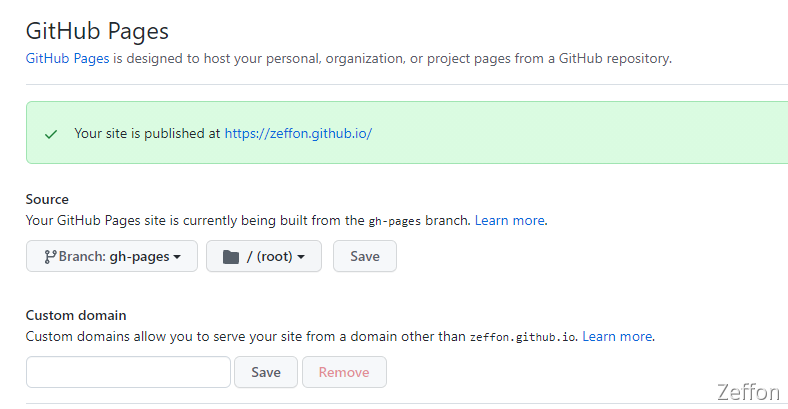
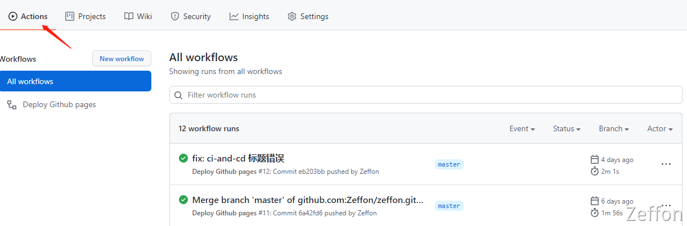

记得2019年使用 Jekyll 和 hoxe 写博客时，那时候还不知道有 github actions，只能手动编译后代码单独将其部署在github pages。后来知道持续集成、github actions后，[docusaurus](https://zeffon.github.io/) 博客使用 actions 特别方便，一提交代码后便会自己编译代码到自指定pages 分支中。

<!--truncate-->

## 基本知识
[GitHub Actions](https://github.com/features/actions) 是 **GitHub** 的[持续集成](https://www.yuque.com/zeffon/blog/ci-and-cd#VczYS)服务，在2018年10月时推出的服务。持续集成由很多操作组成，比如抓取代码、运行测试、登录远程服务器，发布到第三方服务等等。GitHub 把这些操作就称为 actions。
​

GitHub Actions 术语：

1. **workflow**：持续集成一次运行的过程，就是一个 **workflow**。
1. **job**：一个 **workflow** 由一个或多个**jobs** 构成，含义是一次持续集成的运行，可以完成多个任务。
1. **step**：每个** job** 由多个 **step** 构成，一步步完成。
1. **action**：每个 **step** 可以依次执行一个或多个命令（**action**）。

​

## workflow文件
GitHub Actions 的配置文件叫做 **workflow** 文件，存放在项目的根目录的 .github/workflows 目录。
​

该配置文件是很常见的 配置文件格式<YAML>，也就是 **.yml** 文件，文件名称是可以任意命名的，而且也可以有多个 **workflow** 文件。只要 .github/workflows 目录存在 **workflow** 文件，就会自动运行这些文件。
​

```yaml
name: Deploy Github pages
on:
  push:
    branches:
      - master
jobs:
  build-and-deploy:
    runs-on: ubuntu-latest
    steps:
      - name: Checkout
        uses: actions/checkout@master
        with:
          persist-credentials: false
      - name: Install and Build
        run: |
          npm install
          npm run-script build
      - name: Deploy
        uses: JamesIves/github-pages-deploy-action@releases/v3
        with:
          ACCESS_TOKEN: ${{ secrets.ACCESS_TOKEN }}
          BRANCH: gh-pages
          FOLDER: build
          BUILD_SCRIPT: npm install && npm run build
```
上述的配置就是 **workflow** 文件，由以下主要参数（更多可以查看 [官方文档](https://link.segmentfault.com/?url=https%3A%2F%2Fdocs.github.com%2Fen%2Ffree-pro-team%40latest%2Factions%2Freference%2Fevents-that-trigger-workflows) ）：
​

#### name
name 是 workflow 的名称。如果省略该字段，默认为当前workflow的文件名。
​

#### on
on 是 触发 workflow 的条件，通常是某些事件，比如：push、pull_request等
```yaml
on: push
```
我们可以指定到事件具体的分支或者标签
```yaml
on:
  push:
    branches:
      - master
```


#### jobs
jobs 是 workflow文件的主体内容，表示要执行的一项或多项任务。

1. jobs.<job_id>.name:  job_id 是任务的id，name是任务的描述。
```yaml
jobs:
  job1:
    name: This is job1
  job2:
    name: This is job2
```

2. jobs.<job_id>.runs-on: runs-on 运行所需要的虚拟机环境，可以指定操作系统的具体版本或者最新版本
```yaml
jobs:
  job1:
		runs-on: ubuntu-latest
	  # runs-on: ubuntu-18.04
	  # runs-on: windows-latest
	  # runs-on: windows-2020
	  # runs-on: macOS-latest
```

3. jobs.<job_id>.steps: steps 指定每个任务的运行步骤，可以包含一个或多个步骤。每个步骤都可以指定以下三个字段。
```yaml
jobs.<job_id>.steps.name：步骤名称。
jobs.<job_id>.steps.run：该步骤运行的命令或者 action。
jobs.<job_id>.steps.env：该步骤所需的环境变量。
```
​


4. jobs.<job_id>.needs: needs 多个任务时，可以通过job_id来指定当前任务的依赖关系，使得任务的运行顺序按照依赖关系来。
```yaml
jobs:
  job1:
		name: I execute first
  job2:
    name: I need to rely on job1, execute second
    needs: job1
  job3:
    name: I need to rely on job1 and job2, execute finally
    needs: [job1, job2]
```
上面的执行顺序 job1 -> job2 -> job3

## docusaurus博客发布到Github Pages

### 搭建一个docusaurus博客
直接根据[官网教程](https://www.docusaurus.cn/docs/installation)简单搭建一个即可，简单命令如下：
```shell
$ yarn add @docusaurus/init@latest init my-website classic
$ cd my-website
$ yarn install
$ yarn run start
$ yarn run build
```
### 仓库准备
在 **github** 新建一个仓库（作为博客的话，一般命名为**<username>.github.io**）存放博客代码，将代码推送到github上。
​


1. 本地仓库准备：
```shell
$ git init
$ git add .
$ git commit -m "init project"
```

2. 连接远程仓库并推送至master
```shell
$ git remote add origin git@github.com:Zeffon/vue-activity-chart.git
$ git push origin master
```

3. 本地新建 **gh-pages** 分支，并同步至远程

**gh-pages** 分支是用来存放 **master** 分支编译后的代码
```shell
$ git branch gh-pages
$ git checkout gh-pages
$ git push origin gh-pages
$ git checkout master # 再切回master分支，之后gh-pages分支基本不会用到
```
### 项目配置

1. 在项目中 **docusaurus.config.js** 文件中配置下面四个参数
```shell
url: 'https://<username>.github.io',    // 部署后的url
baseUrl: '/',   // 根路径
organizationName: 'username', // 你的用户名
projectName: '<username>.github.io', // 仓库名称

```

2. 在项目根目录建立 **.github/workflows/documentation.yml** 文件
```yaml
name: Deploy Github pages
on:
  push:
    branches:
      - master
jobs:
  build-and-deploy:
    runs-on: ubuntu-latest
    steps:
      - name: Checkout
        uses: actions/checkout@master
        with:
          persist-credentials: false
      - name: Install and Build
        run: |
          npm install
          npm run-script build
      - name: Deploy
        uses: JamesIves/github-pages-deploy-action@releases/v3
        with:
          ACCESS_TOKEN: ${{ secrets.ACCESS_TOKEN }} # 需要在该项目仓库中设置 ACCESS_TOKEN
          BRANCH: gh-pages
          FOLDER: build
          BUILD_SCRIPT: npm install && npm run build
```

3. ​**CNAME**文件

如果部署为自定义域名，可以添加 **CNAME **文件。如果域名为<username>.github.io 可以不添加
```yaml
<username>.github.io
```
> 修改后记得提交代码

### 设置ACCESS_TOKEN
设置 **ACCESS_TOKEN **可以根据[官网教程](https://docs.github.com/cn/authentication/keeping-your-account-and-data-secure/creating-a-personal-access-token)配置。
大致教程：

1. 创建访问Token

用户  ->  Settings  ->   Developer settings  ->  Personal access tokens  -> Generate new token

2. 给项目配置ACCESS_TOKEN

<username.github.io>仓库  ->  Settings  ->  Secrets  ->  New repository secret  ->  取名为ACCESS_TOKEN
​

### 配置GitHub Pages
<username.github.io>仓库  ->  Settings  -> Pages  ->  将Source中切换为 **gh-pages** 分支

### 提交测试
在 **master** 分支推送代码后，就可以在github仓库中的 **action** 查看 **workflow** 文件 **集成状态**。

