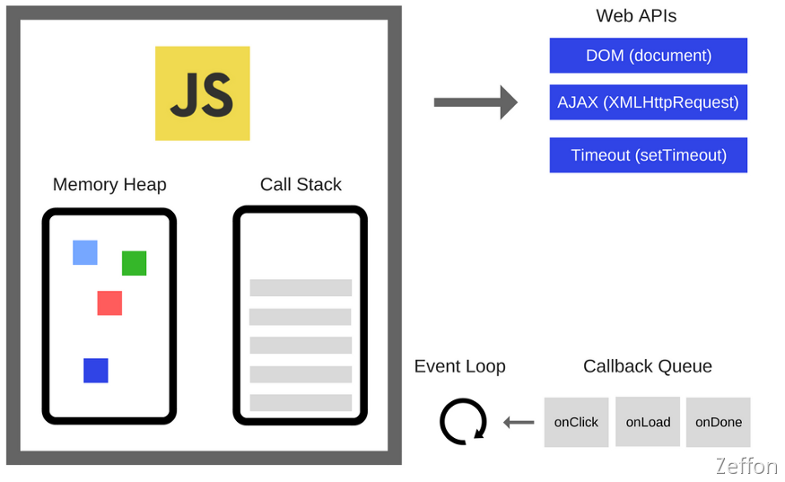
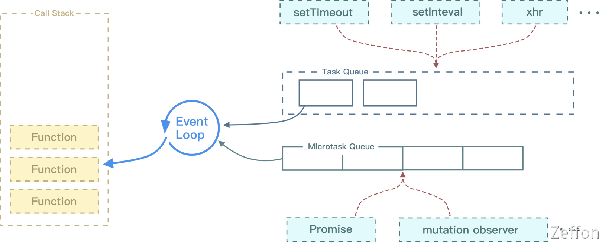

**JavaScript** 是被设计为单线程的，这意味着任务只能一个一个处理。如果某一个任务是 I/O 操作类型的，比如用户输入，那么该操作未完成前，其他所有任务都处于等待状态，这样就会造成页面假死状态，从而导致用户体验极差。为了解决该问题， **JavaScript** 将任务分为**同步任务**和**异步任务**，确保页面的交互和渲染处理能高效进行。
​

<!--truncate-->

## 同步任务

同步任务是会阻塞主线程，当主线程上有任务在排队执行时，后一个任务需要等待前一个任务完整地执行完成后，它才可以被执行。
​

在 **JavaScript** 中，同步任务基本上可以认为是执行 **JavaScript** 代码。而 **JavaScript** 在执行过程中每进入一个不同的运行环境（粗略地理解为一个函数）时，都会创建一个相应的执行上下文。而这些执行上下文，**JavaScript** 解释器采用 **栈** 的方式进行管理。这些**执行上下文**和**函数**之间的调用关系，形成**函数调用栈**（call stack），遵循 FILO（先进后出）的原则）。
​

JavaScript 中代码在**函数调用栈**执行的过程中，会进行以下的处理：

1. 进入全局环境，**全局**执行上下文被创建并添加进**调用栈**中
1. 每调用一个函数，该函数执行上下文会被添加进**调用栈**，并开始执行；
1. 如果正在**调用栈**中执行的 A 函数还调用了 B 函数，那么 B 函数也将会被添加进**调用栈**；
1. 一旦 B 函数被调用，便会立即执行
1. 当前函数执行完毕后，**JavaScript** 解释器将其清出**调用栈**，继续执行当前执行环境下剩余的代码

​

> 由于 JS 的栈与 Java 的栈是很相似的，同样会有栈溢出的情况。
> 如果**函数调用栈**忽略**全局执行上下文**的话，整个函数调用栈执行完函数后是为空栈

由此可见，JavaScript 代码执行过程中，**函数调用栈**栈底永远是**全局执行上下文**，栈顶永远是**当前执行上下文**。
这样的一个函数调用栈结构，可以理解为 JavaScript 中同步任务的执行环境，同步任务也可以理解为 JavaScript 代码片段的执行。
​

因此，同步任务的执行过程中是会阻塞主线程，其它任务只能在当前执行完成后，才能被执行。而如果该任务的执行时间长的话，会导致浏览器长时间处理等待状态，无法执行其它任务，导致浏览器无法处理与用户的其它交互。显然，这样的机制是不够高效的。因此，除了同步任务，浏览器还需要异步任务。
​

## 异步任务

同步任务是不会阻塞主线程，在其任务执行完成之后，会再根据一定的规则去执行相关的回调。

异步任务主要执行：用户交互、HTTP 请求、定时器等这些需要等待响应的任务。
用户交互包括很多操作，比如文字输入、文件选择上传、点击操作...
HTTP 请求就是请求服务端的请求任务，需要服务端返回相应。同样是耗时的 I/O 类型任务。
这些如果不使用异步任务，而是使用同步任务的机制，显然用户的体验是十分糟糕的。
​

异步任务与同步任务采用**函数调用栈**的机制不同，它采用的是**回调队列**的机制，遵循 FIFO（先进先出）的原则。
**JavaScript** 在运行的时候，除了**函数调用栈**之外，还包含了一个待处理的**回调队列**。

JavaScript 中代码在**回调队列**执行的过程中，会进行以下的处理：

1. 异步任务开始执行时，会创建一个回调函数关联着异步任务
1. 异步任务执行结束后，拿到异步结果，该异步任务和与其关联的回调函数会被存放到**回调队列**中
1. **回调队列**会有多个异步任务，但会从最先进入队列的任务开始处理
1. 被处理的任务会被移出队列，该任务的运行结果会作为输入参数，并调用与之关联的**回调函数**，此时会产生一个**函数调用栈**
1. 这时会执行**函数调用栈**中的函数
1. 当**函数调用栈**中的**回调函数**被处理完后，**JavaScript** 才会处理**回调队列**中的下一个异步任务

从上可知，**回调队列**中的**异步任务**最终会在主线程中以**函数调用栈**的方式运行。不同的是，异步任务就需要在执行前提供**回调函数**，当异步任务有了运行结果之后，该任务则会被添加到回调队列中，主线程在适当的时候会从回调队列中取出相应的回调函数并执行。那么会在什么时候取出执行呢？这个就是浏览器的**Event Loop** 机制来控制。

## 任务管理机制

既然任务分有同步任务和异步任务，那么 **JavaScript** 什么时候应该执行同步任务，什么时候应该执行异步任务呢？这个就需要浏览器的 **Event Loop** 机制来管理单线程的 **JavaScript** 中同步任务和异步任务的执行问题。
​

那什么是 **Event Loop** 机制呢？

如上图，在浏览器主线程运行时，会有堆（Memory Heap）和栈（Call Stack），其中堆为内存，栈为函数调用栈。而 **Event Loop** 负责执行代码、收集和处理事件以及执行队列中的子任务，具体包括以下过程：
​

1. **JavaScript** 有一个**主线程**和**函数调用栈**，所有的任务最终都会被放到**调用栈**等待主线程执行。
1. **同步任务**会被放在**调用栈**中，按照顺序等待**主线程**依次执行。
1. **主线程**之外存在一个**回调队列**，**回调队列**中的**异步任务**最终会在**主线程**中以**调用栈**的方式运行。
1. **同步任务**都在**主线程**上执行，栈中代码在执行的时候会调用浏览器的 API，此时会产生一些**异步任务**。
1. **异步任务**会在有了结果后，会将**异步任务**以及关联的**回调函数**放入**回调队列**中。
1. **调用栈**中任务执行完毕后，此时**主线程**处于空闲状态，会从**回调队列**中获取任务进行处理。

​

上述过程会不断重复，这就是 **JavaScript** 的运行机制，称为事件循环机制（**Event Loop**）。

> **Event Loop** 的设计会带来一些问题，比如 setTimeout、setInterval 的 时间精确性。这两个方法会设置一个计时器，当计时器计时完成，需要执行**回调函数**，此时才把**回调函数**放入**回调队列**中。如果当回调函数放入回调队列时，队列中还有大量的回调函数在等待执行，此时就会造成任务执行时间不精确。
> ​

> 要优化这个问题，可以使用系统时钟来补偿计时器的不准确性，从而提升精确度。举个例子，如果你的计时器会在回调时触发二次计时，可以在每次回调任务结束的时候，根据最初的系统时间和该任务的执行时间进行差值比较，来修正后续的计时器时间。

​

## 宏任务和微任务

事件循环中回调队列会有两种队列：宏任务队列（Task Queue）和微任务队列（MicroTask Queue）。

宏任务队列：**script** 全部代码、**setTimeout**、**setInterval**、**setImmediate**（Node.js）、**I/O** 操作、**UI** 渲染
（浏览器）、**requestAnimationFrame**（浏览器）。
​

微任务队列：**Promise**、**Mutation Observer、process.nextTick**（Node.js）。
​

为什么要将异步任务中的回调队列分为宏任务队列和微任务队列呢？
主要是宏任务需要执行上下文（这里指的是资源的切换），微任务不需要执行上下文。这样的结果会导致宏任务的执行时间比较长。所以，为了避免回调队列中等待执行的异步任务（宏任务）过多，从而会导致某些异步任务（微任务）的等待执行的时间过长。为此，在每个宏任务执行完成之后，会先将微任务队列中的任务执行完毕，再执行下一个宏任务。

​

在浏览器的异步回调队列中，宏任务和微任务的执行过程如下：

1. 宏任务队列一次只从队列中取一个任务执行，执行完后就去执行微任务队列中的任务。
1. 微任务队列中所有的任务都会被依次取出来执行，直到微任务队列为空。
1. 在执行完所有的微任务之后，执行下一个宏任务之前，浏览器会执行 UI 渲染操作、更新界面。

​

为此，在浏览器中每个宏任务执行完成后，都会会执行微任务队列中的任务。

:::tip
其实除了浏览器的 **Event Loop** 机制外，Node 也有一套 **Event Loop** 机制。但是在 Node11 后，其 **Event Loop** 跟浏览器保存一致了。
:::
​

​
