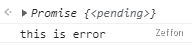
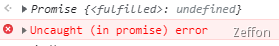

**js**的异常问题在实际项目作用很大，尽管有很多工具做了很多异常捕获和处理。但是，还是需要我们正确地认识 **js** 异常才能提高开发效率。在理解 **js**的异常问题前，先了解一下 《[JS 的任务管理机制](https://www.yuque.com/zeffon/blog/event-loop)》。这样才对 **js** 异常有更好的理解。

<!--truncate-->

对于异常问题，使用 **try catch** 来捕获异常是很简单常见的做法。但并不是所有的 **js** 代码使用 **try catch** 后就能捕获到异常的。在《[JS 的任务管理机制](https://www.yuque.com/zeffon/blog/event-loop)》一文中，我们知道，像 **setTimeout**、**setInterval** 等这种**异步**宏任务队列 或者 **promise** 这种**异步**微任务队列都是在主线程运行后才被执行的，像这种代码进行异常捕获时，我们是无法在主线程上进行捕获到，那我们该如何进行解决？

## 错误类型

在执行 **js** 代码的时候，我们会遇到各种错误问题，不同的错误在浏览器控制台报的错误类型不一样，那么 **js** 会有哪些错误类型呢？首先梳理一下**js**的错误类型。这样可以方便对 **js 异常** 有更多的理解。

在 ECMA-262 中定义了下列 6 种错误类型：

1. EvalError：eval() 的使用与定义不一致
1. RangeError: 数值越界
1. ReferenceError：非法或不能识别的引用数值
1. SyntaxError：语法解析错误
1. TypeError：操作数的类型错误
1. URIError：URI 处理函数使用不当

除了上面的 6 种错误类型外，还有一种 **Error** 错误类型，该类型为错误的基类，其它的错误类型都会继承自它。

## 普通的异常捕获

在编写代码时，除了语法错误外，还很多时候我们都会写错避免写出拼写错误这些编译阶段前的错误。还有，当我们调用**HTTP 请求**的时候，是无法准确知道调用方是否可用，调用后是否成功。所以编写这类的代码片段可能会报错，因此我们需要对该类代码片段进行捕获。那么我们该怎样书写这类代码片段呢？

在 **ECMA-262** 第 3 版中引入了 **try-catch-finally** 语句，作为 **js** 中处理异常的标准方式：

```javascript
try {
  // 可能会导致错误的代码，比如调用HTTP请求
} catch (error) {
  //  当 try 语句发生错误才会执行的代码块
} finally {
  // 无论 try / catch 结果如何都会执行的代码块
}
```

:::tip
**注意：** catch 和 finally 语句都是可选的，但你在使用 try 语句时必须至少使用一个。
:::

可以使用 [**throw** ](https://developer.mozilla.org/zh-CN/docs/Web/JavaScript/Reference/Statements/throw)语句用来抛出一个用户自定义的异常。当前函数的执行将被停止（**throw**之后的语句将不会执行），并且控制将被传递到调用堆栈中的第一个**catch**块。如果调用者函数中没有**catch**块，程序将会终止。

```javascript
function main() {
  try {
    throw new Error("This is a error");
  } catch (e) {
    console.log(e.message);
  }
}
main(); // This is a error
```

当我们使用的是 **try-catch-finally** 语句后

```javascript
function main() {
  try {
    console.log("try");
    throw new Error("This is a error");
  } catch (e) {
    console.log(e.message);
  } finally {
    console.log("finally");
  }
}
main(); // 1.try  2.This is a error  3.finally
```

:::tip
**注意：** 上面的**try-catch-finally**还是简单用法，但是当我们在这三个代码块中加入 **return** 语句就会变得不一样了。**try**和**catch**的中的**return**的值会先缓存起来，并非不执行。**finally**的 return 不会缓存起来而是直接执行，这样会导致整个执行过程**结束掉**。如果**finally**没有 return，那么**try**和**catch**缓存值中 **return** 语句就可以被执行。
:::

## 异步异常的捕获

对于异常问题，使用 **try catch** 来捕获异常是很简单常见的做法。但并不是所有的 **js** 代码使用 **try catch** 后就能捕获到异常的。在《[JS 的任务管理机制](https://www.yuque.com/zeffon/blog/event-loop)》一文中，我们知道，像 **setTimeout**、**setInterval** 等这种**异步**宏任务队列 或者 **promise** 这种**异步**微任务队列都是在主线程运行后才被执行的，像这种代码进行异常捕获时，我们是无法在主线程上进行捕获到。
在 **Promise** 和 **Async/Await** 还没出来的时候，处理异步异常挺难的，只能在其回调函数中进行处理。而有了 **Promise** 和 **Async/Await** 后，处理异步异常的写法变得很简单，但也是仅仅是写法上而已，其内部处理逻辑依然是复杂的。

### 异步异常示例：

```javascript
function main() {
  try {
    setTimeout(() => {
      throw new Error("this is an async error");
    }, 3000);
  } catch (e) {
    console.log("catch-error");
    console.log(e.message);
  }
}

main();
// Uncaught Error: this is an async error
//    at <anonymous>:4:13
```

在上述代码中，并不会像我们想的那样：先打印 'catch-error'，再 **setTimeout** 3 秒后输出 **e.message**。
不会在 catch 中捕获，会导致程序直接报错崩掉。

### 回调函数解决异步捕获

回调函数是作为参数传给另一个函数的函数，然后通过在外部函数内部调用该回调函数以完成某种操作。回调函数属于**异步**任务中的**宏任务**。如果**异步任务**的**回调函数**可以被捕获，那么就可以利用**回调函数**来处理上述例子中**异步任务**无法捕获的问题。

```javascript
const fn = (cb) => {
  cb();
};
function main() {
  try {
    fn(() => {
      throw new Error("this is an async error");
    });
  } catch (e) {
    console.log("error");
  }
}
main(); // error
```

上述代码中，确实可以打印出**error**，捕获到异步任务的异常。但是，使用回调函数来处理异步信息，代码写法很不优雅以及阅读性极差。ES6 中有 **promise** 后，使用 **promise** 来处理异步任务更加方便。

### promise 异步处理方案

**promise**提供了两个参数方法-- **reslove** 和 **reject**。其中的静态函数 **Promise.reject** 返回一个被拒绝的**Promise 对象**。通过使用 [Error](https://developer.mozilla.org/zh-CN/docs/Web/JavaScript/Reference/Global_Objects/Error) 的实例获取错误原因 reason 对调试和选择性错误捕捉很有帮助。所以，**promise** 捕获异常的方法使用起来与上面的例子都不同，它是通过 **promise.catch** 链式调用方法来处理异常捕获的。所以不可以使用 **try-catch** 的方式进行捕获**promise**的异常。

下面就是**错误示例**：

```javascript
function main1() {
  try {
    new Promise(() => {
      throw new Error("promise1 error");
    });
  } catch (e) {
    console.log(e.message);
  }
}

function main2() {
  try {
    Promise.reject("promise2 error");
  } catch (e) {
    console.log(e.message);
  }
}
```

以上两个 **try-catch** 都不能捕获到 **异常**，因为 **promise** 内部的错误并不会冒泡出来，而是被 **promise** 消化掉了。因此，**promise** 只有通过 **promise.catch** 链式方式才可以捕获。而 **promise** 内部的异常错误发生，我们通过 **reject** 和 **throw new Error** 这两种方式对异常进行标识处理。

```javascript
// reject
const p1 = new Promise((reslove, reject) => {
  const r = Math.random();
  if (r < 0.5) {
    reject("error");
  }
});
p1.catch((e) => console.log("p1 error"));

// throw new Error
const p2 = new Promise((reslove, reject) => {
  if (1) {
    throw new Error("p2 error");
  }
});
p2.catch((e) => console.log("p2 error"));
```

> **promise** 处理异常的方式非常常见，现在大部分的类库和包都是使用 **promise** 来抛出异常，比如 **axios**。这样我们在捕获这些异常时，就可以把代码写得优雅通用。

### async/await 异步处理方案

随着 **ES7** 规范的出现，**js** 的异步处理方案迎来的最优方案。**async/await** 被称为 **js** 异步处理的**最终**方案。
**async/await** 这两个关键字的目的就是为了更简洁的方式写出基于 **promise** 的异步代码。那么在异常捕获时，**async/await** 必须配套使用，**async** 关键字主要是声明函数的修饰符，而**await**关键字相当是求值关键字，会堵塞当前进程，等待异步结果处理完成返回。

```javascript
function test() {
  return new Promise((resolve, reject) => {
    setTimeout(function () {
      const r = Math.random();
      if (r < 0.5) {
        reject("error");
      }
    }, 3000);
  });
}

async function main() {
  try {
    await test();
  } catch (error) {
    console.log("this is error");
  }
}
main(); // this is error
```

上述代码中，使用了 **async/await** 就无需使用 **promise.catch** 链式方式来捕获异常，这样的代码更加简洁优雅。

:::tip
**注意：**如果不加上**await**，就会报 **Unhandled promise** 错误：
**(node:5472) [DEP0018] DeprecationWarning: Unhandled promise rejections are deprecated.**
:::

 
