一文介绍 **flex** 弹性布局的用法和常见的布局，更多的内容可以在[**mdn**](https://developer.mozilla.org/zh-CN/docs/Learn/CSS/CSS_layout/Flexbox)阅读。

<!--truncate-->

## 前言

弹性盒子是一种用于按行或按列布局元素的一维布局方法 。元素可以膨胀以填充额外的空间, 收缩以适应更小的空间。

长久以来，CSS 布局中唯一可靠且跨浏览器兼容的创建工具只有 [**float**](https://developer.mozilla.org/zh-CN/docs/Learn/CSS/CSS_layout/Floats) 和 [**position**](https://developer.mozilla.org/zh-CN/docs/Learn/CSS/CSS_layout/Positioning)。这两个工具大部分情况下都很好使，但是在某些方面它们具有一定的局限性，让人难以完成任务。
以下简单的布局需求是难以或不可能用这样的工具（ [**float**](https://developer.mozilla.org/zh-CN/docs/Learn/CSS/CSS_layout/Floats) 和 [**position**](https://developer.mozilla.org/zh-CN/docs/Learn/CSS/CSS_layout/Positioning)）方便且灵活的实现的：

- 在父内容里面垂直居中一个块内容。
- 使容器的所有子项占用等量的可用宽度/高度，而不管有多少宽度/高度可用。
- 使多列布局中的所有列采用相同的高度，即使它们包含的内容量不同。

而使用**flex**弹性盒子可以轻松解决这些问题。

## flex 模型

- **主轴（main axis）**是沿着 flex 元素放置的方向延伸的轴（比如页面上的横向的行、纵向的列）。该轴的开始和结束被称为 **main start** 和 **main end**。
- **交叉轴（cross axis）**是垂直于 flex 元素放置方向的轴。该轴的开始和结束被称为 **cross start** 和** cross end**。
- 设置了 **display: flex** 的父元素被称之为 **flex 容器（flex container）**。
- 在 **flex** 容器中表现为柔性的盒子的元素被称之为 **flex 子项**（**flex item**）。

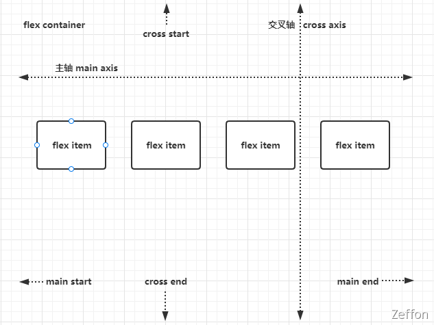

## flex 容器

**flex** 容器当然就是我们设置 **display: flex** 的元素，而 **flex** 容器的属性有：

1. flex-direction
1. flex-wrap
1. justify-content
1. align-items
1. align-content

### flex-direction 改变轴方向

[**flex-direction**](https://developer.mozilla.org/zh-CN/docs/Web/CSS/flex-direction) 属性，它可以指定主轴的方向（弹性盒子子类放置的地方）— 它默认值是 **row**，这使得它们在按你浏览器的默认语言方向排成一排（在英语/中文浏览器中是从左到右）。**flex-direction** 属性取值有：

1. row（默认）
1. row-reverse （从右到左）
1. column（垂直方向，从上到下）
1. column-reverse（垂直方向，从上到下）

1. **flex-direction** 属性取值为：**row**

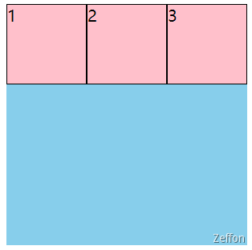

2. **flex-direction** 属性取值为：**row-reverse**

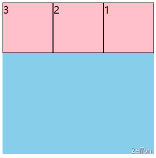

3. **flex-direction** 属性取值为：**column**

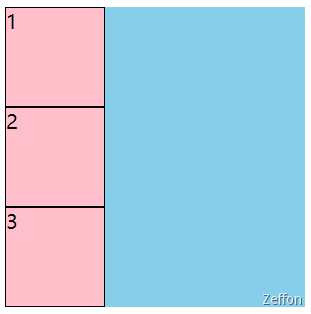

4. **flex-direction** 属性取值为：**column-reverse**

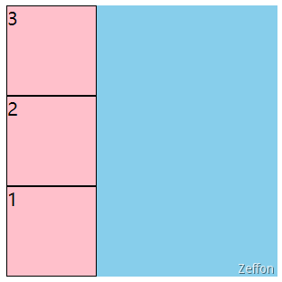

### flex-wrap 换行

当你在布局中使用定宽或者定高的时候，可能会出现问题即处于**flex**容器中的**子项**会溢出，破坏了布局。**flex-wrap** 属性来控制子项溢出情况，是否进行**换行**。

1. **nowrap**（默认，不换行）
1. **wrap**（换行）
1. **wrap-reverse**

1. **flex-wrap** 属性取值为：**nowrap**，如图，子项超出后并不会溢出，而是进行各个子项等比压缩

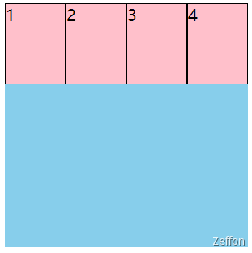

2. **flex-wrap** 属性取值为：**wrap**

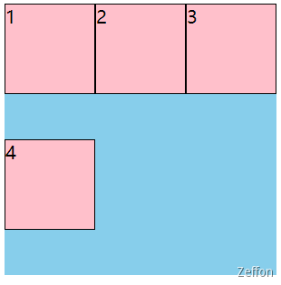

3. **flex-wrap** 属性取值为：**wrap-reverse**

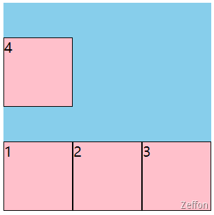

### flex-flow 缩写

**flex-flow** 是 **flex-direction** 和 **flex-wrap** 的缩写

格式：**flex-flow = [flex-direction] [flex-wrap]**，比如：

```css
.container {
  display: flex;
  flex-flow: column wrap;
}
```

### justify-content 主轴对齐

有时候主轴方向的空间没有完全被子项分配掉，所以会剩下一些空间（空隙），那么**flex**是如何解决或者是怎么分配这些（空隙）呢？
**justify-content** 属性来**分配**顺着 **flex** 容器主轴的元素之间及其周围的空间。

> **justify-content** 属性在网格 grid 布局中，是**分配**顺着网格行轴的元素之间及其周围的空间

**justify-content** 是主轴方向的对齐，取值有：

1. flex-start（默认，子项全部**靠左**分布）
1. flex-end（子项全部**靠右**分布）
1. center（居中分布）
1. space-around （最左和最右为其他空隙的 1/2）
1. space-between（除开最左和最右，其它均分空隙）
1. space-evenkly（均分所有空隙）

1. **justify-content** 属性取值为：**flex-start**

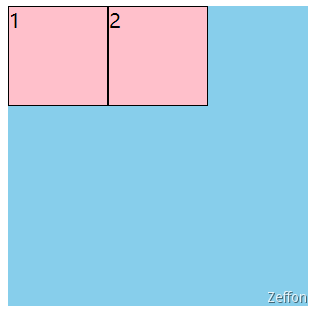

```html
<!DOCTYPE html>
<html lang="en">
  <head>
    <title>Document</title>
    <style>
      .container {
        width: 300px;
        height: 300px;
        background: skyblue;
        display: flex;
        justify-content: flex-start;
      }
      .container div {
        width: 100px;
        height: 100px;
        background: pink;
        border: 1px black solid;
        box-sizing: border-box;
      }
    </style>
  </head>
  <body>
    <div class="container">
      <div>1</div>
      <div>2</div>
    </div>
  </body>
</html>
```

### align-content 交叉轴对齐

同样的交叉轴方向的空间也会没有完全被子项分配掉， **align-content** 属性来**分配**顺着 **flex** 容器交叉轴的元素之间及其周围的空间。

> 该 **align-content** 属性对单行弹性盒子模型无效。（即：带有 **flex-wrap: nowrap**）。

**align-content** 为交叉轴对齐方式，取值有：

1. stretch（默认， 不设置子项的高度会将其 **height** 高度拉伸撑满 **flex** 容器高度）
1. flex-start
1. flex-end
1. center
1. space-around
1. space-bettween
1. space-evenly

1. **align-content** 属性取值为：**stretch**

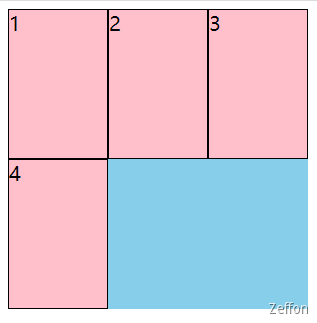

```html
<!DOCTYPE html>
<html lang="en">
  <head>
    <title>Document</title>
    <style>
      .container {
        width: 300px;
        height: 300px;
        background: skyblue;
        display: flex;
        flex-wrap: wrap;
      }
      .container div {
        width: 100px;
        height: 100px;
        background: pink;
        border: 1px black solid;
        box-sizing: border-box;
      }
    </style>
  </head>
  <body>
    <div class="container">
      <div>1</div>
      <div>2</div>
      <div>3</div>
      <div>4</div>
    </div>
  </body>
</html>
```

### align-items 行内对齐

**align-items** 属性可以控制弹性容器中**子项**在当前**行内**交叉轴方向上的对齐方式。**align-items** 属性将所有直接**子项**上的 **align-self** 值设置为一个组。**子项**自己可以设置 **align-self** 属性在其**行内**交叉轴方向上的对齐方式。当**子项**自己设置了 **align-self** 属性时，**flex**容器的 **align-items** 值则不再对它生效。取值有：

1. stretch（默认）
1. flex-start
1. flex-end
1. center
1. baseline

**align-items** 和 **align-content** 的区别：

1. **align-items**作用对象：单个弹性盒子的子项

   **align-items** 属性可以控制弹性容器中**子项**在当前**行内**交叉轴方向上的对齐方式。当**子项**自己设置了 **align-self** 属性时，**flex**容器的 **align-items** 值则不再对它生效。

2. **align-content**作用对象：**多行**弹性盒子（单行弹性盒子是不生效的）

   当弹性容器在交叉轴方向还存在**空白**时，该属性可以控制其中**所有行**的对齐方式。

### gap 间隙

**gap** 属性是用来设置元素行与列之间的间隙（[gutters](https://developer.mozilla.org/zh-CN/docs/Glossary/Gutters)），该属性是 [row-gap](https://developer.mozilla.org/zh-CN/docs/Web/CSS/row-gap) 和 [column-gap](https://developer.mozilla.org/zh-CN/docs/Web/CSS/column-gap) 的简写形式。

格式： **gap = [row-gap] [column-gap]**

:::tip
起初是用 **grid-gap** (en-US) 属性来定义的，有 **gird-row-gap** 、 **gird-column-gap**，目前逐渐被 gap 替代。但是，为了兼容那些不支持 gap 属性的浏览器，你需要像上面的例子一样，使用带有前缀的属性。
不过推荐使用 gap、row-gap 和 column-gap。
:::

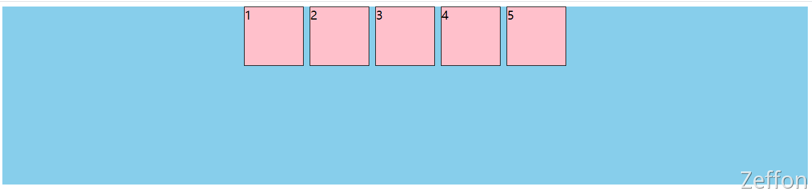

```html
<!DOCTYPE html>
<html lang="en">
  <head>
    <title>Document</title>
    <style>
      .main {
        width: 100%;
        height: 300px;
        background: skyblue;
        display: flex;
        justify-content: center;
        column-gap: 10px;
      }
      .main div {
        width: 100px;
        height: 100px;
        background: pink;
        border: 1px black solid;
        box-sizing: border-box;
      }
    </style>
  </head>
  <body>
    <div class="main">
      <div>1</div>
      <div>2</div>
      <div>3</div>
      <div>4</div>
      <div>5</div>
    </div>
  </body>
</html>
```

## flex 子项

**flex** 子项就是其父元素设置 **display: flex** 的元素，而 **flex** 子项的属性有：

1. flex-grow
1. flex-shrink
1. flex-basis
1. order
1. align-self

### flex-grow 扩展比例

**flex-grow** 属性设置了一个 **flex 项** 主尺寸的 **flex** 增长系数。它指定了 **flex** 容器中剩余空间的多少应该分配给项目（**flex**增长系数）。主尺寸是项的**宽度**或**高度**，这取决于**flex-direction**值。

1. **负值无效**
1. 默认值为 **0**，表示不占用剩余的空白间隙扩展自己的宽度
1. **大于等于 1** 时，都会沾满整个空间
1. 在 **0** < **X** < **1** 时，计算规则：增长后尺寸 = 剩余空间 \* **X** + 原本大小

```html
<!DOCTYPE html>
<html lang="en">
  <head>
    <title>Document</title>
    <style>
      .main {
        width: 600px;
        height: 300px;
        background: skyblue;
        display: flex;
        justify-content: space-evenly;
      }
      .main div {
        width: 100px;
        height: 100px;
        background: pink;
        border: 1px black solid;
        box-sizing: border-box;
      }
      .main div:nth-of-type(1) {
        /* (600 - 100 * 3) * 0.5 + 100 -> 150 + 100 -> 250 */
        flex-grow: 0.5;
      }
    </style>
  </head>
  <body>
    <div class="main">
      <div>1 flex-grow</div>
      <div>2</div>
      <div>3</div>
    </div>
  </body>
</html>
```

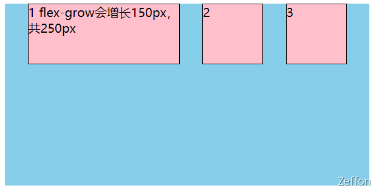

### flex-shrink 收缩比例

**flex-shrink** 属性指定了 **flex** 元素的收缩规则。**flex** 元素仅在默认宽度之和大于容器的时候才会发生收缩，其收缩的大小是依据 **flex-shrink** 的值。

1. **负值无效**
1. 默认值是 **1**，表示**flex**容器空间不足时，元素的收缩比例。
1. 数值为 **0** 时，不收缩

**计算公式**：收缩后尺寸 = 原本大小 - 超出大小 \* （原本大小 \* **系数** / 各子项**系数**乘积之后**总和**)

```html
<!DOCTYPE html>
<html lang="en">
  <head>
    <title>Document</title>
    <style>
      .main {
        width: 400px;
        height: 300px;
        background: skyblue;
        display: flex;
      }
      .main div {
        width: 400px;
        height: 100px;
        background: pink;
        border: 1px black solid;
        box-sizing: border-box;
      }
      .main div:nth-of-type(1) {
        /* 400 - 400 * (400 * 0.6 / 400 * 0.6 + 400 * 1) -> 400 - 150 -> 250 */
        flex-shrink: 0.6;
      }
    </style>
  </head>
  <body>
    <div class="main">
      <div>1 400压缩150，变成250</div>
      <div>2</div>
    </div>
  </body>
</html>
```

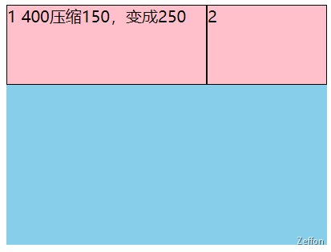

### flex-basis 初始大小

**flex-basis** 属性指定了 flex 元素在主轴方向上的初始大小。如果不使用 box-sizing 改变盒模型的话，那么这个属性就决定了 flex 元素的内容盒（content-box）的尺寸。

1. **负值无效**
1. **flex-basis** 默认值为**auto**，指定了 flex 元素在主轴方向上的初始大小（子项设置宽度，宽度为内容尺寸）
1. 数值为 **0** 时，大小为内容的尺寸

```html
<!DOCTYPE html>
<html lang="en">
  <head>
    <title>Document</title>
    <style>
      .main {
        width: 500px;
        height: 300px;
        background: skyblue;
        display: flex;
      }
      .main div {
        width: 100px;
        height: 100px;
        background: pink;
        border: 1px black solid;
        box-sizing: border-box;
      }
      .main div:nth-of-type(1) {
        flex-basis: 200px;
      }
    </style>
  </head>
  <body>
    <div class="main">
      <div>1 flex-basis=200px</div>
      <div>2</div>
      <div>3</div>
    </div>
  </body>
</html>
```

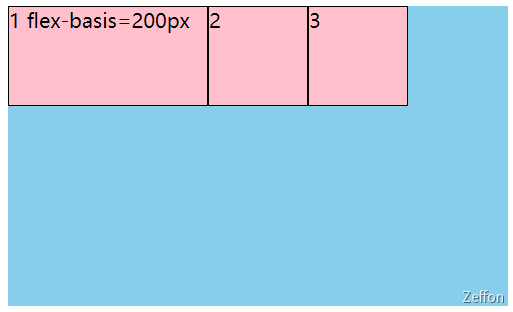

### flex 缩写

**flex** 属性是 **flex-grow**、**flex-shrink** 和 **flex-basis** 的缩写

格式：**flex = [flex-grow] [flex-shrink ] [flex-basis]**，比如：

```css
.container {
  display: flex;
}
.item {
  /* flex-grow: 1;
   flex-shrink: 0;
   flex-basis: 50%; */
  flex: 1 0 50%;
}
```

特殊的写法：

```css
.item {
  flex-grow: 1;
  flex-shrink: 1;
  flex-basis: 0%;
  flex: 1; // 等价上面

  flex-grow: 0;
  flex-shrink: 1;
  flex-basis: 0%;
  flex: 0; // 等价上面

  flex-grow: 1;
  flex-shrink: 1;
  flex-basis: auto;
  flex: auto; // 等价上面
}
```

### order 排序

**order** 属性规定了弹性容器中的可伸缩项目在布局时的顺序。元素按照 order 属性的值的增序进行布局。拥有相同 **order** 属性值的元素按照它们在源代码中出现的顺序进行布局。

**order** 改变某一个 flex 子项的排序位置，默认值是 0。顺序会按数字大小进行排序，负数 < 0 < 正数。

```html
<!DOCTYPE html>
<html lang="en">
  <head>
    <title>Document</title>
    <style>
      .box {
        width: 500px;
        height: 300px;
        background: skyblue;
        display: flex;
        justify-content: center;
      }
      .box div {
        width: 100px;
        height: 100px;
        background: pink;
        border: 1px black solid;
        box-sizing: border-box;
      }
    </style>
  </head>
  <body>
    <div class="box">
      <div>1</div>
      <div>2</div>
      <div>3</div>
    </div>
  </body>
</html>
```

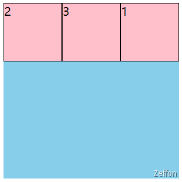

### align-self 当行交叉轴对齐

**align-items** 是 **flex** 容器上属性，设置的值就是所有子项的 **align-self** 属性值。**align-self** 属性会对齐当前 **flex** 行中的元素，并覆盖已有的 **align-items** 的值。在 **flex** 弹性盒子中，会按照交叉轴（当前 **flex** 元素排列方向的垂直方向）进行排列。

**align-self** 默认值是**auto**，控制单独某一个**flex**子项的垂直对齐方式。

1. auto（默认值，设置为 **flex** 容器的 **align-items** 值。如果 **flex** 容器不设置，那就是 **stretch** 了）
1. center
1. flex-start
1. flex-end

> align-self 属性不适用于块类型的盒模型和表格单元。如果任何 flexbox 元素的侧轴方向 margin 值设置为 auto，则会忽略 align-self。

## 常见布局

### 上下左右居中布局

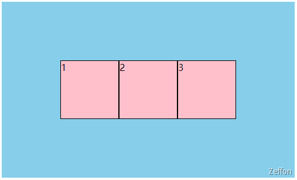

```html
<!DOCTYPE html>
<html lang="en">
  <head>
    <title>Document</title>
    <style>
      .box {
        width: 500px;
        height: 300px;
        background: skyblue;
        display: flex;
        justify-content: center;
        align-items: center;
      }
      .box div {
        width: 100px;
        height: 100px;
        background: pink;
        border: 1px black solid;
        box-sizing: border-box;
      }
    </style>
  </head>
  <body>
    <div class="box">
      <div>1</div>
      <div>2</div>
      <div>3</div>
    </div>
  </body>
</html>
```

### 均分列布局

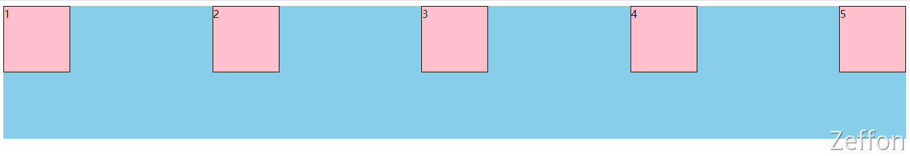

```html
<!DOCTYPE html>
<html lang="en">
  <head>
    <title>Document</title>
    <style>
      .main {
        height: 200px;
        background: skyblue;
        display: flex;
        justify-content: space-between;
      }
      .main div {
        width: 100px;
        height: 100px;
        background: pink;
        border: 1px black solid;
        box-sizing: border-box;
      }
    </style>
  </head>
  <body>
    <div class="main">
      <div>1</div>
      <div>2</div>
      <div>3</div>
      <div>4</div>
      <div>5</div>
    </div>
  </body>
</html>
```

### 子项分组布局

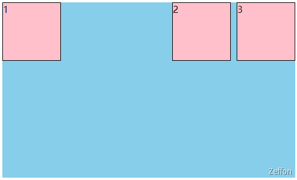

```html
<!DOCTYPE html>
<html lang="en">
  <head>
    <title>Document</title>
    <style>
      .main {
        width: 500px;
        height: 300px;
        background: skyblue;
        display: flex;
        justify-content: space-between;
      }
      .main .box {
        width: 100px;
        height: 100px;
        background: pink;
        border: 1px black solid;
        box-sizing: border-box;
      }
      .main div:nth-of-type(2) {
        display: flex;
        margin-left: 10px;
      }
    </style>
  </head>
  <body>
    <div class="main">
      <div class="box">1</div>
      <div>
        <div class="box">2</div>
        <div class="box">3</div>
      </div>
    </div>
  </body>
</html>
```

### 两列与三列布局

两列布局
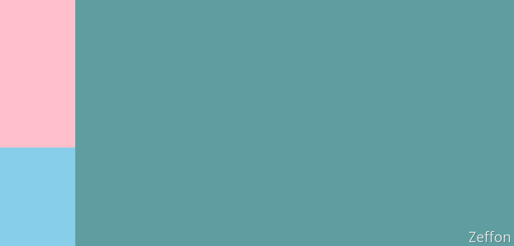

```html
<!DOCTYPE html>
<html lang="en">
  <head>
    <title>两列布局</title>
    <style>
      body {
        margin: 0;
      }
      .main {
        height: 100vh;
        background: skyblue;
        display: flex;
      }
      .col1 {
        width: 200px;
        height: 60%;
        background: pink;
      }
      .col2 {
        flex-grow: 1;
        background: cadetblue;
      }
    </style>
  </head>
  <body>
    <div class="main">
      <div class="col1"></div>
      <div class="col2"></div>
    </div>
  </body>
</html>
```

三列布局
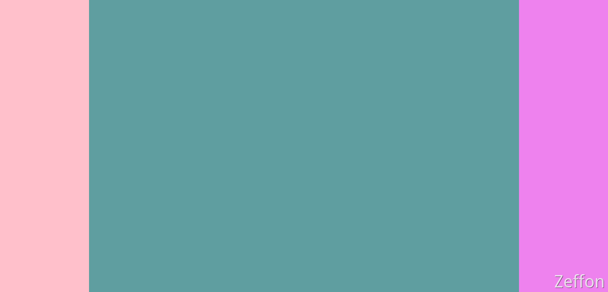

```html
<!DOCTYPE html>
<html lang="en">
  <head>
    <title>三列布局</title>
    <style>
      body {
        margin: 0;
      }
      .main {
        height: 100vh;
        background: skyblue;
        display: flex;
      }
      .main div:nth-of-type(1) {
        width: 200px;
        background: pink;
      }
      .main div:nth-of-type(2) {
        flex-grow: 1;
        background: cadetblue;
      }
      .main div:nth-of-type(3) {
        width: 200px;
        background: violet;
      }
    </style>
  </head>
  <body>
    <div class="main">
      <div></div>
      <div></div>
      <div></div>
    </div>
  </body>
</html>
```

### 溢出项布局

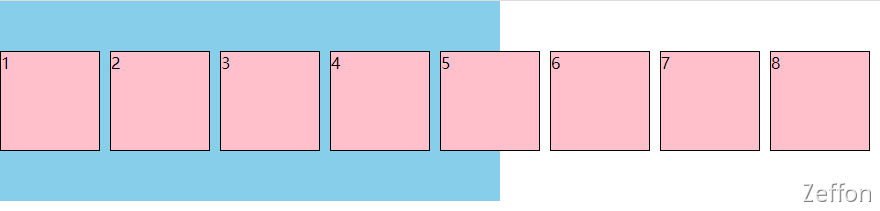

```html
<!DOCTYPE html>
<html lang="en">
  <head>
    <title>Document</title>
    <style>
      body {
        margin: 0;
      }
      .main {
        width: 500px;
        height: 200px;
        background: skyblue;
        display: flex;
        align-items: center;
      }
      .main div {
        width: 100px;
        height: 100px;
        background: pink;
        border: 1px black solid;
        box-sizing: border-box;
        margin-right: 10px;
        flex-shrink: 0;
      }
    </style>
  </head>
  <body>
    <div class="main">
      <div>1</div>
      <div>2</div>
      <div>3</div>
      <div>4</div>
      <div>5</div>
      <div>6</div>
      <div>7</div>
      <div>8</div>
    </div>
  </body>
</html>
```

### StickyFooter 布局

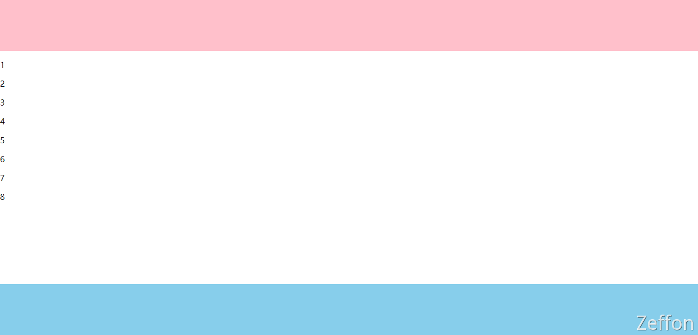

```html
<!DOCTYPE html>
<html lang="en">
  <head>
    <title>Document</title>
    <style>
      body {
        margin: 0;
      }
      .main {
        min-height: 100vh;
        display: flex;
        flex-direction: column;
      }
      .main .header {
        height: 100px;
        background: pink;
      }
      .main .content {
        flex-grow: 1;
      }
      .main .footer {
        height: 100px;
        background: skyblue;
      }
    </style>
  </head>
  <body>
    <div class="main">
      <div class="header"></div>
      <div class="content">
        <p>1</p>
        <p>2</p>
        <p>3</p>
        <p>4</p>
        <p>5</p>
        <p>6</p>
        <p>7</p>
        <p>8</p>
      </div>
      <div class="footer"></div>
    </div>
  </body>
</html>
```
