# grid 网格布局

一文介绍**grid**网格布局的用法和常见布局，更多的内容可以在[**mdn**](https://developer.mozilla.org/zh-CN/docs/Learn/CSS/CSS_layout/Grids)阅读。

<!--truncate-->

## 前言

**grid 网格**是一个用于 web 的二维布局系统。利用网格，你可以把内容按照行与列的格式进行排版。另外，网格还能非常轻松地实现一些复杂的布局。
**grid 网格布局**擅长于将一个页面划分为几个主要区域，以及定义这些区域的大小、位置、层次等关系（前提是 HTML 生成了这些区域）。
像表格一样，网格布局让我们能够按行或列来对齐元素。 然而在布局上，网格比表格更可能做到或更简单。 例如，网格容器的子元素可以自己定位，以便它们像 CSS 定位的元素一样，真正的有重叠和层次。
**grid 网格布局**适合二维层面的布局，而 **flex 弹性布局**适合一维层面的布局。二者有些属性是共用的，如**gap**，也有类似属性。所以在学习 **grid** 网格前，**一定要先熟悉** [**flex **弹性布局](https://www.yuque.com/zeffon/blog/flex) ！！！

## 网格布局

网格是由一系列水平及垂直的线构成的以一种布局模式。根据网格，我们能够将设计元素进行排列，帮助我们设计一系列具有固定位置以及宽度的元素的页面，使我们的网站页面更加统一。
一个网格通常具有许多的**列（Column Track）**与**行（Row Track**，以及行与行、列与列之间的间隙 **Gap**。
单个单元格为 **Cell**，多个单元格合并成为 **Area**。水平方向的数字序号为 **Column line**，标识某个单元格**所处列**的位置。垂直方向的数字序号为 **Row line**，标识某个单元格**所处行**的位置。
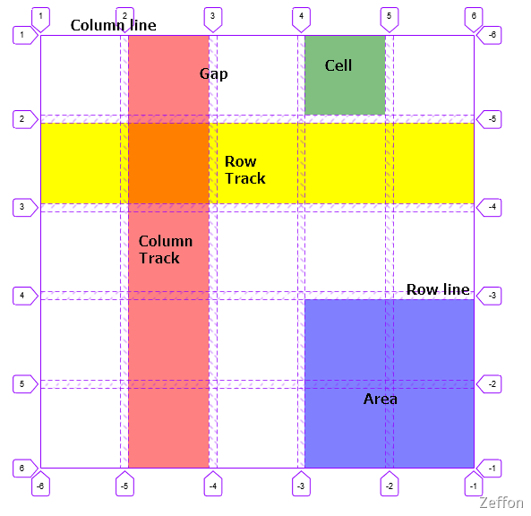

## grid 容器

**grid** 容器当然就是我们设置 **display: grid** 的元素，而 **grid** 容器的属性有：

1. grid-template-rows
1. grid-template-columns
1. grid-template-areas
1. row-gap
1. column-gap
1. justify-items
1. align-items
1. justify-content
1. align-content
1. grid-auto-flow
1. grid-auto-rows
1. grid-auto-columns

### 定义网格的行和列

**grid-template-rows** 该属性是基于**网格行（Row Track）**的维度，去定义网格线的名称和网格轨道的尺寸大小。
**grid-template-columns** 该属性是基于**网格列（Column Track）**的维度，去定义网格线的名称和网格轨道的尺寸大小。
例如：定义一个单元格大小为**100px**三行三列的九宫格，网格的名称可以任意，也可以忽略。

```css
.grid {
  display: grid;
  grid-template-columns: [col1] 100px [col2] 100px [col3] 100px;
  grid-template-rows: [row1] 100px [row2] 100px [row3] 100px;
}
```

是表示网格**行**和**列**尺寸大小的时候，除了长度和百分比，我们也可以用 **fr** 这个单位来灵活地定义网格的行与列的大小。这个单位表示了可用空间的一个比例。

1. 使用下面的规则来创建 3 个 **1fr** 的列，每一列的**宽度**可以会随着可用空间变小而变小。**fr** 单位按比例划分了可用空间。

   ```css
   .container {
     display: grid;
     grid-template-columns: 1fr 1fr 1fr;
   }
   ```

2. 第一列被分配了 **2fr** 可用空间，余下的两列各被分配了 **1fr** 的可用空间，这会使得第一列的宽度是第二第三列的两倍。

   ```css
   .container {
     display: grid;
     grid-template-columns: 2fr 1fr 1fr;
   }
   ```

3. **fr** 可以与一般的长度单位混合使用，比如第一列宽度是 **300px**，剩下的两列会根据除去 **300px** 后的可用空间按比例分配。

   ```css
   .container {
     display: grid;
     grid-template-columns: 300px 2fr 1fr;
   }
   ```

:::tip
**fr**单位分配的是可用空间而非所有空间，所以如果某一格包含的内容变多了，那么整个可用空间就会减少，可用空间是不包括那些已经确定被占用的空间的。
:::

### 合并网格及网格命名

**gird-template-areas** 使用命名方式定义网格区域，需要和 **grid** **子项**中 **gird-area**属性进行配合使用。
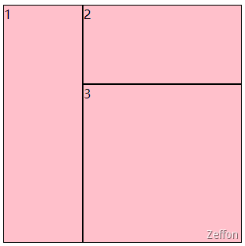

```html
<!DOCTYPE html>
<html lang="en">
  <head>
    <title>Document</title>
    <style>
      .main {
        width: 300px;
        height: 300px;
        background: skyblue;
        display: grid;
        grid-template-columns: 1fr 1fr 1fr;
        grid-template-rows: 1fr 1fr 1fr;
        grid-template-areas:
          "a1 a2 a2"
          "a1 a3 a3"
          "a1 a3 a3";
      }
      .main div {
        background: pink;
        border: 1px black solid;
        box-sizing: border-box;
      }
      .main div:nth-of-type(1) {
        grid-area: a1;
      }
      .main div:nth-of-type(2) {
        grid-area: a2;
      }
      .main div:nth-of-type(3) {
        grid-area: a3;
      }
    </style>
  </head>
  <body>
    <div class="main">
      <div>1</div>
      <div>2</div>
      <div>3</div>
    </div>
  </body>
</html>
```

### gird-template 缩写

**gird-template** 是 **gird-template-rows** 、 **gird-template-columns** 和 **gird-template-areas** 属性的缩写。
格式：

```css
.main {
  width: 300px;
  height: 300px;
  background: skyblue;
  display: grid;
  grid-template:
    "a1 a2 a2" 1fr
    "a1 a3 a3" 1fr
    "a1 a3 a3" 1fr
    / 1fr 1fr 1fr;
}
```

:::tip
**gird-template-areas**中

垂直的是 **gird-template-rows**

水平的是 **gird-template-columns**
:::

### gap 网格间隙

与 **flex** 弹性布局一样，间隙的熟悉使用 **row-gap、column-gap** 用来设置元素行列之间的间隙大小
**gap**是缩写，即 **gap = [row-gap] [column-gap]**

:::tip
起初是用 **grid-gap**(en-US) 属性来定义的，有 **gird-row-gap** 、 **gird-column-gap**，目前逐渐被 gap 替代。但是，为了兼容那些不支持 gap 属性的浏览器，你需要像上面的例子一样，使用带有前缀的属性。

不过推荐使用 gap、row-gap 和 column-gap。
:::

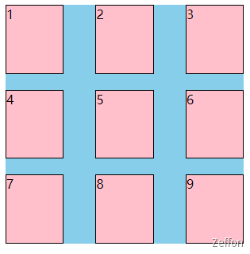

```html
<!DOCTYPE html>
<html lang="en">
  <head>
    <title>Document</title>
    <style>
      .main {
        width: 300px;
        height: 300px;
        background: skyblue;
        display: grid;
        grid-template-columns: 1fr 1fr 1fr;
        grid-template-rows: 1fr 1fr 1fr;
        gap: 20px 40px;
      }
      .main div {
        background: pink;
        border: 1px black solid;
        box-sizing: border-box;
      }
    </style>
  </head>
  <body>
    <div class="main">
      <div>1</div>
      <div>2</div>
      <div>3</div>
      <div>4</div>
      <div>5</div>
      <div>6</div>
      <div>7</div>
      <div>8</div>
      <div>9</div>
    </div>
  </body>
</html>
```

### gird 容器对齐方式

**gird 容器**在水平（相对**flex 主轴**）、垂直方向（**交叉轴**）的**对齐方式**所使用的属性是一样的，水平方向使用的是 **justify-content**，垂直方向使用的是 **align-content**，它们分别指定了所有网格在 **grid 容器**中水平和垂直方式的对齐方式。它们的默认值都是 **stretch**。**place-content** 是 **align-content** 和 **justify-content** 的简写。
格式：**place-content = [align-content] [justify-content]**
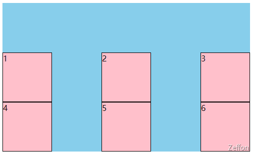

```html
<!DOCTYPE html>
<html lang="en">
  <head>
    <title>Document</title>
    <style>
      .main {
        width: 500px;
        height: 300px;
        background: skyblue;
        display: grid;
        grid-template-columns: 100px 100px 100px;
        grid-template-rows: 100px 100px;
        /* justify-content: space-between;
            align-content: end; */
        place-content: end space-between;
      }
      .main div {
        background: pink;
        border: 1px black solid;
        box-sizing: border-box;
      }
    </style>
  </head>
  <body>
    <div class="main">
      <div>1</div>
      <div>2</div>
      <div>3</div>
      <div>4</div>
      <div>5</div>
      <div>6</div>
    </div>
  </body>
</html>
```

### gird 行内对齐方式

**justify-items** 属性可以控制 **grid** 容器中**子项**在当前**行内**水平（**主轴**）方向上的对齐方式。
**align-items** 属性可以控制 **grid** 容器中**子项**在当前**行内**垂直方向（**交叉轴**）方向上的对齐方式。
它们的默认值都是 **stretch**。**place-items** 是 **align-items** 和 **justify-items** 的简写。
格式：**place-items = [align-items ] [justify-items ]**

> **grid 容器**的 **align-items** 属性与 **flex 容器** 是一样的，但是**flex 容器**没有**justify-items** 属性。

**align-items** 和 **align-content** 的区别：

1. **align-items**作用对象：单个网格的子项
2. **align-content**作用对象：**grid** 容器内的所有网格

**justify-items** 和 **justify-content** 的区别：

1. **justify-items**作用对象：单个网格的子项
1. **justify-content**作用对象：**grid** 容器内的所有网格

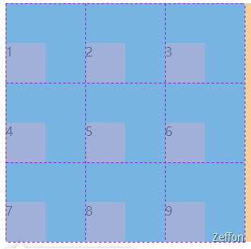

```html
<!DOCTYPE html>
<html lang="en">
  <head>
    <title>Document</title>
    <style>
      .main {
        width: 300px;
        height: 300px;
        background: skyblue;
        display: grid;
        grid-template-columns: 100px 100px 100px;
        grid-template-rows: 100px 100px 100px;
        /* justify-items: start;
            align-items: end; */
        place-items: end start;
      }
      .main div {
        width: 50px;
        height: 50px;
        background: pink;
      }
    </style>
  </head>
  <body>
    <div class="main">
      <div>1</div>
      <div>2</div>
      <div>3</div>
      <div>4</div>
      <div>5</div>
      <div>6</div>
      <div>7</div>
      <div>8</div>
      <div>9</div>
    </div>
  </body>
</html>
```

### 显示网格与隐式网格

如果定位到**某行**或者**某列**中的网格元素没有使用 **grid-auto-rows** 或者 **grid-auto-columns** 来指定大小，则会隐式创建 **grid** 轨道来保存它。这可能在显示定位到超出范围的**行**或者**列**，或者由自动放置算法（**grid-auto-flow**）创建额外的**行**或者**列**时发生。
**grid-auto-rows** 用于指定隐式创建的网格**行轨道**大小。
**grid-auto-columns** 指定了隐式创建的网格**列轨道**大小。

**grid-auto-flow** 属性控制着自动布局算法怎样运作，精确指定在网格中被自动布局的元素怎样排列。
**grid-auto-flow** 属性语法：**grid-auto-flow: [ row | column ] || dense**
此属性有两种形式：

- 单个关键字：**row**、**column**，或 **dense** 中的一个。
- 两个关键字：**row dense** 或 **column dense**。

**row：**该关键字指定自动布局算法按照通过逐行填充来排列元素，在必要时增加新行。如果既没有指定 **row** 也没有 **column**，则默认为 **row**。
**column：**该关键字指定自动布局算法通过逐列填充来排列元素，在必要时增加新列。
**dense：**该关键字指定自动布局算法使用一种“稠密”堆积算法，如果后面出现了稍小的元素，则会试图去填充网格中前面留下的空白。这样做会填上稍大元素留下的空白，但同时也可能导致原来出现的次序被打乱。
如果省略它，使用一种「稀疏」算法，在网格中布局元素时，布局算法只会「向前」移动，永远不会倒回去。

## grid 子项

**grid** 子项就是其父元素设置 **display: grid** 的元素，而 **grid** 子项的属性有：

1. grid-column-start
1. grid-column-end
1. grid-row-start
1. grid-row-end
1. justify-self
1. align-self

### 基于线的元素放置

**grid-column** 属性是 **gird-column-start、gird-column-end** 的简写属性，用于指定网格项目的大小和位置{ 通过为它的网格位置贡献线条，跨度或不添加任何内容（自动），继而确定 [grid area](https://developer.mozilla.org/zh-CN/docs/Glossary/Grid_Areas) 的边界。
**grid-row**属性是 **gird-row-start、gird-row-end**的简写属性，通过基线（line），跨度（span）或没有（自动）的网格放置在 [grid row](https://developer.mozilla.org/zh-CN/docs/Glossary/Grid_Rows) 中指定一个网格项的大小和位置，继而确定 [grid area](https://developer.mozilla.org/zh-CN/docs/Glossary/Grid_Areas) 的边界。

也就是说，**gird-column-start、gird-column-end、gird-row-start、gird-row-end** 表示 **gird** 子项所占据的区域的起始和终止位置，包括水平方向和垂直方向。

每个 **`<grid-line>`** 值可以指定为：

- 要么是**auto**关键字，表示自动放置，自动跨度或默认跨度为 1
- 或**`<custom-ident>`**值，如果有一个名为"`<custom-ident>-start`"/"`<custom-ident>-start`"的命名行，则它将第一行添加到网格项目的位置。
- 或**`<integer>`**值
- 或者 **`<custom-ident>`** 和 **`<integer>`**，两者之间用空格分隔
- 或关键字**span**与 **`<custom-ident>`** 或 **`<integer>`** 或两者一起使用。

:::tip
注意：命名网格区域会自动生成这种形式的隐式命名行，因此请指定 grid-column: foo;将选择该命名网格区域的开始/结束边缘（除非在其之前明确指定了另一条名为 foo-start / foo-end 的行）。
:::

**grid-area** 是 **grid-row、grid-column** 基于线对应位置的简写属性，通过 **/** 作为分割。

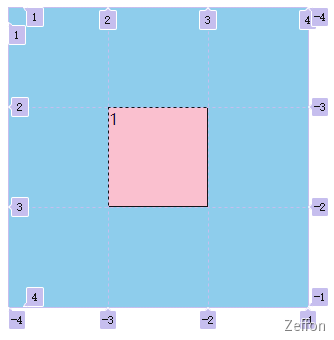

```html
<!DOCTYPE html>
<html lang="en">
  <head>
    <title>Document</title>
    <style>
      .main {
        width: 300px;
        height: 300px;
        background: skyblue;
        display: grid;
        grid-template-columns: [col1] 1fr [col2] 1fr [col3] 1fr [col4];
        grid-template-rows: [row1] 1fr [row2] 1fr [row3] 1fr [row4];
      }
      .main div:nth-of-type(1) {
        background: pink;
        border: 1px black solid;
        box-sizing: border-box;
        /* grid-column-start:2;
            grid-column-end:span 2; */
        /*  grid-column-start: col2;
            grid-column-end: col4; */

        /* grid-column: 2 / 3;
            grid-row: 2 / 4; */
        grid-area: 2 / 2 / 3 / 3;
      }
      .main div:nth-of-type(2) {
        background: slategray;
      }
    </style>
  </head>
  <body>
    <div class="main">
      <div>1</div>
    </div>
  </body>
</html>
```

### 子项对齐方式

**justify-self** 属性设置 单个网格 在其布局容器水平方向的对齐方式。
**align-self** 属性设置 单个网格 在其布局容器垂直方向的对齐方式。**（与 flex 弹性布局一样）**
**place-self **是 **justify-self、align-self** 的速写属性，跟 **place-items **用法相同，只不过 **place-self **操作的是指定的子项，**place-items **操作的是指定的容器。
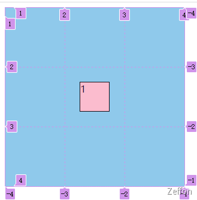

```html
<!DOCTYPE html>
<html lang="en">
  <head>
    <title>Document</title>
    <style>
      .main {
        width: 300px;
        height: 300px;
        background: skyblue;
        display: grid;
        grid-template-columns: [col1] 1fr [col2] 1fr [col3] 1fr [col4];
        grid-template-rows: [row1] 1fr [row2] 1fr [row3] 1fr [row4];
      }
      .main div:nth-of-type(1) {
        width: 50px;
        height: 50px;
        background: pink;
        border: 1px black solid;
        box-sizing: border-box;
        justify-self: center;
        align-self: center;
        grid-area: 2 / 2 / 3 / 3;
      }
      .main div:nth-of-type(2) {
        background: slategray;
      }
    </style>
  </head>
  <body>
    <div class="main">
      <div>1</div>
    </div>
  </body>
</html>
```

## 函数方法

### repeat()

**repeat()** 函数表示轨道列表的重复片段，允许以更紧凑的形式写入大量显示重复模式的列或行。
该函数可以用于 CSS Grid 属性中 **grid-template-columns** 和 **grid-template-rows。**
取值：

1. **`<length>`** 整数长度
1. **`<percentage>`** 非负百分比
1. **`<flex>`** 带有 fr 单位的非负尺寸指定轨道的弹性系数。
1. **max-content** 代表占据网格轨道的网格项目所分配的最大内容区域的最大值。
1. **min-content** 代表占据网格轨道的网格项目所分配的最小内容区域的最小值。
1. **auto** 作为最大值，等同于 **max-content**。作为最小值，它代表占据网格轨道的网格项目的最小尺寸的最大值 （如同 **min-width** / **min-height** 所指定的)）。
1. **auto-fill** 根据容器的大小，自动地调节网格的分布。如果网格容器在相关轴上具有确定的大小或最大大小，则重复次数是最大可能的正整数，不会导致网格溢出其网格容器。
1. **auto-fit** 行为与 **auto-fill** 相同，除了放置网格项目后，所有空的重复轨道都将折叠。空轨道是指没有流入网格或跨越网格的网格项目。（如果所有轨道都为空，则可能导致所有轨道被折叠。）

如图，使用 **auto-fill** 并不会导致网格溢出其网格容器。随着宽度越大，可表示的网格越多。
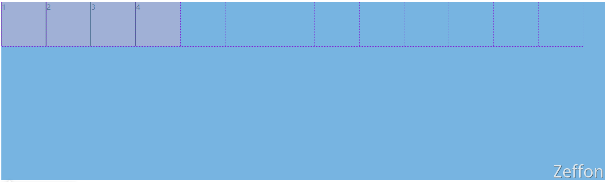

```html
<!DOCTYPE html>
<html lang="en">
  <head>
    <title>Document</title>
    <style>
      .main {
        height: 400px;
        background: skyblue;
        display: grid;
        /* grid-template-columns: 100px 100px 100px; */
        /* grid-template-columns: repeat(3, 100px); */

        /* grid-template-columns: 150px 100px 100px; */
        /* grid-template-columns: 150px repeat(2, 100px); */

        grid-template-columns: repeat(auto-fill, 100px);
        grid-template-rows: 100px;
      }
      .main div {
        background: pink;
        border: 1px black solid;
        box-sizing: border-box;
      }
    </style>
  </head>
  <body>
    <div class="main">
      <div>1</div>
      <div>2</div>
      <div>3</div>
      <div>4</div>
    </div>
  </body>
</html>
```

### minmax()

**minmax()** 定义了一个长宽范围的闭区间， 它与 CSS 网格布局一起使用。
此函数包含两个参数，**最小值** 和 **最大值**，语法： **minmax(min, max)**
每个参数分别是**`<length>`、`<percentage>`、`<flex>`**的一种，或者是**max-content、min-content、auto**之一。
如果 **最大值** < **最小值**，则**最大值**被忽略并且**minmax**(最小值, 最大值)被看成**最小值**。**`<flex>`** 值作为**最大值**时设置网格轨道的**弹性系数**；作为**最小值**时无效。

如图，中间设置最小为 100px，最大自适应长度。
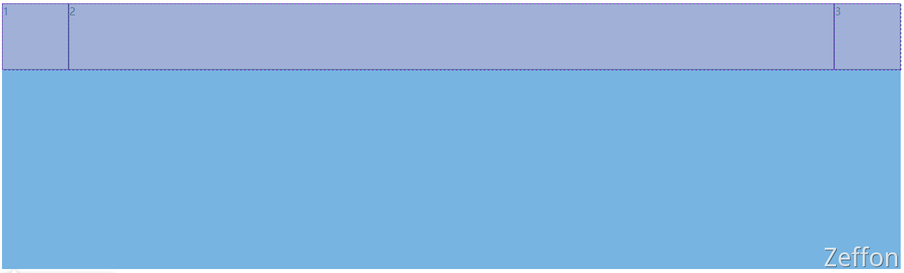

```html
<!DOCTYPE html>
<html lang="en">
  <head>
    <title>Document</title>
    <style>
      .main {
        height: 400px;
        background: skyblue;
        display: grid;
        /* grid-template-columns: 100px 1fr 100px; */
        grid-template-columns: 100px minmax(100px, 1fr) 100px;
        grid-template-rows: 100px;
      }
      .main div {
        background: pink;
        border: 1px black solid;
        box-sizing: border-box;
      }
    </style>
  </head>
  <body>
    <div class="main">
      <div>1</div>
      <div>2</div>
      <div>3</div>
    </div>
  </body>
</html>
```

## 常见布局

### 叠加布局


```html
<!DOCTYPE html>
<html lang="en">
  <head>
    <title>Document</title>
    <style>
      .main {
        width: 530px;
        height: 300px;
        background: skyblue;
        display: grid;
      }
      .area {
        grid-area: 1/1/1/1;
        background-color: pink;
      }
      .logo {
        grid-area: 1/1/1/1;
        justify-self: start;
        align-self: start;
        margin: 5px;
      }
      .fonter {
        grid-area: 1/1/1/1;
        align-self: end;
        background: rgba(0, 0, 0, 0.1);
      }
    </style>
  </head>
  <body>
    <div class="main">
      <div class="area"></div>
      <div class="logo">我的logo</div>
      <div class="fonter">这是页脚...</div>
    </div>
  </body>
</html>
```

### 多种组合排列布局

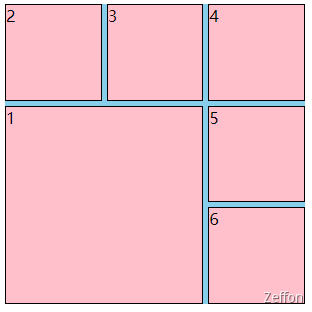

```html
<!DOCTYPE html>
<html lang="en">
  <head>
    <title>Document</title>
    <style>
      .main {
        width: 300px;
        height: 300px;
        background: skyblue;
        display: grid;
        grid-template-columns: repeat(3, 1fr);
        grid-template-rows: repeat(3, 1fr);
        gap: 5px;
      }
      .main div {
        background: pink;
        border: 1px black solid;
        box-sizing: border-box;
      }
      .main div:nth-of-type(1) {
        /* grid-area: 1/1/span 2/span 2; */
        grid-area: 2/1 / span 2 / span 2;
      }
    </style>
  </head>
  <body>
    <div class="main">
      <div>1</div>
      <div>2</div>
      <div>3</div>
      <div>4</div>
      <div>5</div>
      <div>6</div>
    </div>
  </body>
</html>
```

### 栅格布局

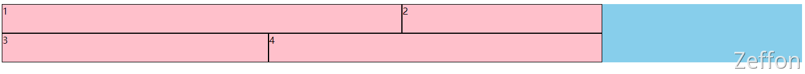

```html
<!DOCTYPE html>
<html lang="en">
  <head>
    <title>Document</title>
    <style>
      .row {
        background: skyblue;
        display: grid;
        grid-template-columns: repeat(12, 1fr);
        grid-template-rows: 50px;
        grid-auto-rows: 50px;
      }
      .row div {
        background: pink;
        border: 1px black solid;
        box-sizing: border-box;
      }
      .row .col-1 {
        grid-area: auto/auto/auto/span 1;
      }
      .row .col-2 {
        grid-area: auto/auto/auto/span 2;
      }
      .row .col-3 {
        grid-area: auto/auto/auto/span 3;
      }
      .row .col-4 {
        grid-area: auto/auto/auto/span 4;
      }
      .row .col-5 {
        grid-area: auto/auto/auto/span 5;
      }
      .row .col-6 {
        grid-area: auto/auto/auto/span 6;
      }
      .row .col-7 {
        grid-area: auto/auto/auto/span 7;
      }
      .row .col-8 {
        grid-area: auto/auto/auto/span 8;
      }
      .row .col-9 {
        grid-area: auto/auto/auto/span 9;
      }
      .row .col-10 {
        grid-area: auto/auto/auto/span 10;
      }
      .row .col-11 {
        grid-area: auto/auto/auto/span 11;
      }
      .row .col-12 {
        grid-area: auto/auto/auto/span 12;
      }
    </style>
  </head>
  <body>
    <div class="row">
      <div class="col-6">1</div>
      <div class="col-3">2</div>
      <div class="col-4">3</div>
      <div class="col-5">4</div>
    </div>
  </body>
</html>
```

### 自适应行列布局

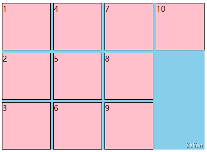

```html
<!DOCTYPE html>
<html lang="en">
  <head>
    <meta charset="UTF-8" />
    <meta http-equiv="X-UA-Compatible" content="IE=edge" />
    <meta name="viewport" content="width=device-width, initial-scale=1.0" />
    <title>Document</title>
    <style>
      .main {
        width: 300px;
        background: skyblue;
        display: grid;
        grid-template-columns: repeat(3, 1fr);
        grid-auto-rows: 100px;
        gap: 5px;
      }
      .main div {
        background: pink;
        border: 1px black solid;
        box-sizing: border-box;
      }
    </style>
  </head>
  <body>
    <div class="main">
      <div>1</div>
      <div>2</div>
      <div>3</div>
      <div>4</div>
      <div>5</div>
      <div>1</div>
      <div>2</div>
      <div>3</div>
      <div>4</div>
      <div>5</div>
    </div>
  </body>
</html>
```
