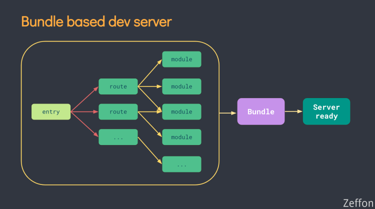
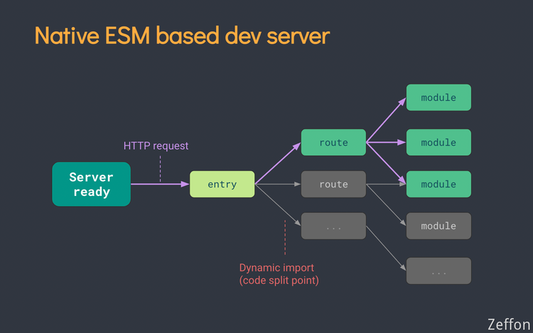

Vite 第一个版本是随着 Vue3 一起发布的，这个版本主要是对 Vue3 进行编译的。之后又快速地推出第二个版本。V2 版本的 Vite 是可以跨框架进行编译的，因此 Vue2 和 React 等都是支持的。本文主要对 Vite 的 简单介绍。

:point_right: [原文链接](https://www.yuque.com/zeffon/blog/vite) :point_left:

<!--truncate-->

## Vite

Vite V1 版本从一开始就是为 Vue3 而生的工具，随后迅速推出 V2 版本，实现跨框架构建的工具。

Vite 其主要的目标就是：

1. 使用简单
2. 编译快
3. 便于扩展。

其实，Vite 相比与 主流 Webpack、Rollupo 这些构建工具，Vite 自己本身是没有编译能力的。Vite 是高阶封装，其内部其实使用的其它工具，核心的就是 Rollup。所以 Vite 便于扩展的优势就是一开始就拥有了 Rollup 的生态插件。

对此，Vite 其目标更多的是工程、是项目开发，它不像 webpack 和 rollup 那样，它们更多的是作为一个构建工具，它们核心之处是执行项目的构建。而 Vite 的初衷就是帮忙开发者更友好、更方便地开发项目。

关于 Vite 的更多介绍请查看[官网](https://cn.vitejs.dev/)。

## 对比

Vite 其初衷就是为项目而生的，而不是为了构建而生的，对此 Vite 简化项目很多配置，其减少了很多配置量：

1. 减少了 传统的 dev server 服务
1. 减少各类 loader（已内置）
1. 减少 build 命令

从官网的 - [为什么选 Vite](https://cn.vitejs.dev/guide/why.html) 中，Vite 主要解决的痛点就是 **缓慢的服务器启动**。这个问题应该是大多大型项目都会遇到的问题。随着项目模块的不断添加，项目的编译运行时间会慢慢加长。

这是因为传统的构建工具，是从入口开始将所有的文件打成一个 Bundle。所以随着项目模块的增加，构建时间会明显的变长。


> Vite 通过在一开始将应用中的模块区分为 **依赖** 和 **源码** 两类，改进了开发服务器启动时间。
>
> - **依赖** 大多为在开发时不会变动的纯 JavaScript。一些较大的依赖（例如有上百个模块的组件库）处理的代价也很高。依赖也通常会存在多种模块化格式（例如 ESM 或者 CommonJS）。Vite 将会使用 [esbuild](https://esbuild.github.io/) [预构建依赖](https://cn.vitejs.dev/guide/dep-pre-bundling.html)。Esbuild 使用 Go 编写，并且比以 JavaScript 编写的打包器预构建依赖快 10-100 倍。
> - **源码** 通常包含一些并非直接是 JavaScript 的文件，需要转换（例如 JSX，CSS 或者 Vue/Svelte 组件），时常会被编辑。同时，并不是所有的源码都需要同时被加载（例如基于路由拆分的代码模块）。Vite 以 [原生 ESM](https://developer.mozilla.org/en-US/docs/Web/JavaScript/Guide/Modules) 方式提供源码。这实际上是让浏览器接管了打包程序的部分工作：Vite 只需要在浏览器请求源码时进行转换并按需提供源码。根据情景动态导入代码，即只在当前屏幕上实际使用时才会被处理。

也就是说，Vite 是将区分模块的，并且在启动时并没有去做编译或是做了预编译，真正编译是在 HTTP 访问时。


## 使用

Vite 基本使用流程：

1. 在 **package.json** 文件中，引入 vite 依赖
1. 在 **vite.config.js** 配置文件中使用对应框架插件
1. 需要创建 **index.html** 文件，指定开始页面地址

> 注意：Vite 中内置框架集成中：vue 版本是 Vue3，react 是最新版本，preact 是 mini 版本的 react，而 Vue2 没有官方的插件，故没有在该列表中，只能通过 vanilla 原生方式构建，使用第三方插件 **underfin/vite-plugin-vue2**

### Vite 构建 Vue3

> **React **版本一样的流程

1. 创建 Vite 项目

   ```shell
   npm init @vitejs/app
   // 1.全局安装 y
   // 2.项目名称 vite-demo
   // 3.框架集成 vanilla原生 vue指Vue3 preact这是mini版的react
   // 4.TS选择

   ```

2. 安装依赖（使用 yarn，npm 有[bug](https://github.com/vitejs/vite/issues/587)）

   ```shell
   yarn install
   ```

3. 运行项目

   ```shell
   yarn dev
   ```

4. 安装 jsx 插件

   ```shell
   yarn add @vitejs/plugin-vue-jsx -D
   ```

5. 在 vite.config.js 引入

   ```javascript
   import { defineConfig } from "vite";
   import vue from "@vitejs/plugin-vue";
   import vueJsx from "@vitejs/plugin-vue-jsx";

   // https://vitejs.dev/config/
   export default defineConfig({
     plugins: [vue(), vueJsx()],
   });
   ```

6. 在 src 下新建 App.jsx

   ```jsx
   import { defineComponent } from "vue";

   export default defineComponent({
     setup() {
       return () => {
         return <div>Hello Vue3 Jsx</div>;
       };
     },
   });
   ```

7. 删掉原本的 App.vue，在 mainjs 更换 App.jsx

   ```javascript
   import { createApp } from "vue";
   import App from "./App";

   createApp(App).mount("#app");
   ```

8. 重新运行 `yarn dev`

### Vite 构建 Vue2

1. 构建项目

   ```shell
   npm init @vitejs/app
   // 使用原生 vanilla
   ```

2. 添加 vite-plugin-vue 插件

   ```shell
   yarn add vite-plugin-vue -D
   ```

3. 手动创建 vite.config.js

   ```javascript
   import { createVuePlugin } from "vite-plugin-vue2";

   export default {
     plugins: [createVuePlugin()],
   };
   ```

4. 安装 Vue 依赖

   ```javascript
   yarn add vue -S
   // 当前Vue版本依旧是vue2 （vue: "^2.6.14"）
   ```

5. 创建 src 目录，将 main.js 移入，并修改 index.html 中 main.js 路径

6. 创建 App.vue 文件

   ```vue
   <template>
     <div>Hello Vite Vue2</div>
   </template>
   ```

7. 修改 main.js

   ```ts
   import Vue from "vue";
   import App from "./App.vue";

   new Vue({
     el: "#app",
     render: (h) => h(App),
   }).$mount();
   ```
