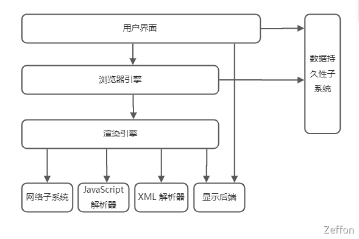
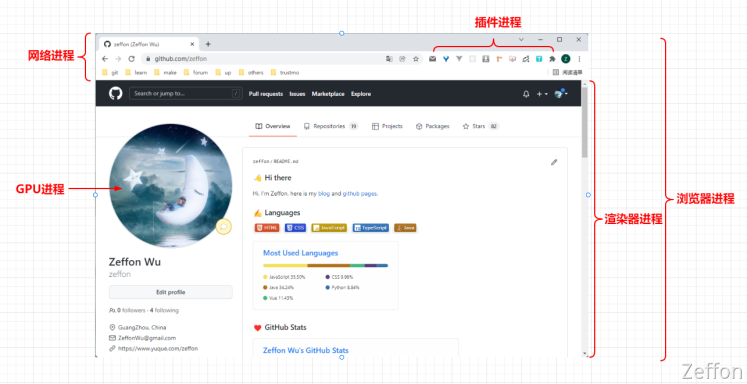
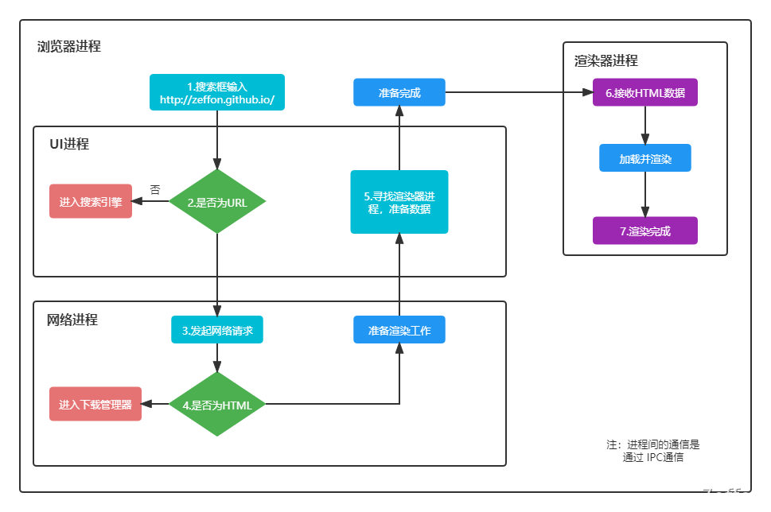
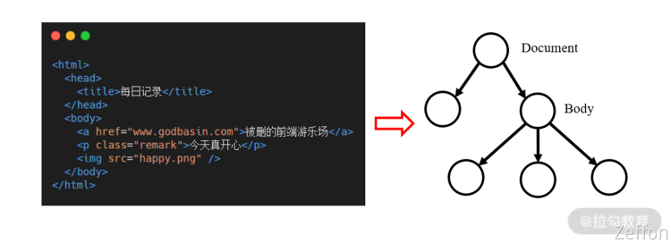
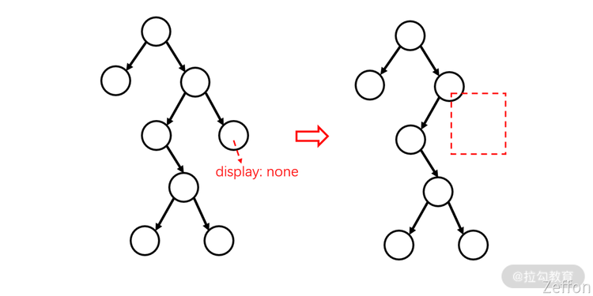
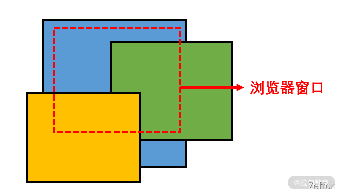
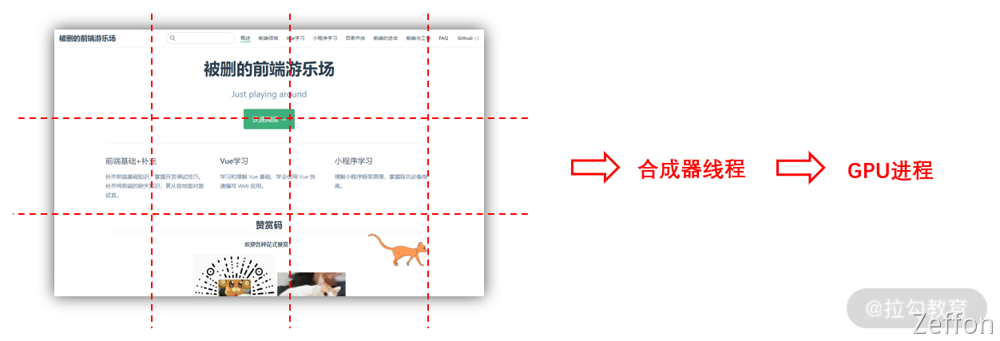

作为前端开发，更多的都是在于浏览器打交道，对于一个页面是如何渲染出来，那么我们就需要很了解浏览器的渲染机制。而在了解浏览器的渲染机制前，我们需要了解浏览器的内部结构是怎样的。

​:point_right: [原文链接](https://www.yuque.com/zeffon/blog/page-render) :point_left:

<!--truncate-->

本文学习自《[前端进击笔记 08](https://kaiwu.lagou.com/course/courseInfo.htm?courseId=822&decorateId=fa0e22c7bea94d52b2a71f2de8221e7a&lgec_type=website&lgec_sign=40209EF6C070714E5D2725BBDC010F63&p=422291f6ffe9570fbe0aa510a5bb64d87202885e6fb5de68096ab2d0d8dd4137f73d4353e92f25f4&utm_campaign=distribution#/detail/pc?id=7204)》和《深入了解现代浏览器系列》。

## 浏览器的内部结构

从结构上来说，**浏览器** 的内部结构可以分为**八个子系统**：**用户界面**、**浏览器引擎**、**渲染引擎**、**网络子系统**、**JavaScript 解释器**、**XML 解析器**、**显示后端**、**数据持久性子系统**。
​

那么这八个子系统间的关系又是如何的呢？

由**用户界面**充当浏览器的入口，接着的是浏览器引擎，而**浏览器引擎**后者就是我们页面渲染出来的核心子系统 - **渲染引擎**，从渲染引擎与其它子系统的交互中，我们可知道**页面的加载和渲染过程**，离不开**网络子系统**、**渲染引擎**、**JavaScript 解释器**和**浏览器引擎**。
​

以前端开发最常使用的 **Chrome** 浏览器为例， **Chrome** 浏览器是使用多进程架构的方式来管理这些子系统。

## Chrome 多进程架构

**Chrome** 浏览器采用的**多进程架构**，主要包括**五个进程**：

1. **浏览器进程**：负责整个浏览器内行为协调，调用各个进程。。
1. **GPU 进程**：该进程用于完成图像处理任务，同时还支持分解成多个进程进行处理。
1. **网络进程**。主要负责页面网络资源的加载。
1. **渲染器进程**：**Chrome** 浏览器中支持多个选项卡，其中每个选项卡在单独的渲染器进程中运行，渲染器进程主要用于控制和处理选项卡中的网站内容显示。
1. **插件进程**：主要是负责插件的运行，因插件易崩溃，所以需要通过插件进程来隔离，以保证插件进程崩溃不会对浏览器和页面造成影响。

​

除此之外，还有：负责本地 I/O 的 **存储进程**、负责浏览器提供给用户的 **UI 进程** 和负责与各种本地设备交互的 **设备进程**。
​

对于“在浏览器的地址栏中输入 **URL**，按下回车键，到浏览器渲染页面”这个过程，浏览器内部会通过**浏览器进程、网络进程 **和 **渲染器进程**，进行很多交互逻辑，最终才得以将页面内容显示在屏幕上。
​

基于这些进程，浏览器有两种可用的架构设计，一种是**少进程**，一种是**多进程**。
​

**少进程**是指将这些进程放在一个或有限的几个进程里，也就是每个进程一个线程，这样做的好处是最大程度共享了内存空间，对设备要求较低，但问题是只要一个线程挂了都会导致整个浏览器挂掉，因此稳定性较差。
​

**多进程**是指为每个进程（尽量）开辟一个进程空间，进程间通过 [**IPC 通信**](https://zh.wikipedia.org/zh-cn/%E8%A1%8C%E7%A8%8B%E9%96%93%E9%80%9A%E8%A8%8A)，因此任何进程挂掉都不会影响其它进程，但坏处是内存占用较大，比如浏览器 js 解析与执行引擎 V8 就要在这套架构下拷贝多份实例运行在每个进程中。
​

**Chrome** 尽量为每个 **tab** 单独创建一个进程，所以我们才能在某个 **tab** 未响应时，从容的关闭它，而其它 **tab** 不会受到影响。不仅是 **tab** 间，一个 **tab** 内的 **iframe** 间也会创建独立的进程，这样做是为了保护网站的安全性。

## 浏览器中页面的渲染过程

首先我们将浏览器中页面的**渲染过程**分为两部分。

1. 页面导航：用户输入 **URL**，**浏览器进程**进行请求和准备处理。
1. 页面渲染：获取到相关资源后，**渲染器进程**负责选项卡内部的渲染处理。

​

### 页面导航过程

当用户在地址栏中输入内容时，浏览器内部会进行以下处理。

1. 首先**浏览器进程**的 **UI 线程**会进行处理：如果是 **URI**，则会发起网络请求来获取网站内容；如果不是，则进入搜索引擎。
1. 如果需要发起网络请求，请求过程由**网络线程**来完成。**HTTP** 请求响应如果是 **HTML** 文件，则将数据传递到**渲染器进程**；如果是其他文件则意味着这是下载请求，此时会将数据传递到**下载管理器**。
1. 如果请求响应为 **HTML** 内容，此时浏览器应导航到请求站点，**网络线程** 便通知 **UI 线程** 数据准备就绪。
1. 接下来，**UI 线程**会寻找一个**渲染器进程**来进行网页渲染。当数据和**渲染器进程**都准备好后，**HTML** 数据通过 **IPC** 从**浏览器进程**传递到**渲染器进程**中。
1. **渲染器进程**接收 **HTML** 数据后，将开始加载资源并渲染页面。
1. **渲染器进程**完成渲染后，通过 **IPC** 通知浏览器进程页面已加载。

​

以上是用户在地址栏输入网站地址，到页面开始渲染的整体过程。为了方便理解，我帮你梳理了一个流程图：

如果当前页面跳转到其他网站，浏览器将调用一个单独的 **渲染器进程** 来处理新导航，同时保留当前**渲染器进程**来处理像**unload**这类事件。
​

在上面的过程中可以看到，页面导航主要依赖**浏览器进程**。其中，上述过程中的 **步骤 6 **便是页面的渲染部分，该过程同样依赖**渲染器进程**，我们一起来看看。
​

### 页面渲染过程

​**渲染器进程** 负责选项卡内部发生的所有事情，它的核心工作是将 **HTML**、**CSS** 和 **JavaScript** 转换为可交互的页面。
​

整体上，**渲染器进程** 渲染页面的流程如下四个步骤

1. 解析(**Parser**)：解析** HTML/CSS/JavaScript **代码。
1. 布局(**Layout**)：定位坐标和大小、是否换行、各种**position/overflow/z-index**属性等计算。
1. 绘制(**Paint**)：判断元素渲染层级顺序。
1. 光栅化(**Raster**)：将计算后的信息转换为屏幕上的像素。

#### 解析

**渲染器进程**的主线程会解析以下内容：

- 解析 **HTML** 内容，产生一个 **DOM 节点树**；
- 解析 **CSS**，产生** CSS 规则树**；
- 解析 **Javascript** 脚本，由于 **Javascript** 脚本可以通过 **DOM API** 和 **CSSOM API** 来操作 **DOM 节点树** 和 **CSS 规则树**，因此该过程中会等待 **JavaScript** 运行完成才继续解析 **HTML**。

解析完成后，我们得到了 **DOM 节点树** 和 **CSS 规则树**，布局过程中便是通过 **DOM 节点树** 和 **CSS 规则树** 来**构造渲染树**（**Render Tree**）。
​

#### 布局

通过**解析**之后，**渲染器进程**知道**每个节点**的结构和样式，但如果需要渲染页面，浏览器还需要进行**布局**，**布局过程**便是我们常说的**渲染树**的创建过程。
​

在这个过程中，像**header**或**display:none**的元素，它们会存在 **DOM 节点树**中，但不会被添加到**渲染树**里。

布局完成后，将会进入**绘制**环节。
​

#### 绘制

在**绘制**步骤中，**渲染器主线程**会遍历**渲染树**来创建**绘制**记录。
​

需要注意的是，如果**渲染树**发生了改变，则**渲染器**会触发**重绘**（**Repaint**）和**重排**（**Reflow**）。

- **重绘**：屏幕的一部分要重画，比如某个 **CSS** 的背景色变了，但是元素的**几何尺寸**没有变。
- **重排**：元素的**几何尺寸**变了（渲染树的一部分或全部发生了变化），需要重新验证并计算**渲染树**。

​

为了不对每个小的变化都进行完整的布局计算，**渲染器**会将更改的元素和它的子元素进行**脏位标记**，表示该元素需要重新布局。其中，全局样式更改会触发**全局布局**，部分样式或元素更改会触发**增量布局**，增量布局是异步完成的，全局布局则会同步触发。
​

**重排**需要涉及变更的所有的结点**几何尺寸**和**位置**，成本比**重绘**的成本高得多的多。所以我们要注意以避免频繁地进行增加、删除、修改 **DOM** 结点、移动 **DOM** 的位置、**Resize** 窗口、滚动等操作，因为这些操作可能会导致性能降低。
​

#### 光栅化

通过**解析**、**布局**和**绘制**过程，浏览器获得了文档的结构、每个元素的样式、绘制顺序等信息。将这些**信息转换为屏幕上的像素**，这个过程被称为**光栅化**。
​

**光栅化**可以被 **GPU** 加速，**光栅化**后的位图会被存储在 **GPU** 内存中。根据前面介绍的**渲染流程**，当页面布局变更了会触发**重绘**和**重排**，还需要重新进行**光栅化**。此时如果页面中有动画，则主线程中过多的计算任务很可能会影响动画的性能。
​

因此，现代的浏览器通常使用合成的方式，将页面的各个部分分成若干层，分别对其进行**栅格化**（将它们分割成了不同的瓦片），并通过合成器线程进行页面的合成。

合成过程如下：

1. 当主线程创建了合成层并确定了绘制顺序，便将这些信息提交给合成线程；
1. 合成器线程将每个图层栅格化，然后将每个图块发送给光栅线程；
1. 光栅线程栅格化每个瓦片，并将它们存储在 **GPU** 内存中；
1. 合成器线程通过 **IPC** 提交给浏览器进程，这些合成器帧被发送到 **GPU** 进程处理，并显示在屏幕上。

合成的真正目的是，在移动合成层的时候不用重新光栅化。因为有了合成器线程，页面才可以独立于主线程进行流畅的滚动。
​

到这里，页面才真正渲染到屏幕上。
